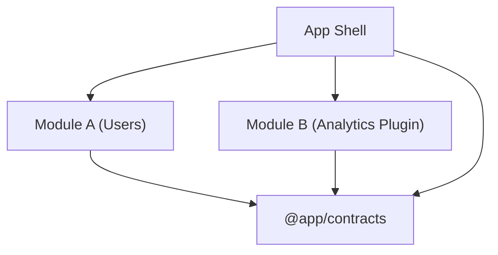

* Написать резюме
    * Lead Software Engineer
    * Ссылки на выступления
        * Добавить краткое описание
        * Указать в порядке популярности
    * Ссылка на курс TypeScript
        * Отметить что курс разрабатывался для внутренней площадки, но также доступен публично
    * Ссылка на серию статей на Хабр
    * Добавить ссылку на storyshots
        * Оформить README в storyshots. DONE
        * Сделать акцент на использование решения внутри компании и на буст производительности (~30%)
    * Оформить фабрику cli приложений как отдельный проект
        * Описать в README целевую гипотезу
    * Указать наличие опыта использования codex в работе (skills, mcp и plugins)
    * Указать релевантные Frontend технологии (возможно имеет смысл разбить по категориям?)
    * Указать опыт в работе над проектам, сделать акцент на точечные решения по архитектуре
    * Уровень англ, образование и т.п.
* Поместить резюме на популярные площадки, отдать предпочтение точечным откликам
* Готовиться к собеседованию
    * Подтянуть алгоритмы и структуры данных (использовать готовую площадку с задачами по категориям, обратить внимание
      на задачи связанные с бинарными деревьями (поиск, вставка, балансировка))
    * Подтянуть css (найти площадку с примерами и принципами работы)
    * Пройтись по google web dev (документации по browser runtime, включаяя детали работы HTTP)
    * Пройтись по основной документации React
    * Пройтись по основной документации Next
    * Изучить loader router в tanstack/router
    * По TypeScript повторить project refs

# Защита резюме

## Распределённая архитектура

### Решение

````mermaid
flowchart TB
    Core["core"]
    Shell["app-shell"]
    ModuleA["module-a"]
    ModuleB["module-b"]
    Shell -->|" loads remote "| ModuleA
    Shell -->|" loads remote "| ModuleB
    Shell -->|" uses package "| Core
    ModuleA -->|" uses package "| Core
    ModuleB -->|" uses package "| Core
    ModuleA -->|" uses "| ModuleB
````

Важные свойства:

* Отсутсвуют циклы зависимостей, это позволяет явно определять порядок сборки и деплоя, также прогнозировать эффект
  изменений
* Зависимости направлены в сторону повышения абстракции, это делает решение менее хрупким (меньше каскадных изменений).
  Исключение состовляет app-shell, как aggregation root он собирает модули по manifest, поэтому технически он более
  абстрактный, однако runtime зависимости смотрят именно в сторону показанную на графе
* Зависимости между модулями также возможны (даже циклы с некоторыми ограничениями), детально принцип работы будет представлен ниже

Используется семантическое версионирование, особенности:
* Мажор версия app-shell определяет версию платформы. Каждый модуль устанавливает его как dev зависимость

Стратегия ветвления:
* Каждый модуль - это отдельный репозиторий
* По умолчанию работаем в мейн ветке
* После ff, делаем релиз ветку (сквозной релиз у всех стримов)
* В релизной ветке выполняем стабилизацию
* После стабилизации, на интеграционный стенд выходит определённая версия модуля (заносится в специальную табличку
  релиза, там же указывается потенциальная lts версия core)
* Далее, руководитель устанавливает конфигруацию в aggregation-root по правилам описанным ниже (коммит с тегом релиза)
* Фиксы релизных версий (и тех что в деплой) происходят в отдельных fixes ветках и инкрементируются согласно схеме версионирования

#### core

Чистый модуль, содержит используемые во всех модулях единицы:

* Context - Providers используются в app-shell, Consumers используются в зависимых модулях
* Общие компоненты, утилиты и прочее
* Зависимость является shared между модулями

Важные свойства:

* Компонент является ответсвенным, поэтому должен быть достаточно абстрактным и расширяемым чтобы меняться реже.
* Содержимое данного компонента должно пересекаться по домену *со всеми* модулями. Например, кнопка нужна в каждом
  модуле (ну или почти в каждом), поэтому является частью `core`.
* Второй пункт намекает на возможность более гранулярного разделения (single reuse), для того чтобы избежать лишних
  релизов. Однако, из-за условий проектов этого не потребовалось и хватило более простой схемы.
* Должен быть singleton shared, так как содержит поведения зависимые от ссылочной целостности

Сборка и деплой:

DEV-режим - storybook + unit-tests
BUILD-режим - storybook артефакт + сам dist пакета через tsup
Релиз - storybook пуш на стенд (только lts) + dist пуш в реджистри

#### ModuleX

Конечный модуль приложения, содержит:

* Реализацию страниц (export { Routes }) и пунктов меню
* Инжекты в общее пространство приложения: состояние и capabilities (функции выполняющие релевантные модулю
  сайд-эффекты)
* Augmented declaration глобальных типов: для поддержки типизации роутинга, состояние и capabilities (для внешнего
  использования)

Использование другого модуля:
* ModuleA использует ModuleB
* ModuleA устанавливает пакет ModuleB указывая версию
* Содержимое пакета ModuleB это просто типы (аугментации ambient типов)
* ModuleA использует ModuleB через capabilities (это реакт хук из `core`)

Свойства такого подхода:
* Зависимость явно выражена в package.json
* Порядок инициализации остаётся независимым, т. к. capabilities устанавливаются при инициализации модулей и их можно
  использовать только на конкретных страницах
* Благодаря второму пункту возможны циклы
* Явно связываются внешние контракты и реализация (одна и та же версия)

Сборка и деплой:

DEV-режим - из app-shell предоставляется сборка (app-shell как dev зависимость) при которой указывается override
манифестов пакетов + локальная сборка host модуля
BUILD-режим - собирается ModuleX контейнер и отдельно npm библиотека (если актуально)
Деплой - на стенд уходит стандартная схема app-shell с override манифестом указывающим на локальную (на стенде) build сборку модуля
Релиз - типы в npm пакет в nexus реджистри (npm репозиторий), сам container уходит в Nexus Raw Repository

Важно, при локальных сборках host модуля, он инициализируется всегда первым, для того чтобы его версия `core` оставалась
актуальной (например в core появляется новая фича и её нужно подтянуть не меняя другие модули также
использующие `core`). Это же происходит и при локальных деплоях. Конечно, это создаёт потенциально не рабочий билд,
однако, для целей локальной отладки/разработки конкретного модуля этого более чем достаточно.

#### App shell

Aggregation root, содержит:

* Инициализацию контейнеров из манифеста и context providers.
* Инициализацию элементов меню (динамическая, по порядку в манифесте)
* На модули ссылается согласно манифесту получаемому динамически (от сервера (dev/nginx))
* Манифест заполняется руками и хранится в репозитории. Содержит:

```json
[
  {
    "name": "ModuleA",
    "version": "1.1.1"
  },
  {
    "name": "ModuleB",
    "version": "1.2.1"
  }
]
```

Сам app shell должен устанавливать такую стат. зависимость от `core`, чтобы она удовлетворяла всем модулям в manifest.

Сборка и деплой:

DEV-режим - собирается app-shell (dev mode) с модулями из манифеста
BUILD-режим - собирается app-shell (dev mode)
Деплой - собирается app-shell с манифестом и отправляется на стенд
Релиз - собирается app-shell пакет содержащий в себе утилиты для локальной сборки и отладки модуля (manifest override
mode + override `core` зависимости через порядок инициализации) также отдельно собирается артефакт в nexus raw repository (контейнер вместе с хардкод манифестом)

Full production сборка приложения выполняется следующим образом:
* Руками устанавливаются версии модулей
* Руками устанавливается версия core в app-shell
* При сборке версии модулей валидируются согласно схеме версионирования (+ транзитивные зависимости модулей)
* Также валидируется совместимость версий по core пакету (runtime валидация отсутствует намеренно)
* По итогу готовая мета отправляется на стенд

Инкрементальный деплой в общий стенд при такой схеме невозможен, так как требуется ручное изменение и ревалидация
манифеста.

Таким образом app-shell - это платформа на которой работают модули приложения. В нём же объявляются общие зависимости (
react, react-dom, etc.). В то же время он расширяемый (через манифест) и редко требовал изменений.

### Защита

Вопрос: Как подгружались модули
Вопрос: Как использовались общие компоненты
Вопрос: А что если один модуль зависит от другого
Вопрос: А почему не сделать связь неявной через третий модуль (push модель)



Ответ: Данная архитектура имеет следующие недостатки:

* @app/contracts - это отвественный компонент, каждый раз когда контракт взаимодействия меняется или дорабатывается,
  данный пакет должен быть изменён. Каждое изменение инвалидирует все зависимые части, что создаёт элемент хрупкости.
* push модель - это хороший инструмент инвертирования зависимости (если есть модуль посредник то строится полная
  архитектурная граница), однако, есть и значительный минус, это описание неявного контракта. Один модуль зависит от
  другого, однако не ясен порядок сборки т. к. нет прямой зависимости.
* отсутсвие зависимости - это плюс с точки зрения простоты сборки, однако итоговая сложность никуда не девается, она как
  бы перетекает в область неявности:
    * не ясно какой модуль от какого зависит в runtime (зависимость становится семантической)
    * нет чёткого контроля совместимости версий
    * нет явного порядка регистрации модулей (правильного порядка может и не быть вовсе если есть циклы)

Такое решение может подойти системам где модули являются высокодинамичными по определению (plugin экосистемы), где
независимый деплой и runtime discovery являются приоритетными.

Вопрос: Как работал runtime
Вопрос: Как формировался манифест
Вопрос: Как работала сборка модуля
Вопрос: Как работала сборка всего приложения
Вопрос: Как работал деплой
Вопрос: Был ли реализован инкрементальный деплой
Вопрос: Общие зависимости, дубли и конфликты
Вопрос: А что если появляется цикл
Вопрос: Стратегия ветвления
Вопрос: Стратегия версионирования
Вопрос: А что если модуль не обнаружен
Вопрос: А как делили
Ответ: По доменам и по ответсвенностям, чтобы между модулями было как можно меньше связанных изменений

# SSR тайловых пирамид

Продумать решение рендеринга тайловых пирамид на сервере (kafka + склейка пирамид?)

# MicroFronted to MonoRepo

Прописать алгоритм склейки модульного проекта в монорепозиторий

# Module Federation

Изучить механизм работы в Webpack и основные паттерны работы

# OBD сканнер система

Расписать дизайн решения

# Остальное

Изучить API Sentry (телеметрию)
System Design во Frontend
Добавить пункт на эволюционную архитектуру (сначала поддерживаемость и расширяемость -> затем целевая схема поставки,
распределённость)