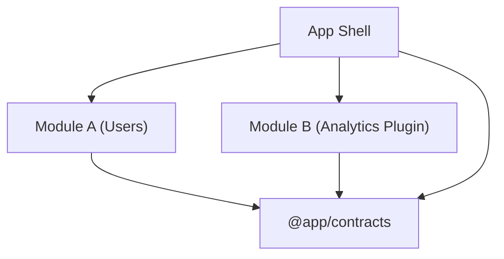

* Написать резюме
  * Lead Software Engineer
  * Ссылки на выступления
    * Добавить краткое описание
    * Указать в порядке популярности
  * Ссылка на курс TypeScript
    * Отметить что курс разрабатывался для внутренней площадки, но также доступен публично
  * Ссылка на серию статей на Хабр
  * Добавить ссылку на storyshots
    * Оформить README в storyshots. DONE
    * Сделать акцент на использование решения внутри компании и на буст производительности (~30%)
  * Оформить фабрику cli приложений как отдельный проект
    * Описать в README целевую гипотезу
  * Указать наличие опыта использования codex в работе (skills, mcp и plugins)
  * Указать релевантные Frontend технологии (возможно имеет смысл разбить по категориям?)
  * Указать опыт в работе над проектам, сделать акцент на точечные решения по архитектуре
  * Уровень англ, образование и т.п.
* Поместить резюме на популярные площадки, отдать предпочтение точечным откликам
* Готовиться к собеседованию
  * Подтянуть алгоритмы и структуры данных (использовать готовую площадку с задачами по категориям, обратить внимание на задачи связанные с бинарными деревьями (поиск, вставка, балансировка))
  * Подтянуть css (найти площадку с примерами и принципами работы)
  * Пройтись по google web dev (документации по browser runtime, включаяя детали работы HTTP)
  * Пройтись по основной документации React
  * Пройтись по основной документации Next
  * Изучить loader router в tanstack/router
  * По TypeScript повторить project refs

# Защита резюме

## Распределённая архитектура

````mermaid
graph TD
    AppShell["App Shell"]

    ModuleA["Module A"]
    ModuleB["Module B"]

    ModuleA --> AppShell
    ModuleB --> AppShell
````

Вопрос: Как подгружались модули
Ответ: JSONP модули, подгружались как:

```typescript
onModuleLoaded({
  Routes,
  reducer
});
```

Вопрос: Как использовались общие компоненты
Ответ: Общие компоненты использовались через пакеты:

```typescript jsx
import { Button } from '@project/core';

const render = <Button />;
```

Стоит отметить, что `@project/core` также содержит и shell часть. Это сокращает общее количество пакетов.

Вопрос: А что если один модуль зависит от другого
Ответ: Связи между модулями также описывались через API:

```typescript
// module-b
import { useModuleAData } from '@project/module-a';

const data = useModuleAData();
```

Так, связь становится явной (на уровне пакетного менеджера). К тому же, сразу закрывается проблема транзитивных
зависимостей и согласование версий (сборщик всё устанавливает и валидирует автоматически).

Каждый проект при этом содержал два export entry point:

* main.js файл jsonp регистратор модуля
* lib.js файл со внешними зависимостями

Вопрос: А почему не сделать связь неявной через третий модуль (push модель)



Ответ: Данная архитектура имеет следующие недостатки:

* @app/contracts - это отвественный компонент, каждый раз когда контракт взаимодействия меняется или дорабатывается,
  данный пакет должен быть изменён. Каждое изменение инвалидирует все зависимые части, что создаёт элемент хрупкости.
* push модель - это хороший инструмент инвертирования зависимости (если есть модуль посредник то строится полная
  архитектурная граница), однако, есть и значительный минус, это описание неявного контракта. Один модуль зависит от другого, однако не ясен порядок сборки т. к. нет прямой зависимости.
* отсутсвие зависимости - это плюс с точки зрения простоты сборки, однако итоговая сложность никуда не девается, она как бы перетекает в область неявности:
  * не ясно какой модуль от какого зависит в runtime (зависимость становится семантической)
  * нет чёткого контроля совместимости версий
  * нет явного порядка регистрации модулей (правильного порядка может и не быть вовсе если есть циклы)

Такое решение может подойти системам где модули являются высокодинамичными по определению (plugin экосистемы), где
независимый деплой и runtime discovery являются приоритетными.

Вопрос: Как работал runtime
Ответ: Точкой входа является app-shell, который автоматически подгружал все установленные модули согласно root манифесту (по порядку).
app-shell делал запрос по имени модуля где dev-сервер возвращал entry скрипт (из node_modules/@project) или локальный (для host модуля)

Вопрос: Как формировался манифест
Ответ: Манифест формировался руками, он объявлял порядок подгрузки модулей и их версии (для общего деплоя)

Вопрос: Как работала сборка модуля
Ответ: Артефактами сборки являлся сам модуль, также в папку помещялся app-shell и все установленные модули (зависимые по package.json)

Вопрос: Как работала сборка всего приложения
Ответ: Специальный режим полной сборки, который осуществлялся только из репозитория app-shell:
* в манифесте, помимо порядка перечислялись итоговые версии (их заполнял к feature-freeze) каждый из стримов
* при сборке, создавался исскусственный npm пакет в который устанавливался app-shell и все модули соответствующих версий
* в данном пакете запускался стандартный процесс сборки app-shell и модулей

Вопрос: Как работал деплой
Ответ: На стенд уходили основные артефакты сборки: app-shell и модули ссылки на которые были в манифесте. В манифест
подставлялись ссылки до файлов модулей.

Вопрос: Был ли реализован инкрементальный деплой
Ответ: Нет, такого требования не было. Сам процесс сборки проходил быстро т. к. модули помещялись в реджистри уже в
собранном виде.

Вопрос: Общие зависимости, дубли и конфликты
Ответ: Через externals, все внешние зависимости подключались именно так

Вопрос: А что если появляется цикл
Ответ: Зависит от его природы, у нас циклов не было. Но если что то такое получилось бы, то был бы создан промежуточный
пакет.

Вопрос: Стратегия ветвления
Вопрос: Стратегия версионирования
Вопрос: А что если модуль не обнаружен
Вопрос: А как делили
Ответ: По доменам и по ответсвенностям, чтобы между модулями было как можно меньше связанных изменений

Прописать архитектуру на базе jsonp модулей (детали по разделениям)

# SSR тайловых пирамид

Продумать решение рендеринга тайловых пирамид на сервере (kafka + склейка пирамид?)

# MicroFronted to MonoRepo

Прописать алгоритм склейки модульного проекта в монорепозиторий

# Module Federation

Изучить механизм работы в Webpack и основные паттерны работы

# OBD сканнер система

Расписать дизайн решения

# Остальное

Изучить API Sentry (телеметрию)
System Design во Frontend
Добавить пункт на эволюционную архитектуру (сначала поддерживаемость и расширяемость -> затем целевая схема поставки, распределённость)