# Единственная ответственность

Любой инженер начинает свой путь с написания простой программы, например такой, как представлена ниже:

 

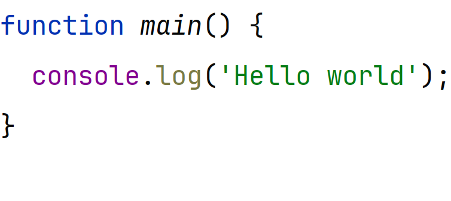

Простая программа

Дальше, из любопытства или потребности разработчик пытается добавлять новые поведений, от чего исходного кода, очевидно,
становится больше. Требования, атакуя одно за другим, естественным образом увеличивают количество кода в файле. Спустя
некоторое время инженер с неприятным для себя удивлением обнаруживает, что контролировать систему стало *сложнее*.

 

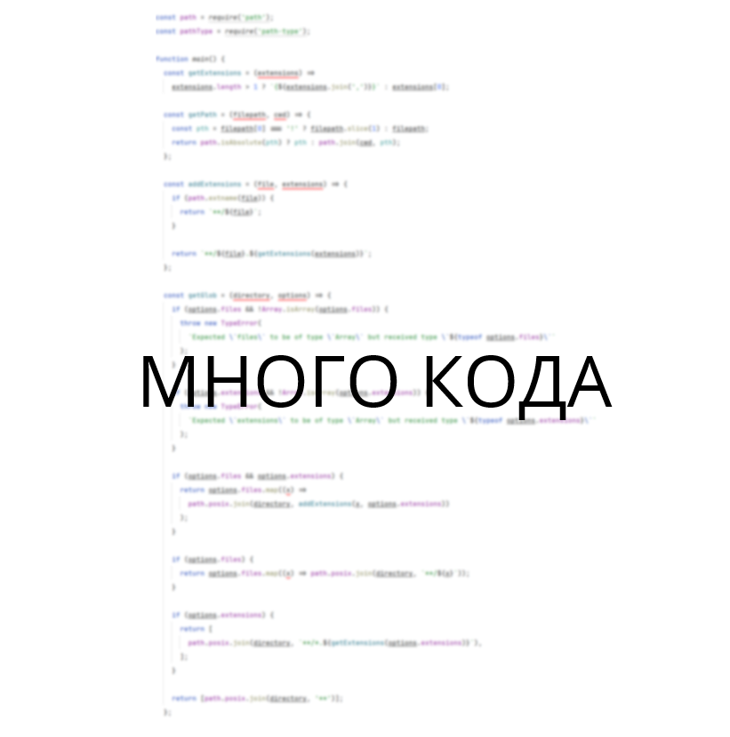

Сложность имеет много интерпретаций, поэтому попробуем выразиться несколько конкретнее. Сталкиваясь с очередной задачей
разработчик обнаруживал следующее:

* Для внесения, казалось бы, простых изменений приходится пробираться через кучу заграждающих деталей, которые, в итоге,
  оказываются нерелевантными для решаемой проблемы.
* Сложно предугадать объем предстоящей работы, реализация даже самой простой задачи часто превращается в утомительную
  деятельность, где разработчику приходится вносить нескончаемые изменения, которые каскадом распространяются по
  системе. Инженер, вместо того чтобы точечно внести правку, разваливает весь карточный домик и собирает его заново, с
  нуля.
* Изменения зачастую приводят к неожиданным последствиям, ломая поведения там, где меньше всего этого
  ожидаешь. Это заставляет программиста попотеть, ведь нужно ухитриться и реализовать новое требование, при этом не
  сломав логику уже существующих компонентов.

Кажется, что с ростом кодовой базы, программа становится все упрямее, оказывая все больше сопротивления постоянно
надвигающимся изменениям. В своей пиковой точке, она становится на столько сложной, что никто уже не может
предсказать чем обернется та или иная модификация. С точки зрения поведения программа все еще может приносить пользу,
выполнять критичную бизнес задачу, но плохая внутренняя структура не даёт ей развиваться дальше, сводя все планы по
дальнейшему развитию на нет. В лучшем случае это лишь замедлит выпуск новых версий продукта, в худшем же, поставит под
вопрос существование всего проекта.

До боли знакомая каждому инженеру ситуация, новый проект на котором вначале сложность растет незаметно, но в
какой-то момент вспыхивает и начинает бесконтрольно улетать вверх, обуславливается естественными свойствами любой
развивающейся системы.

# Сложность

Программирование - это сложно. Данный факт начали отмечать ещё с далеких времен когда люди только начали писать
сколь-либо объемные программы.

Дейкстра, еще в 1972 отметил, что средняя сложность программ выросла настолько, что уже ни один человек не сможет
полностью уместить всю внутреннюю структуру ПО у себя в голове.

Эдсгер Вибе Дейкстра

Попробуем разобраться с возможными причинами существования такого негативного свойства. Прежде всего стоит отметить, что
любой исходный код можно разбить на две составляющие: наблюдаемое поведение и структура. Рассмотрим их по порядку.

## Поведение

Любая программа в конечном итоге решает какую-то проблему своего пользователя (пользователь не обязательно
должен быть человеком). Именно за решение задачи в рамках взятого домена заказчик платит деньги разработчику. Это именно
то на что заводит дефекты тестирование и что требует к реализации аналитика. Это то, зачем клиент использует систему.

Пользуясь, например, календарем или мессенджером, нам не важно каким образом он реализован, напротив, нас волнует то, какие функции он выполняет, приносит ли он пользу

### Естественная сложность

Поведение, само по себе, является источником естественной сложности, той что исходит из свойств реализуемого домена.
Функция не может быть проще чем та задача, которую она решает.

Кажется, что разработчик имеет мало возможностей на это как-то повлиять, ведь он редко диктует требования, являясь
простым исполнителем*.

* Существуют методы косвенной оптимизации, например, построение не избыточных, но точных моделей. Модель это представление
чего-либо в упрощенном виде, которая концентрируется только на важных для решаемой проблемы параметрах реального мира.

## Структура

Очень часто, когда речь заходит о структуре, в голове всплывает нечто подобное:

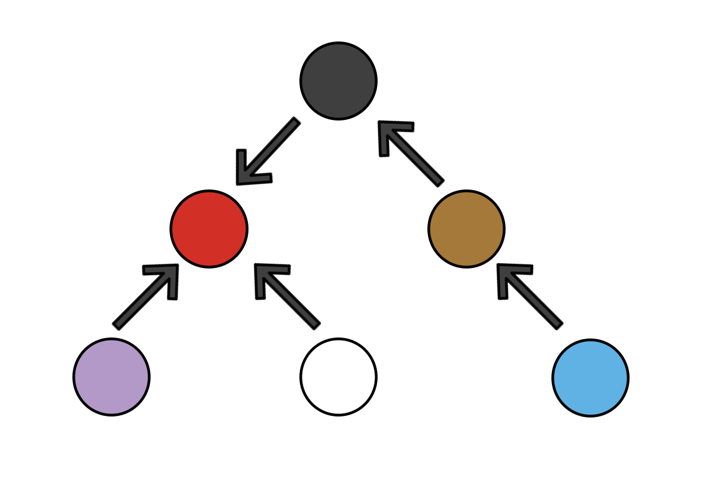

Структура часто представляется как направленный граф, где узлы это компоненты системы, а отношения между ними - зависимости

На самом деле она является чем-то большим, а именно деталью реализации, всем тем, что скрыто от глаз конечного
пользователя и что проявляет себя через *наблюдаемое поведение*.

От самых маленьких функций до крупных блоков системы, структура пронизывает программу насквозь. Её часто называют
архитектурой или дизайном, но от этого смысл не меняется*.

* Архитектурой часто называют верхне-уровневую организацию элементов, в то время как дизайн относят к нечто более
локальному, в рамках данной статьи оба понятия будут считаться взаимозаменяемыми.

### Искусственная сложность

Помимо поведения, детали реализации формируют и так называемую *искусственную сложность*. То есть ту на которую влияют
выбранные инженером конкретные способы реализации: алгоритмы, модели, библиотеки и так далее.

Рассмотрим пример, ярко демонстрирующий основную идею:

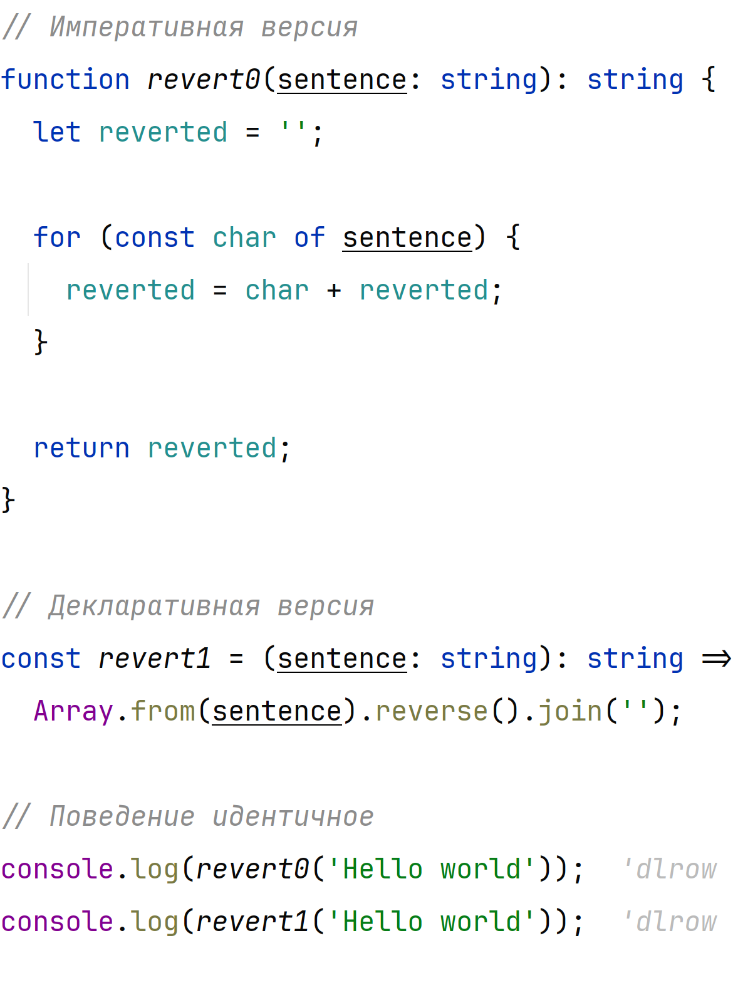

Две разные реализации одно и того же поведения

Несмотря на то что обе функции `revert0` и `revert1` обладают одинаковым наблюдаемым поведением, их сложность является
различной и даже более того, *относительной*. Кому-то будет проще работать с императивной версией, для кого-то напротив,
декларативная версия окажется более предпочтительной.

Структура является источником *искусственной сложности*. Основная цель проектирования
заключается в формировании правильной структуры, то есть той, что помимо требуемого наблюдаемого поведения, будет
обеспечивать должную производительность труда на проекте, сдерживая рост сложности на проекте.

## Основная идея

Представим что существует программа, позволяющая вести список дел:

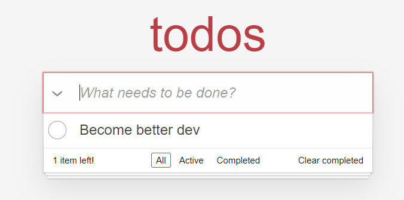

Список дел

Как было рассказано ранее, помимо наблюдаемого поведения, у неё есть и внутренняя структура, которая в свою очередь
выражает искусственную сложность. Последняя негативно сказывается на поддерживаемости, но что если данную программу не
надо будет поддерживать? Что если заказчик окажется настолько доволен конечным результатом, что не захочет ничего
больше изменять?

В таком случае качество структуры программы станет нерелевантным. Неважно насколько хорошо написаны функции, насколько
чистым является код, если с ним не работает реальный разработчик. Не важно, насколько сложной является программа если её
никто не будет изменять.

Это означает, что основной целью качественной архитектуры является обеспечение адаптивности программы к своим
модификациям. Нет ничего, что может разработчик контролировать также хорошо как искусственную сложность. Путем выбора
тех или иных деталей реализации, инженер определяет дальнейшую судьбу проекта, будь то стабильное развитие либо
постепенная стагнация и устаревание.

Исходя из всего вышесказанного, основным полем для оптимизации будет структура программы. Главный параметр - это то,
насколько хорошо или плохо исходный код будет реагировать на входящие изменения.

# Разделение

Одним из частых и самых очевидных визуальных признаков сложных программ является их размер. С файлом состоящим из 10
строк работать в среднем проще чем с полотном длинною в несколько сотен строчек кода.

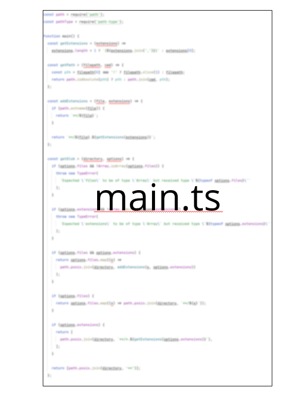

Большой файл. Исходный код смазан специально, ввиду своей незначительности

"Разделить" - это первое, что возникает в голове у любого инженера встречающего такой файл.

Но данная задача является достаточно коварной, ведь за её кажущейся простотой скрываются достаточно серьёзные и сложные
вопросы:

* На какие компоненты нужно разбить одно целое?

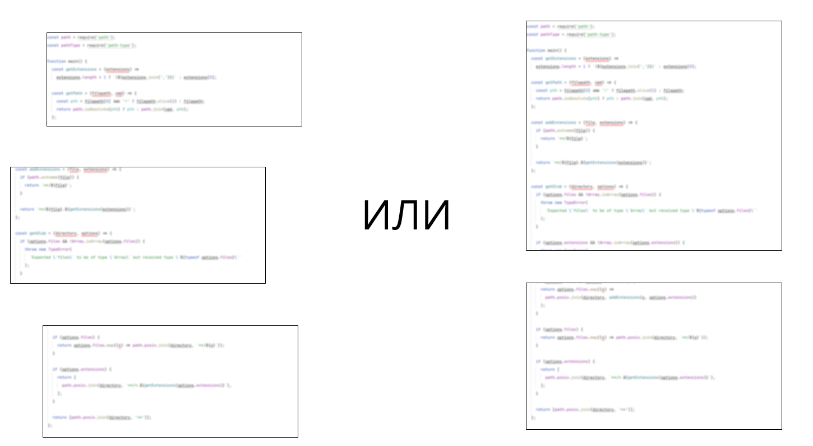

* Какие части бывшего монолита должны принадлежать одним компонентам, а какие другим?

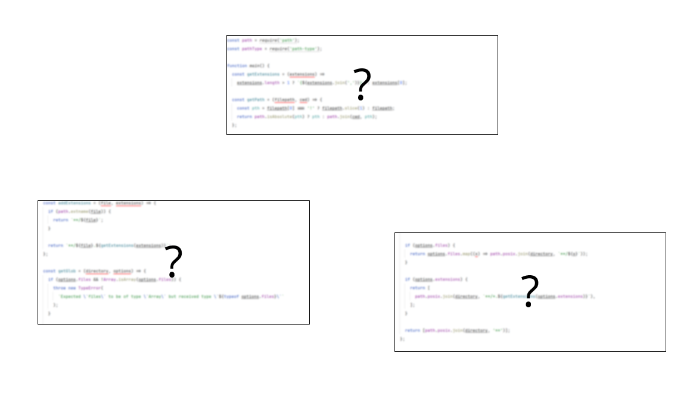

* Какие компоненты должны зависеть от других, а какие нет?

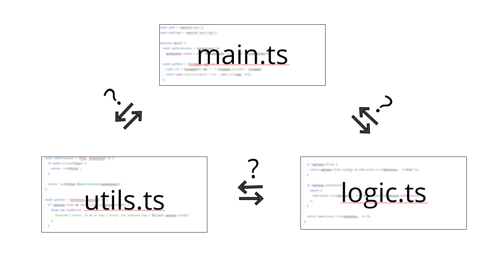

Ответы на эти вопросы во многом определяют итоговый дизайн системы. Если они окажутся правильными, тогда разработчики
получат поддерживаемую систему, которая легко адаптируется к входящим изменениям. Если же где-то в наших рассуждениях
закралась ошибка, результатом будет запутанный код, который только сильнее ускорит и без того быстрое устаревание
проекта.

Известный принцип единственной ответсвенности как раз ставит своей целью указать разработчику, каким образом необходимо
разделить код так, чтобы добиться желаемого результата.

## Ложное определение SRP

Прежде чем приступить к истинному определению принципа, будет полезно посмотреть на то, как его трактуют чаще всего.

Принцип единственной ответсвенности, далее просто *SRP**, многими воспринимается как, на первый взгляд, простое
правило: "Модуль** должен быть ответственен за что-то одно, отвечать только за одну функциональность". Такое простое по
своей форме определение на самом деле приносит больше проблем, чем пользы.

Для того чтобы наглядно это увидеть, рассмотрим простую функцию:

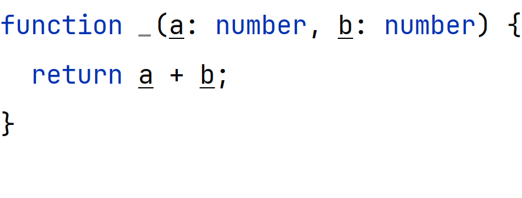

Простая функция. Имя не указано специально

Сколько ответственностей имеет данная функция? Многие ответят что только одну, ведь все что процедура делает - это
лишь складывает два числа, что берутся из аргументов.

Давайте немного продолжим нашу мысленную гимнастику, обратите внимание на то, что у функции из примера специально
отсутствует название, попробуем слегка изменить данную ситуацию, добавив имя и ещё одну операцию:

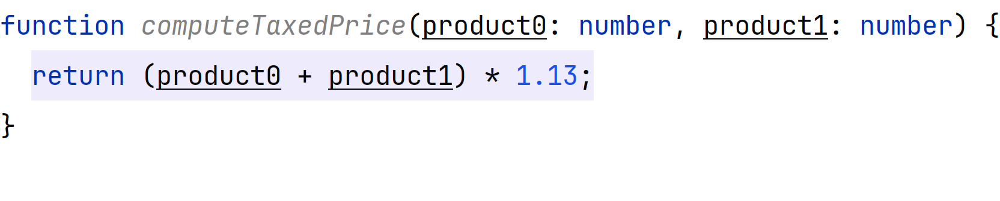

Функция считающая налог

Сколько ответственностей у неё теперь? С одной стороны она и складывает и умножает, то есть выполняет несколько
операций. С другой стороны, опираясь на её сигнатуру, все что она выполняет, так это считает итоговую цену продуктов с
учетом налога.

Как было сказано ранее, все решения, касающиеся вопросов разделения кода, прямо или косвенно скажутся на итоговой
поддерживаемости системы, то, что из популярного определения SRP исходит такая неоднозначность является достаточно
негативным признаком.

Допустим, что посовещавшись с коллегами, мы решили что данная процедура все же нарушает SRP, тогда необходимо сделать
следующее:

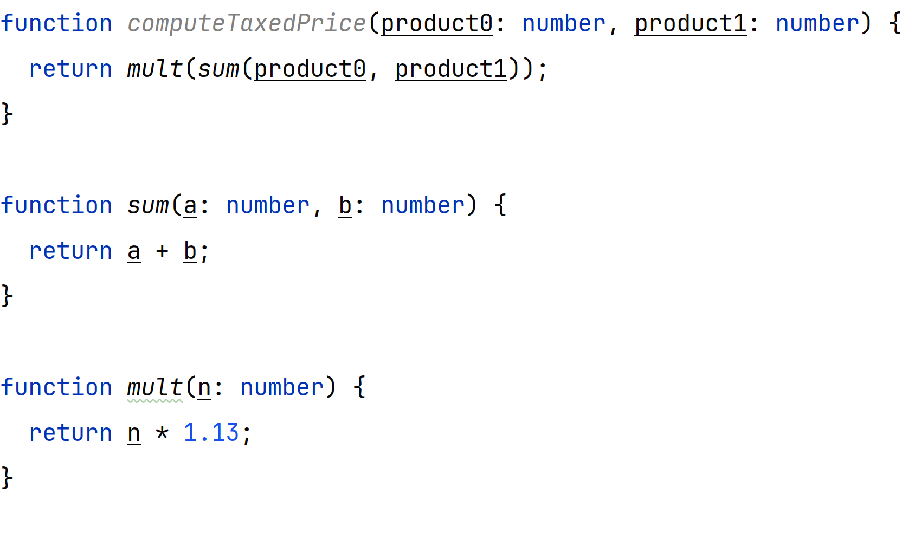

Система из функций удовлетворяющих "SRP"

Теперь, каждая из процедур действительно делает что-то одно. Но чего инженеры добились на самом деле, изменив структуру
программы подобным образом?

Появление новых сущностей - это ожидаемый результат любого разделения кода. До этого, программа содержала лишь одну
небольшую процедуру, но после модификации их стало уже больше. Стало ли её проще читать и изменять? Учитывая изначальную
простоту, наврятли ситуация изменилась к лучшему. Но тогда закономерный вопрос, а чего пытается добиться SRP? За счет
чего, обычное разделение кода может сделать систему более поддерживаемой, более адаптивной к входящим изменениям?

Ключевой ошибкой ранее представленного определения было использование такого понятия как "функция модуля". То, за что
отвечает модуль - это нечто чрезвычайно растяжимое и относительное. Инженеры не должны опираться на что-то настолько
ненадежное когда речь идет о принятии архитектурных решений, будь то разделение маленькой функции на процедуры или целой
программы на отдельные модули.

* Сокр. Single responsibility principle
 
** Модуль здесь понимается как любая сущность: функция, класс, пакет, программа и так далее

# История одного проекта

На самом деле, принцип единственной ответсвенности гласит следующее: "Модуль должен иметь одну и только одну причину для
изменения".

Для демонстрации определения, рассмотрим чуть более сложный пример. Программа принимает в качестве аргумента название
файла со списком продуктов, обрабатывает его и выводит их итоговую сумму в консоль:

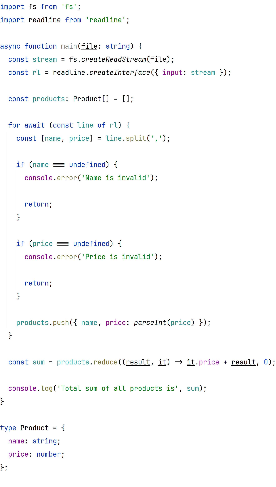

Считыватель продуктов

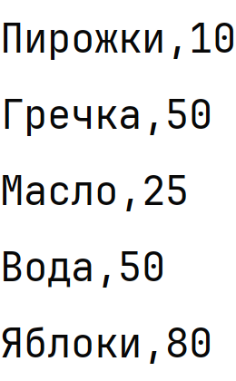

Пример файла списка продуктов

Функция `main` хоть и является относительно небольшой, но уже вызывает некоторые сложности в своём восприятии.

Отобразим данную функцию на диаграмме компонентов, сейчас общая структура решения является тривиальной:

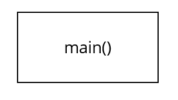

Таким образом на диаграммах будут отображаться сущности, в данном случае это функция main

## Первая модификация

Смоделируем следующую ситуацию, приходит заказчик и говорит: "Сотрудники, что поставляют нам файлы со списком продуктов
решили что в качестве альтернативного источника предоставят API метод, который вернет текущий список по
переданной дате".

Каким образом программа среагирует на данное изменение? Сначала обозначим текущую секцию функции, в которой происходит
обработка файла.

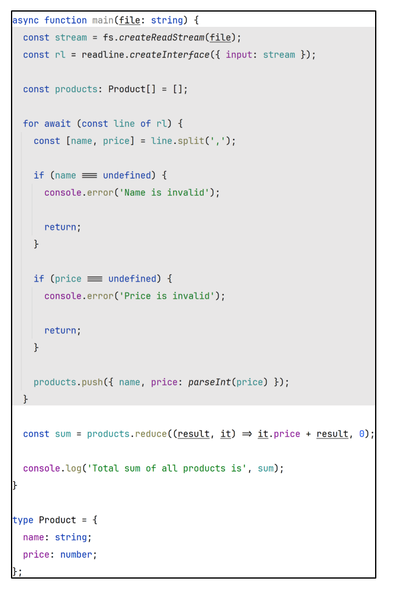

Место обработки файла

Сразу стоит отметить следующие проблемы, которые могут потенциально помешать внести требуемые изменения:

* Программу используют много разных пользователей. Согласно требованиям, добавляется *альтернативный* метод поставки
  данных, то есть текущее поведение должно сохранится для тех клиентов, что предоставляют продукты по старому, с помощью
  локальных файлов.
* Требуется добавить новый метод получения данных. Тем не менее, для того чтобы это сделать, придется явно
  взаимодействовать с кодом достающим продукты по старому, хотя с точки зрения задачи данные операции не являются
  релевантными.

Начнем с самого простого решения:

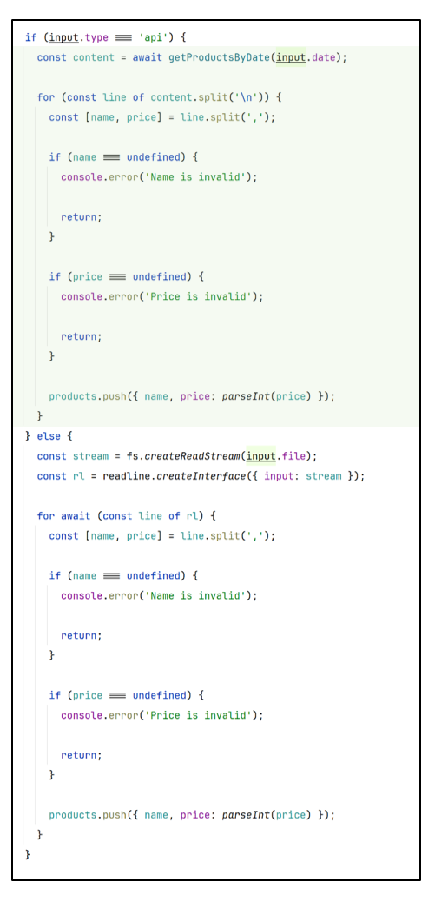

Наивное решение

Поведение программы удовлетворяет новым требованиям. Теперь, система может обрабатывать ввод как в виде обычных файлов,
так и со стороны внешних источников данных API. Помимо тех сложностей, что мешали внесению изменений, итоговое решение
также стало обладать сомнительными качествами:

* Функция `main` стала еще больше
* Появились повторяющиеся элементы между получением продуктов из API и из файла

Функция `main` получила свою первую модификацию. Можно с уверенностью сказать, что она приобрела свою первую причину для
изменения, то есть ответственность другими словами:

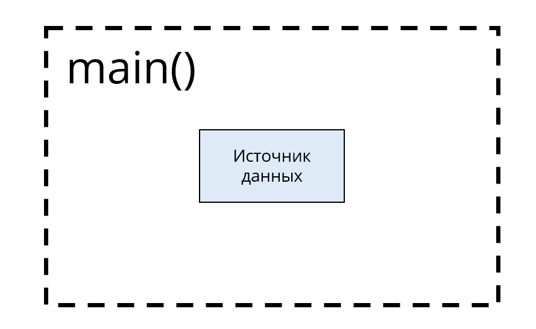

Первое, что изменилось, это источник данных. Ответственность обозначается как блок со своим цветовым индикатором и описанием

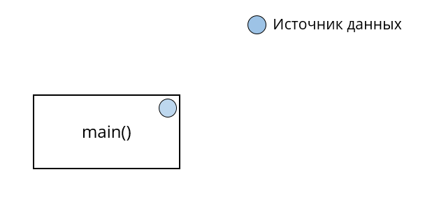

Сокращенный вид. Индикатор в углу означает наличие ответсвенности или причины для изменения

## Превентивные меры

Программа получила свое первое изменение или другими словами причину для него. Такое событие должно служить подсказкой
для инженера, склонять его к определенным действиям. О каких действиях идет речь? О превентивных мерах. Если что-то
поменялось один раз, оно имеет отличные шансы измениться ещё раз в будущем.

Исходя из этого, было бы неплохо организовать структуру таким образом, чтобы подобная задача, при своём повторном
возникновении, отняла как можно меньше времени и сил у разработчика.

Вспомним, что одной из проблем при реализации нового метода получения данных, был тот факт, что разработчику также
приходилось взаимодействовать и со старым способом получения продуктов из файла. Это можно легко исправить, вынесем
каждый из методов получения данных в отдельные функции:

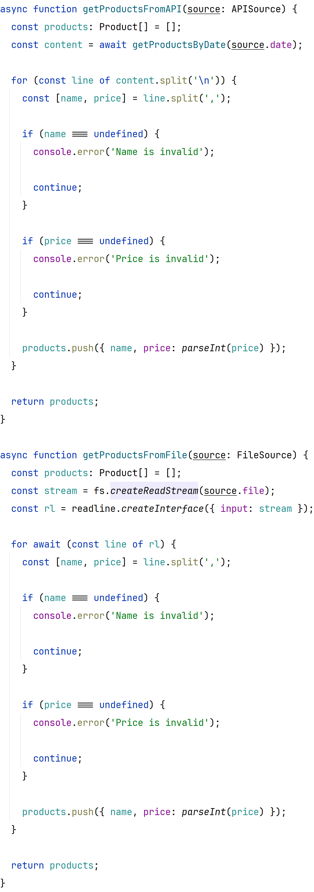

Отдельные функции чтения

Далее, в самом main подменим условие:

Новый вид условия

Функция main стала гораздо меньше. Рассмотрим актуальную диаграмму компонентов и их ответственностей.

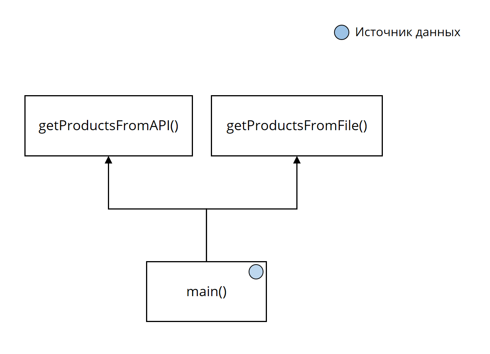

main напрямую ссылается на функции получения данных

Исходя из ответственностей, при добавлении нового источника данных изменится только содержимое функции `main` и
действительно, всё что потребуется сделать, так это добавить новую ветку в условие и реализовать новую функцию.

Существующие реализации остальных источников данных не будут затронуты, более того, разработчику не придется даже
утруждать себя и заглядывать внутрь реализации этих функций, так как для добавления нового способа получения продуктов в
этом скорее всего не будет никакой нужды.

## Разделение ответственностей

Постойте, но где же то самое разделение ответственностей?

Взглянем на функцию main еще раз:

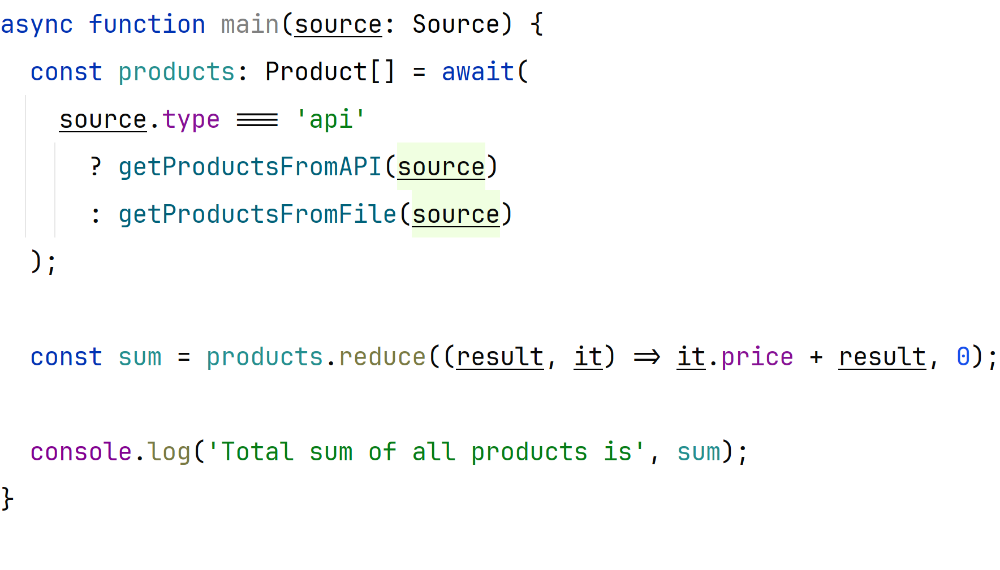

Помимо получения продуктов, в функции происходят дополнительные операции, перечислим их явно:

* Подсчитывается общая сумма продуктов
* Результат выводится в консоль

Сгруппируем все эти операции под одну общую отдельную ответственность:

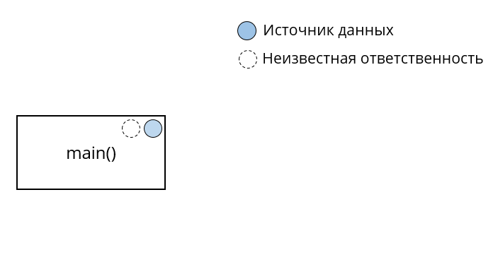

Неизвестная ответственность отмечена штрихом

Обратите внимание на то, что у ответсвенности на диаграмме нет цвета, так как для нас неизвестна её природа, её
*источник*. Будет ли вывод данных меняться независимо от логики подсчета? Для того чтобы это понять, данный код должен
измениться, то есть должен найтись такой человек или такая причина, по которой эти секции потребуют своей модификации.

Однако можно сказать наверняка - данная ответственность является *отдельной*. Распишем последнее утверждение несколько
подробнее.

Исходя из истинного определения SRP, ответственность есть нечто иное как причина для изменения модуля. Под изменением,
здесь понимается в целом работа с исходным кодом: его чтение и модификация.

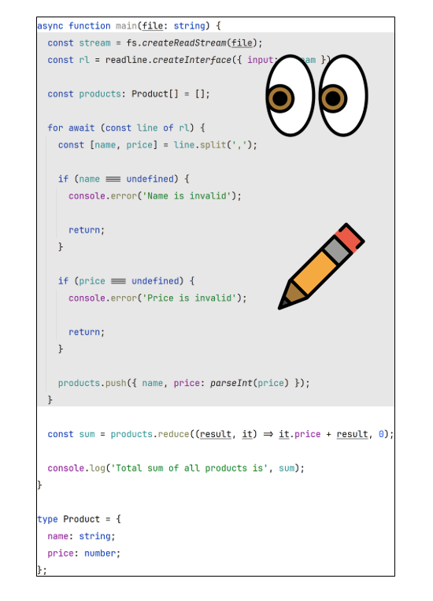

В случае с main это была секция относящаяся к источникам данных. Определенный код был полезен в качестве чтения, другой - требовал своей модификации

Не весь код оказался полезным в рамках добавления нового источника данных, некоторая его часть оказалась шумом:

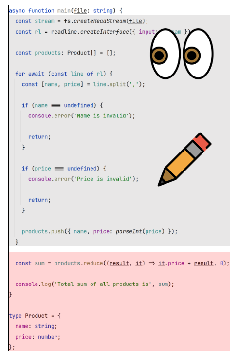

Информационный балласт

По итогам реализации задачи, только верхняя секция функции main изменилась, в то время как все что идет ниже, осталось в
своём первозданном виде:

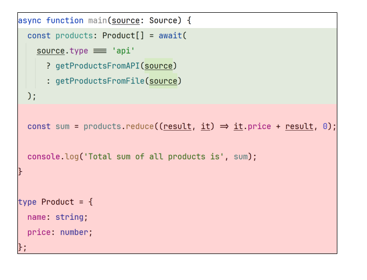

Зеленным отмечена разница, красным - то что осталось прежним

Это означает, что функция `main` содержит в себе поведения, которые изменяются в *разное время* в рамках разных, не
связанных между собой задач. То есть эти две секции имеют *разные* причины для изменения, просто пока неизвестно какие
именно.

Несмотря на кажущуюся скупость имеющейся информации, можно уже сейчас воспользоваться SRP и разделить `main` явно:

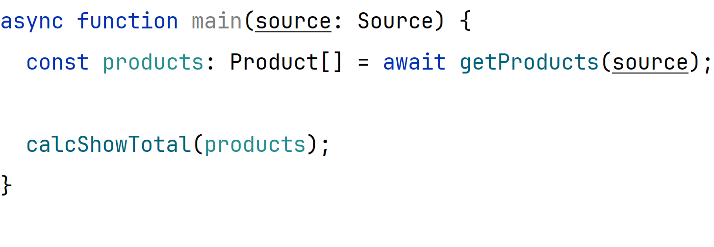

main после разделения

На диаграмме ситуация выглядит следующим образом:

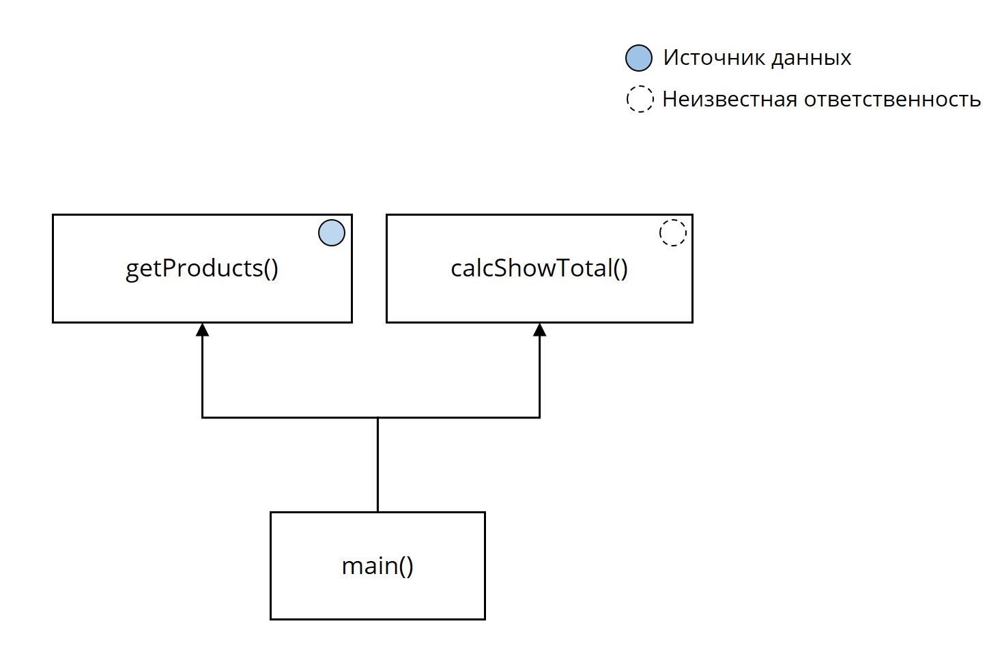

main после разделения на диаграмме

Теперь, система удовлетворяет SRP, каждый из компонентов на диаграмме содержит одну ответственность.

При срабатывании определенных на диаграмме ответственностей, будут задействованы элементы программы с меньшим
объемом, что были до этого.

Но действительно ли разделение стоило того, особенно учитывая небольшие размеры исходной функции?

## Новая ответственность

Спустя некоторое время, пользователи системы обнаруживают, что зачастую файлы и API возвращают продукты с негативной
ценой:

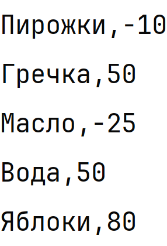

Пример некорректного содержимого файла

Обсудив проблему с заказчиком, было решено доработать функцию валидации данных, чтобы она не пропускала такие продукты
дальше.

Внимательно изучив код, разработчик обнаруживает достаточно интересный факт - обе функции получения продуктов содержат
идентичный код валидации.

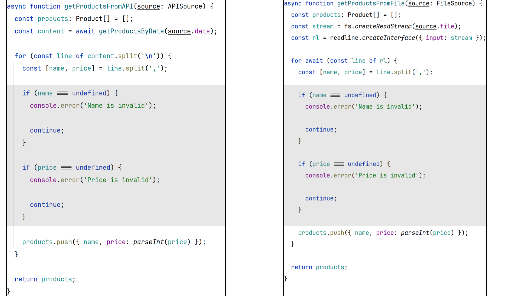

Валидация данных от API и от файла полностью совпадает

После внесения изменений, файл выглядит следующим образом:

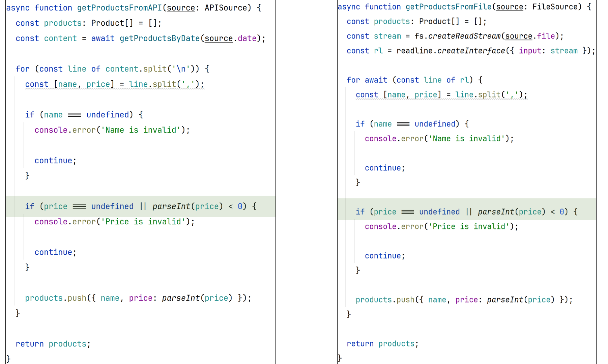

Результат изменений 

На что стоит обратить своё внимание - обе функции `getProductsFromAPI` и `getProductsFromFile` изменились в результате
одной и той же задачи. Это означает, что между ними есть общая ответственность или общая причина для изменений:

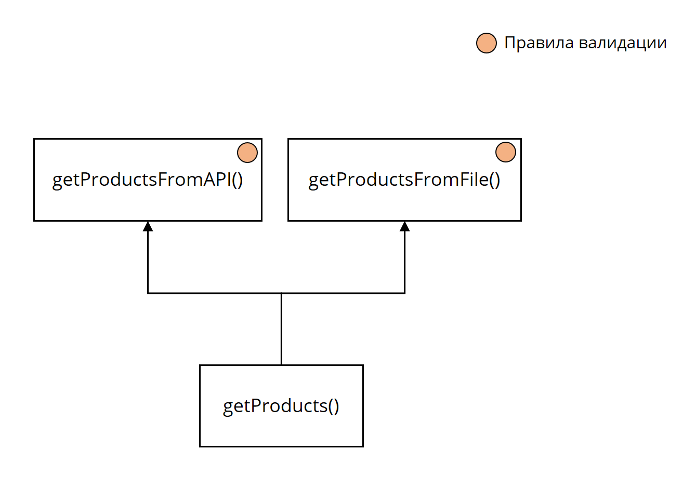

Общая ответственность на диаграмме с индикаторами ответственностей

Итак, программа испытала стресс ввиде новой ответсвенности. Основная проблема при внесении изменений заключалась в том
что их пришлось в точности повторить для каждого из источников данных. Если в будущем альтернативных источников данных
станет больше и правила валидации будут меняться часто, это может негативно повлиять на производительность труда на
проекте.

Вынесем общую, по ответственностям, между методами получения данных часть в отдельную функцию:

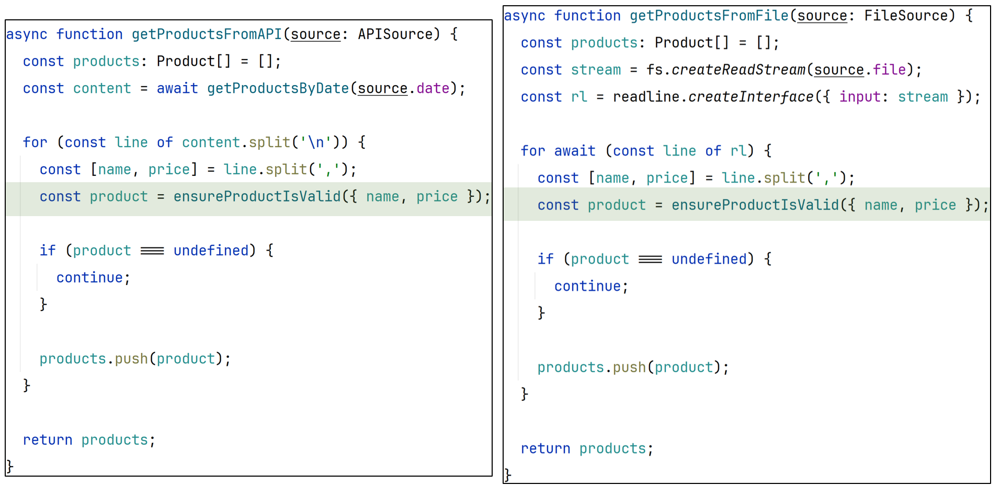

Общая функция ensureProductIsValid

Взглянем на то, каким образом изменились ответсвенности на диаграмме:

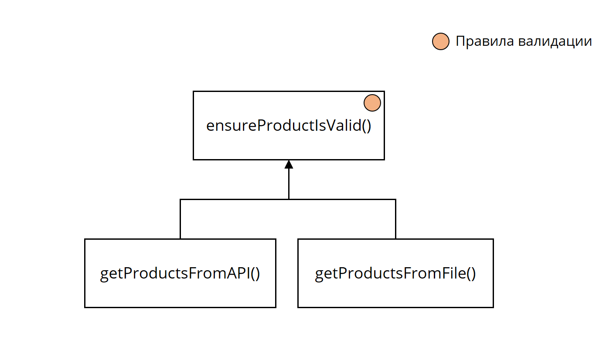

Новое расположение ответсвенности валидации

И действительно, теперь, при возникновении новых требований для валидации, все изменения будут сконцентрированы в одном
месте и автоматически выполняться для всех источников данных.

## Дублирование

А теперь про слона в комнате. Очевидно, что предыдущая ситуация была связана с явным повторением кода валидации. Он был
полностью идентичным между двумя функциями получения продуктов, так почему же не называть вещи своими именами? Зачем
пытаться объяснить проблему косноязычно, через ответсвенности?

Попробуем руководствоваться известным правилом DRY и выносить все что дублируется в отдельные сущности, в частности,
обратите внимание на то, что данные секции полностью повторяются между двумя источниками данных:

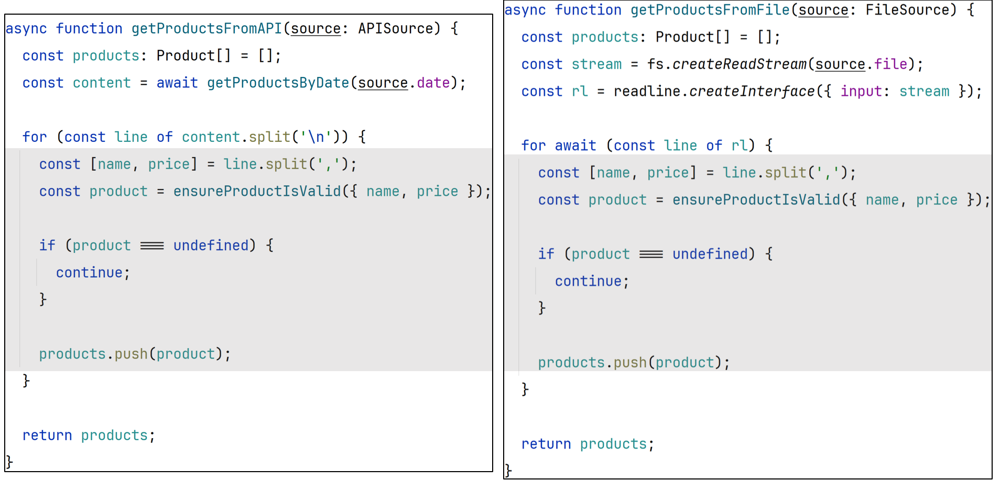

Идентичный код

Вынесем его в отдельную функцию:

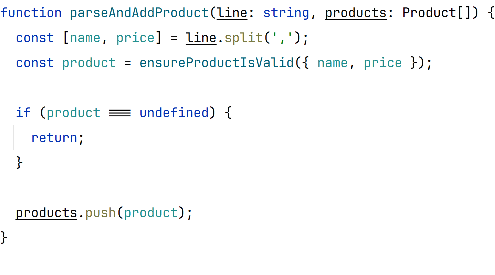

Новая общая функция

Так она используется в одном из источников данных:

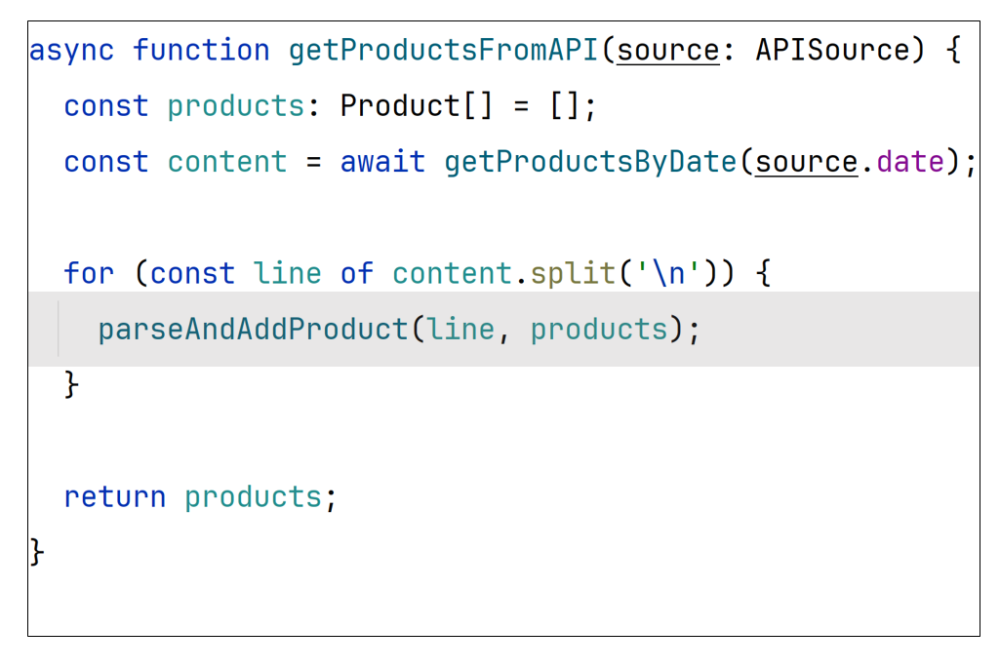

Кода действительно стало меньше, для кого-то, он даже стал более читаемым*. Так зачем же утруждать себя рассуждениями о
причинах изменения, ответственностях, если можно просто визуально определить идентичный код и вынести его в отдельный
метод?

* Маловероятно, что это так, особенно ввиду наличия сайд-эффекта на products

## Новое изменение

Спустя некоторое время, разработчики предоставляющие списки продуктов через API заявили: "Теперь, в качестве разделителя
параметров продукта будет использоваться символ `|`, а не `,` как прежде". Каким образом система отреагирует на данное
изменение?

Напомним, что сейчас, конкретный разделитель зашит внутри общей функции `parseAndAddProduct`:

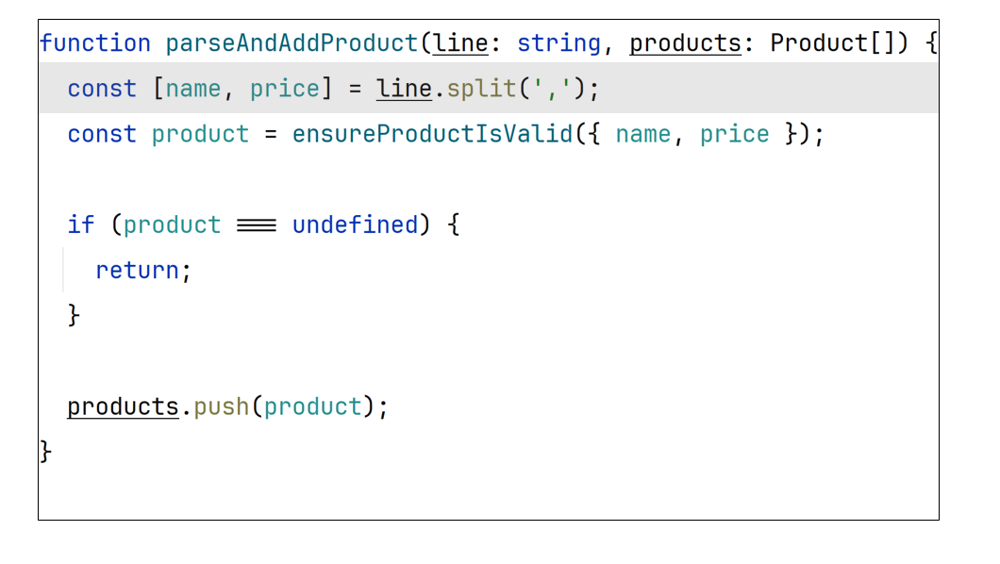

Но в тоже самое время, требование предполагает изменение *исключительно* логики получения продуктов из API, то есть
функции `getProductsFromAPI`:

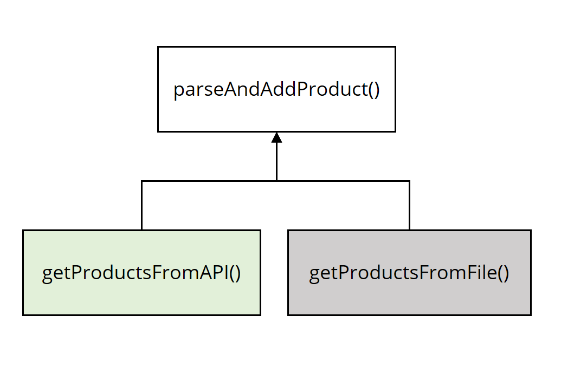

То есть теперь общая функция создания продукта должна поддержать два разных поведения, которые будут выбираться
*взависимости* от того, кто является клиентом.

Попробуем сделать то, что в таких ситуациях предпринимается чаще всего:

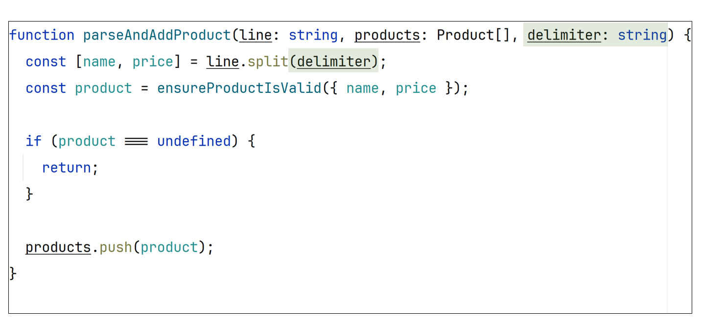

В функцию добавился отдельный аргумент

Общая функция теперь стала чуть более *абстрактной*, конечно, ей же теперь нужно поддержать больше возможных поведений.

Обратим внимание вот на что, в результате добавления нового и *обязательного* аргумента, функция `getProductsFromFile`,
та что обратывает продукты из локальных файлов, также требует модификации:

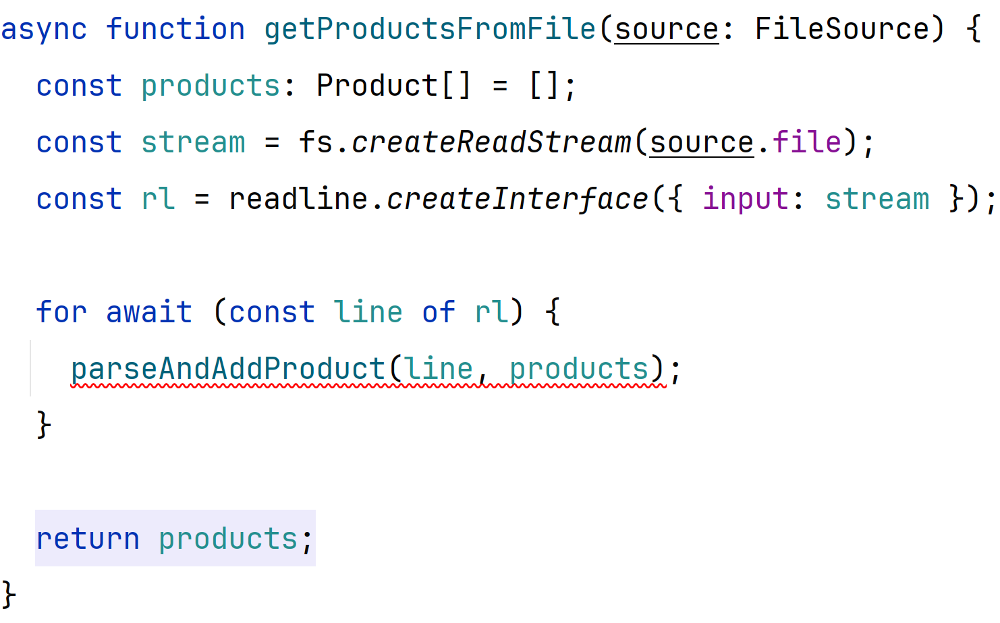

Требуется передать новый обязательный аргумент - delimiter

Изначально пришло требование которое по смыслу относилось к функции `getProductsFromAPI`, но по итогу пришлось менять
те части программы, которые не имели отношения к изначальному требованию вовсе:

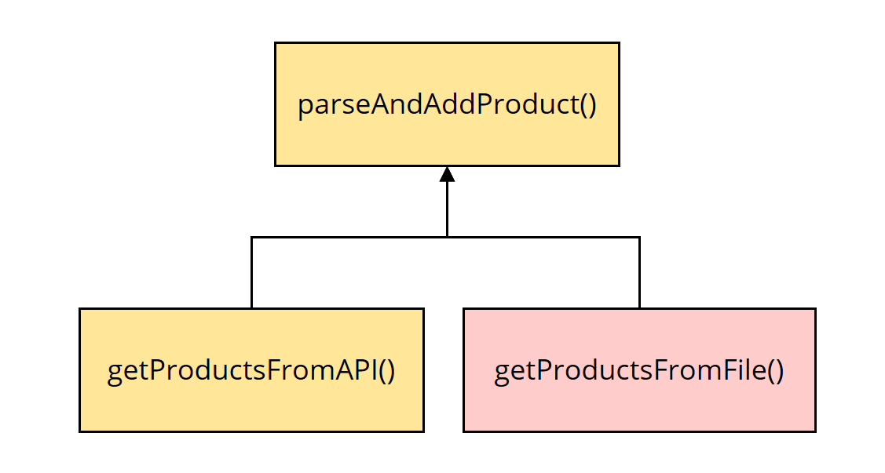

Изменения в parseAndAddProduct привели к каскаду изменений клиентов данной функции. Красным цветом отмечены нежелательные и неожиданные изменения

Текущий дизайн системы, заставил разработчика изменить больше модулей, чем того требовала задача по своему
смыслу. Инженеров попросили поменять дверь, а в итоге им пришлось снести фундамент и строить всё заново.

Такое свойство дизайна называется *жесткостью*.

Дизайн называется жестким, когда локальное, на первый взгляд, изменение требует корректировки неожиданно большого числа
взаимозависимых модулей.

Если говорить языком ответственностей, то ситуация *в моменте* выглядит так:

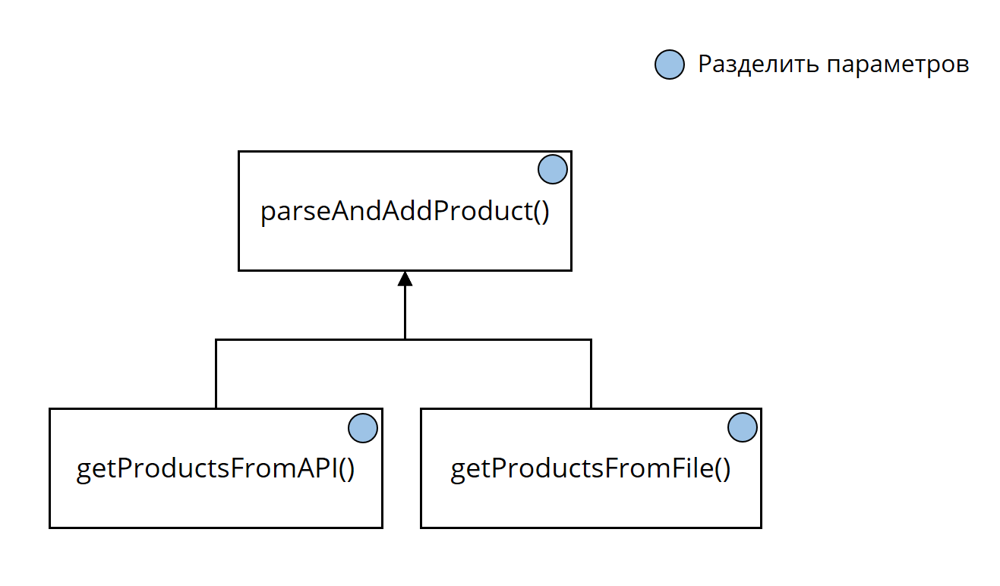

Причина для изменения в данном случае это конкретный разделитель параметров продукта в файле

Изменение `getProductsFromAPI` ведь именно там добавился новый разделитель. Но из-за того что общая `parseAndAddProduct`
была завязана на данную ответственность, её также пришлось изменить. Последнее в итоге вынудило
функцию `getProductsFromFile` также поменяться, причём в рамках этой же задачи. Выглядит так, как будто ответственность
*протекла* в те части системы, в которых находится не должна была вовсе.

### Еще один признак

Главная причина по которой функция `getProductsFromFile` потребовала изменений - это несовместимость
новой `parseAndAddProduct` со своей старой версии. Она стала требовать от своих клиентов *больше*, чем было до этого.

Возможно ли поддержать новый разделитель и при этом сохранить сигнатуру функции `getProductsFromFile` совместимой с уже
существующими клиентами? Легко:

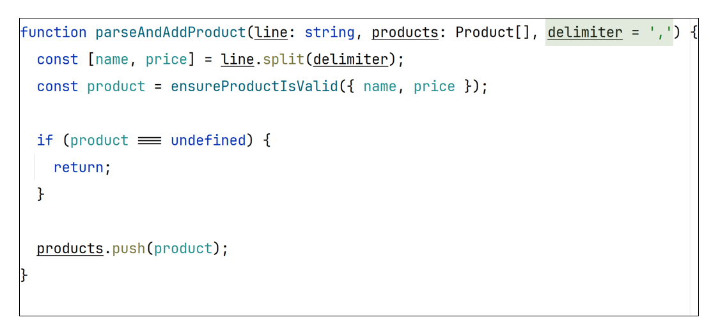

Функция принимает опциональный аргумент

В таком случае, действительно, `getProductsFromFile` останется нетронутой, ведь требуемое ею поведение станет по
умолчанию. Система уже не кажется такой жесткой, ведь изменения сконцентрированы в меньшем числе компонентов. Но
действительно ли все так в порядке, как кажется на первый взгляд?

Разберем то, что произошло на самом деле, реализация `parseAndAddProduct` была изменена. Любая модификация функции
имеет все шансы оказать негативный эффект на наблюдаемое поведение, вызывать *регресс* другими словами.

В данном пример, хоть `getProductsFromFile` и не потребовал изменений, его поведение могло измениться, ведь исходный код
одной из используемых им частей был изменен:

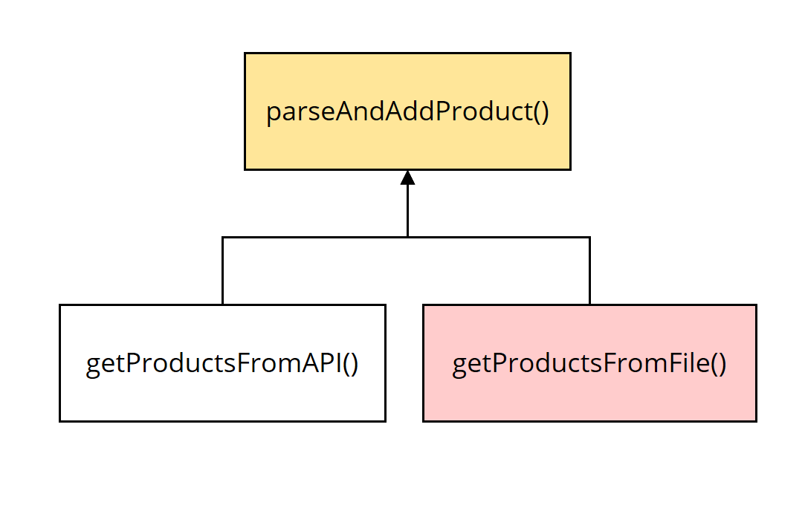

Функцию все равно придется перепроверить

Такой свойство также является одним из проявлений дизайна и имеет название `хрупкость`. Основным виновником здесь всегда
является некий общий компонент, модификации которого влияют не только на какого-то конкретного клиента, но и на всех
остальных его пользователей.

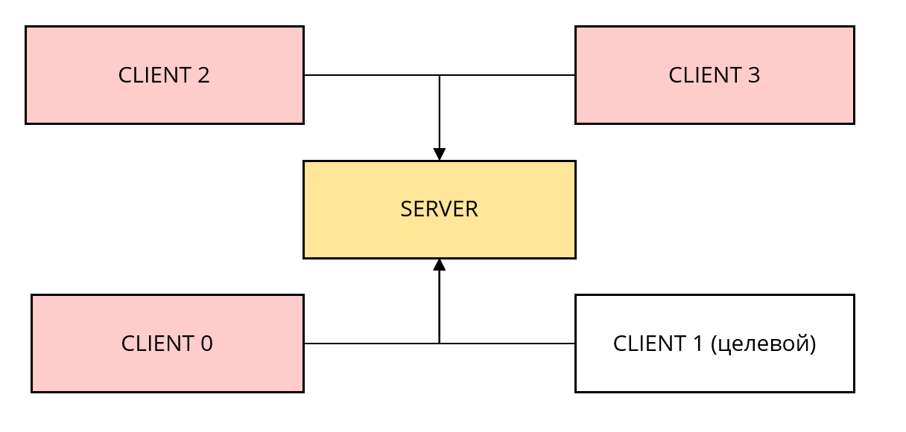

Целевой клиент, для которого и предназначалось изменение, не отмечен красным, ведь изменения в его поведении являются ожидаемыми, в отличии от большинства остальных

Хрупкость является нежелательным свойством по ряду причин:

* Поведение легко сломать - действительно, чем больше имеет клиентов изменяемый компонент, тем сложнее сохранить
  поведение для них валидным. Человеческий фактор дополнительно усугубляет дело, никто не будет постоянно перепроверять
  поведение каждого из компонентов.
* Дефекты легко пропустить - чем больше компонентов и сложнее связи, тем труднее понять чем конкретно откликнется та или
  иная модификация компонента.

С точки зрения ответсвенностей здесь также присутсвует небольшая проблема, если разделители поменяются для продуктов из
локальных файлов, то в таком случае изменится общая функция `parseAndAddProduct`, а не `getProductsFromFile` как
ожидается логически:

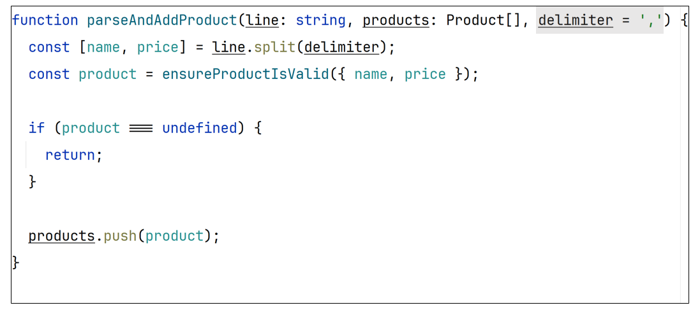

Общая функция фиксирует в себе поведение конкретного клиента, тем самым приобретая новую ответственность

### Ещё немного изменений

Наша программа пользуется большим успехом. Спустя несколько месяцев после релиза заказчик решает несколько доработать
систему, а именно - для продуктов полученных из локального файла (функция `getProductsFromFile`) необходимо немного
иначе проводить обработку невалидных строчек, а именно, вставлять в качестве продукта `Невалидный продукт` и указывать
его сумму как `0`, а не просто пропускать продукт как это происходит сейчас:

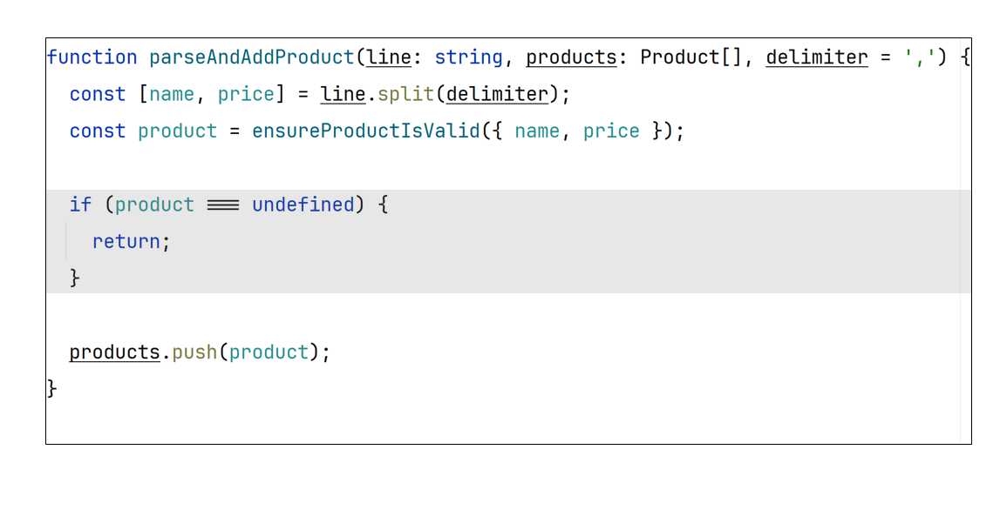

На лицо имеем ту же ситуацию, что и прежде:

* Требование предназначено для конкретного источника данных
* Реализация требует изменения общего компонента

Для начала, попробуем решить проблему в лоб, через добавление флага:

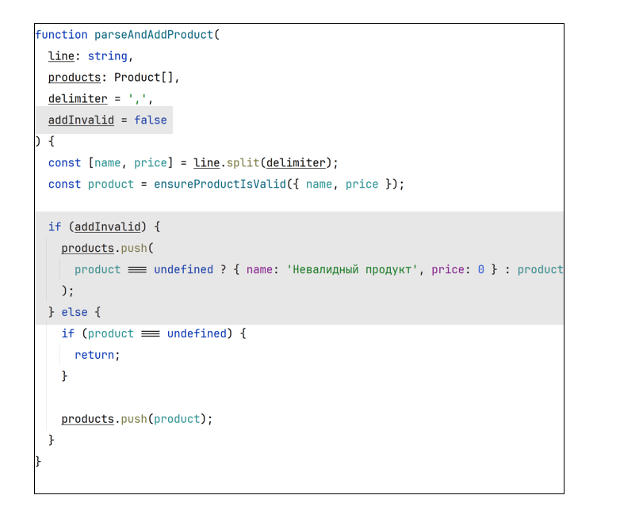

Флаг, разграничивающий поведение

Помимо проблем обозначенных уже ранее, функция стала больше, более того, она стала сложнее, ведь у неё теперь
больше различных условий внутри. Но это лишь то что лежит на поверхности, попробуем копнуть несколько глубже.

Прежде всего, стоит обратить внимание на один занимательный факт - изменение, чисто логически, предназначалось для
продуктов, полученных из файла (функция `getProductsFromFile`), но большая часть логики оказалась внутри общей
функции `parseAndAddProduct`.

Обе функции содержат в себе одну и ту же причину для изменения - а именно логика обработки невалидного продукта.

Посмотрим на общую схему:

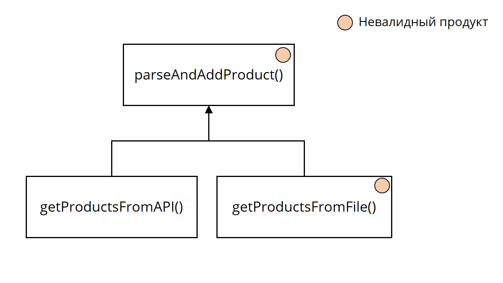

Обратите внимание на то, что каждый раз когда будут поступать изменения касательно работы невалидного продукта взятого
из локального файла, функция `getProductsFromAPI` также должна будет проверена повторно. И действительно,
раз `parseAndAddProduct` содержит данную ответственность, то она обязана быть модифицирована (по определению),
следовательно, все клиенты которые от неё зависят, должны будут протестированы во избежание регресса.

Обратите внимание на то, что даже при условии сохранения обратной совместимости (исключения жесткости), дизайн все равно
проявляет негативные характеристики относительно входящих в него изменений.

К сожалению, тут проблемы только начинаются. Вспомним что функция `parseAndAddProduct` содержит в себе и
дополнительную ответственность, которая представляет собой все, что функция делает помимо обработки невалидного
продукта:

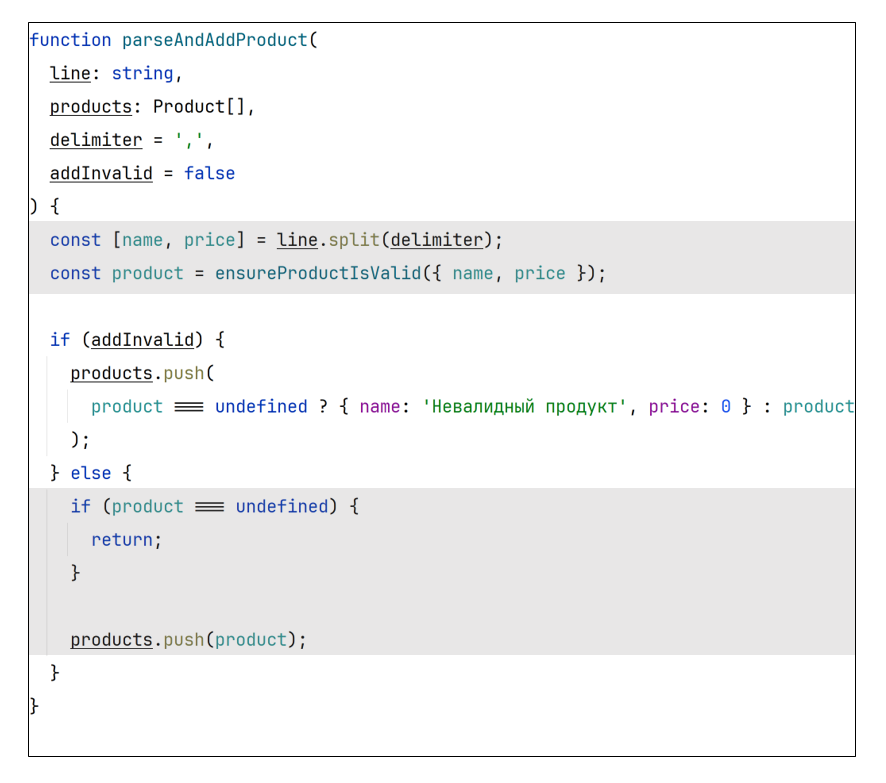

На диаграмме это выглядит следующим образом:

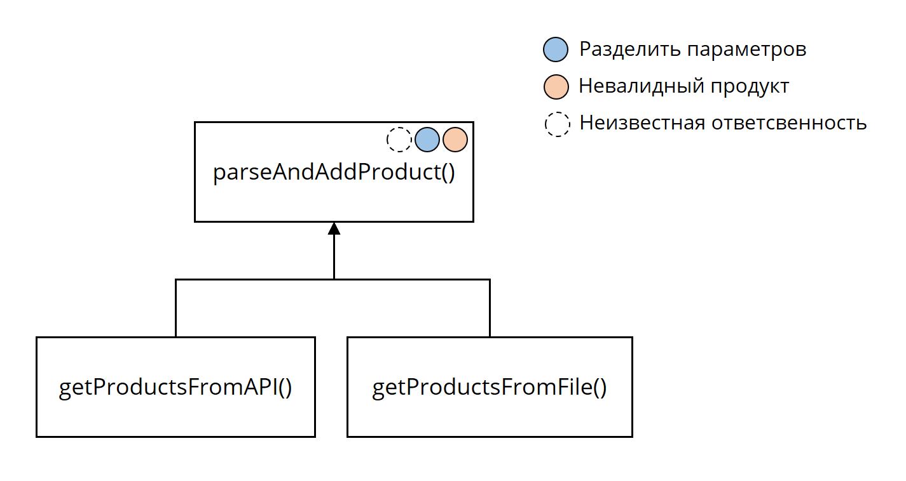

Функцию пришлось изменять по указанным на диаграмме причинам

Функция `parseAndAddProduct` является *ответственной*, то есть от неё зависят много клиентов, в то время как она сама
не зависима ни от кого. Ответственные компоненты трудно изменять напрямую, как раз вследствие существования их
пользователей, которые к каждой такой модификации будут чувствительны, либо явно через *жесткость*, либо неявно через
*хрупкость*.

В данном случае, наличие у `parseAndAddProduct` нескольких ответственностей прежде всего говорит о том, что такой
элемент будет изменяться *чаще* чем обычно. При этом, каждая модификация будет дополнительно усложнена жесткостью и
хрупкостью дизайна.

Ситуация с флагами (и прочими условными конструкциями) в общих компонентах должна быть знакома каждому. Почему так
происходит?

Прежде всего всему виной неверное определение того что является дублированием, а что нет.

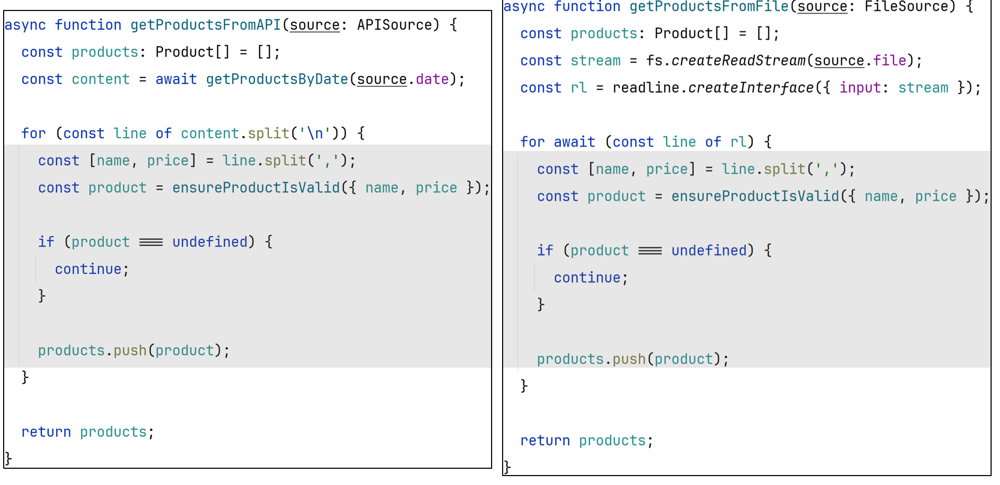

Несмотря на визуальную схожесть функций источников между собой, ответсвенности данных секций со временем оказались
*разными*, что и привело в итоге к дизайну, плохо адаптированному под рассмотренные изменения:

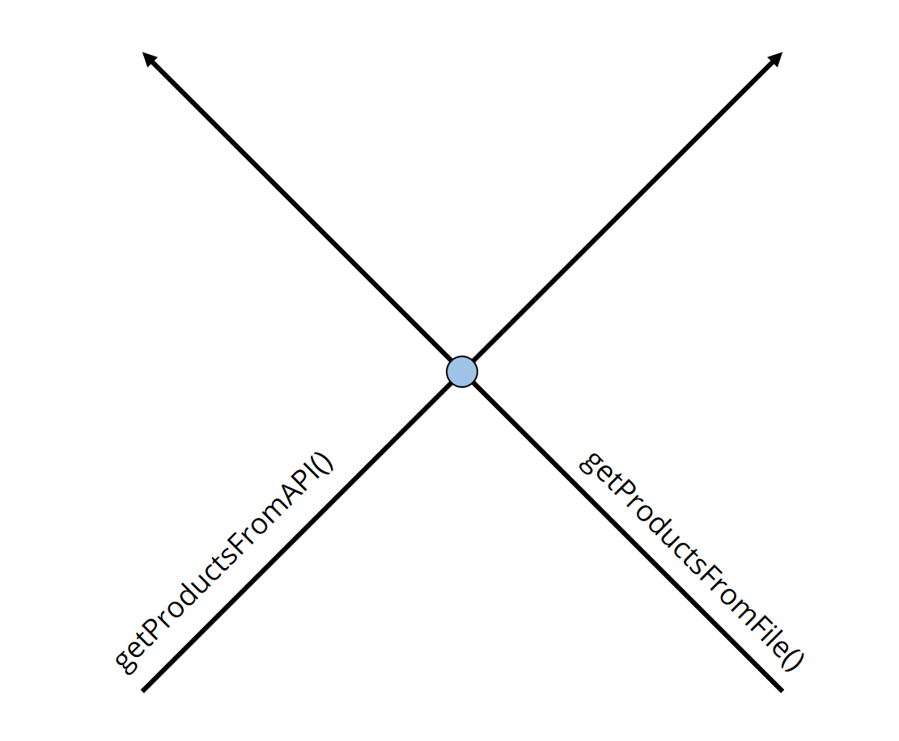

Векторы изменений обеих функций пересеклись в некоторой точке, что и привело к временному дублированию

Основные драйверы изменений в источниках данных были разными, вследствие чего общий
компонент `parseAndAddProduct` начал раздуваться, пытавшись покрыть все более разрозненные требования от совершенно
разных клиентов привнося в дизайн признаки жесткости и хрупкости.

## Истинное дублирование

Что же тогда такое настоящее дублирование? Дублирующим, называется код, удовлетворяющий двум основным критериям:

* Код обладает одинаковым наблюдаемым поведением
* Код обладает одинаковыми ответственностями

Ответсвенности, как говорилось ранее, это прежде всего источники или причины для изменений. Для того чтобы их четко
определить, *эти изменения должны произойти*. До тех пор, пока компоненты не менялись, избавляться от дублирования
следует с особой осторожностью. По сути, преждевременное обобщение похоже на игру где нужно руководствуясь своим опытом
или просто везением угадать, а что же в будущем будет изменяться синхронно и в одном направлении, а что нет.

Пример с валидацией оказался *истинным дублированием*:

* Правила валидации оказались идентичными для обоих источников данных
* Новое требование потребовало одновременно и одинаковым образом поменять обе функции

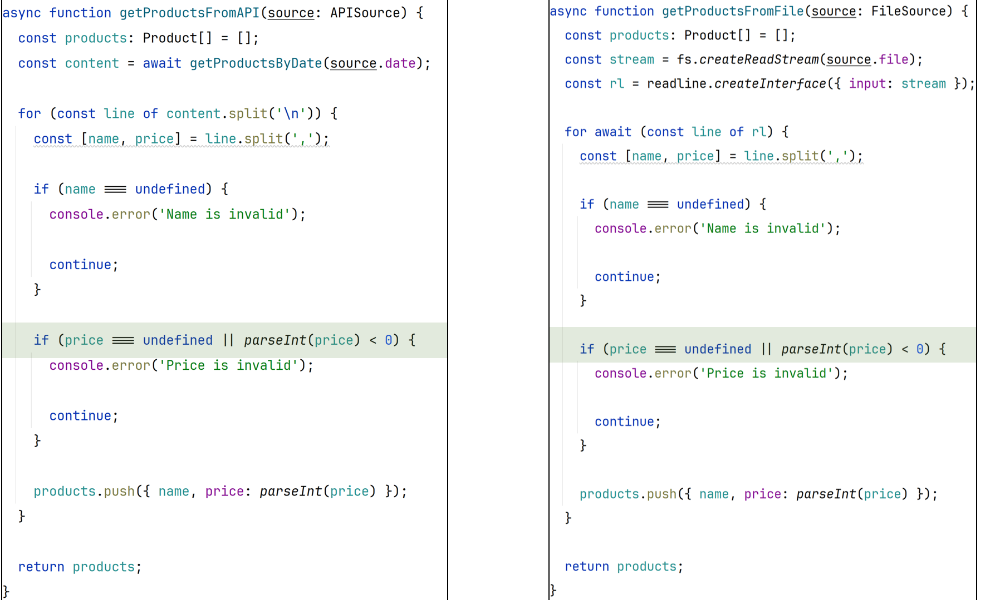

Обратите внимание, что в описании признаков истинного дублирования ни слова не сказано про то, что код должен быть
одинаковым - он может быть абсолютно разным, но при этом являться дублирующим, а может совпадать на 100%, как это было
с `parseAndAddProduct()`, но уже попадать под категорию *ложного дублирования*.

С точки зрения диаграмм ответственностей, истинное дублирование выглядит следующим образом:

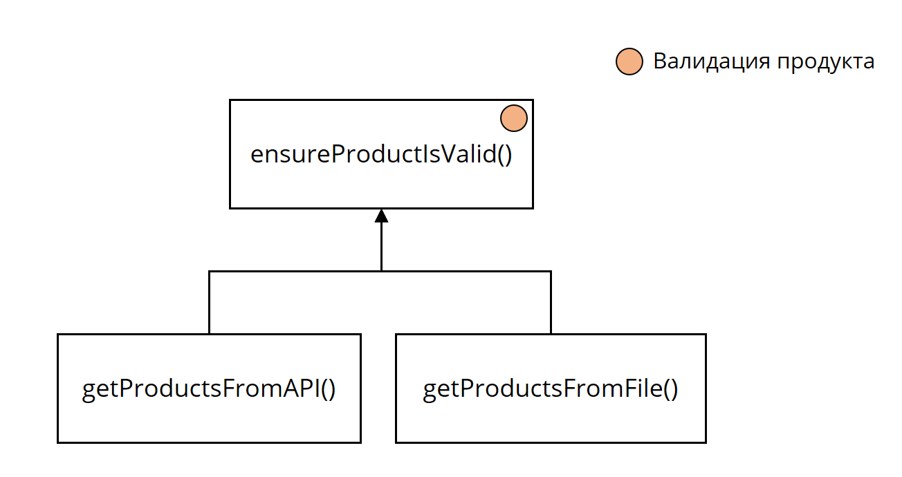

Ответственности при истинном дублировании

Обратите внимание, что клиенты *используют* ответственность валидации между собой. Это означает, что любые изменения в
логике проверки продукта инициированные одним клиентом, будут полезны и для всех остальных пользователей
функции `ensureProductIsValid`. А вот как бы выглядела ситуация если бы функции `ensureProductIsValid` не существовало:

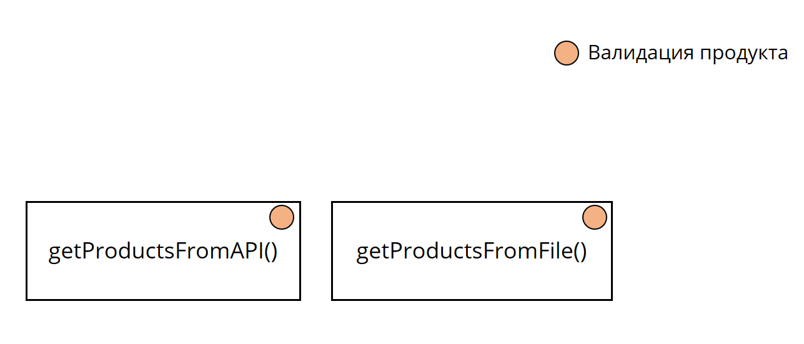

За счёт добавления общей функции, удалось сократить количество изменяемых модулей в два раза. Интересно, но в данном
примере происходит не разделение ответственностей, так как она одна, а скорее её *перемещение* в один единственный
компонент.

Теперь рассмотрим ложное дублирование, также через диаграммы ответственностей:

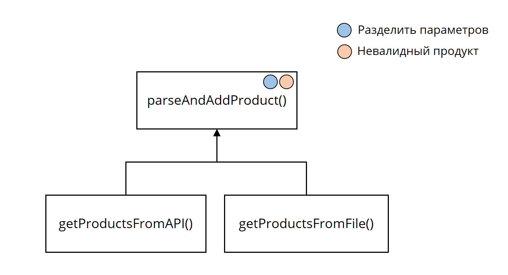

Теперь посмотрим что будет с ответственностями, если от данной функции избавиться:

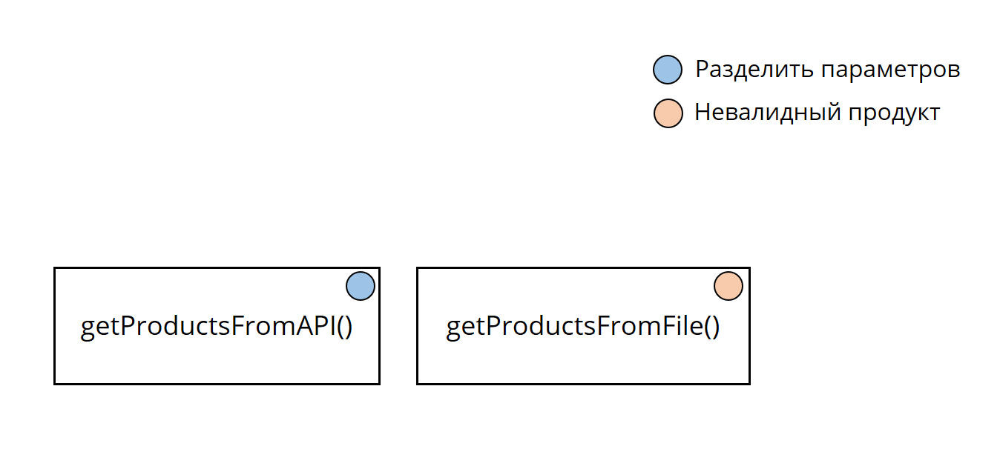

Обратите внимание на то, что количество ответственностей от этого не изменилось, не уменьшилось также и количество
затрагиваемых модулей для каждого источника изменений по отдельности.

По сути, добавив общий компонент, инженеры ничего не выйграли, наоборот, только сильнее усложнив модификацию системы,
ведь как было сказано ранее, общий компонент содержащий в себе несколько ответственностей изменять достаточно не просто
в силу проявляющейся жесткости и хрупкости дизайна.

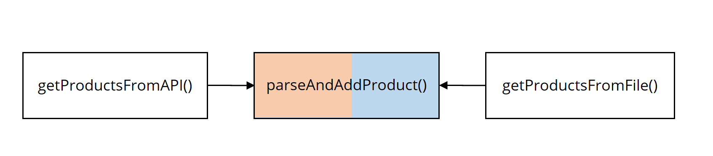

Общий компонент как-бы разрывается между двумя клиентами, выполняя совершенно разные функции

Вместе со срабатыванием конкретной ответственности функция `parseAndAddProduct` входит в что-то вроде суперпозиции,
где она, в рамках взятого источника изменений, преобразуется для одного клиента (для которого изменение и
предназначено), но остается неизменной для всех остальных.

Это можно сравнить с игрой в Твистер, где с каждым новым раундом, нужно переместить определенную часть своего тела, но
сохранить при этом всё остальное на прежних местах. Это сделать не просто, так как в организме, как и в любой другой
сложной системе, все зачастую связанно между собой.

Ровно тоже самое происходит и внутри таких функции, где между разными ответственностями редко стоят четкие границы,
напротив, зачастую они сильно между собой переплетены, тем самым только сильнее усложняя задачу.

### Больше абстракций

Сделаем небольшой шаг назад и подумаем, а можно ли поддержать новое требование, не прибегая к использованию флагов и
примешиванию новой ответсвенности общему компоненту? Конечно, мы могли бы использовать схожую абстракцию как с примером
с разделителем:

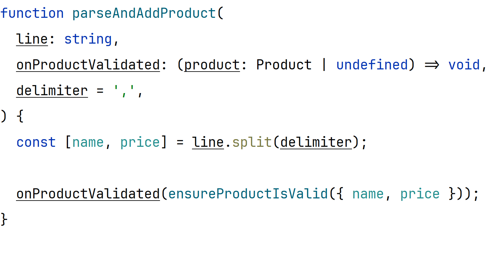

Новый параметр

Далее, каждый клиент передаёт свою реализацию в соответствии с контекстом.

Прежде всего, как было показано ранее, добавление нового обязательного аргумента приведет систему в состояние жесткости.
Вариант со значением по умолчанию привёл бы нас к той же ситуации, что была рассмотрена ранее, где `parseAndAddProduct`
приобрел несколько ответственностей.

Если взглянуть на функцию `parseAndAddProduct` еще раз можно обратить внимание на то,
что она ничего особого не делает, другими словами она стала *ленивой*. Смысла в её существовании не так уж и много, это
один из признаков *избыточности*.

Более того, в системе стало еще больше абстракций, добавился новый аргумент, а вместе с ним и общий тип. Конкретное
поведение системы теперь сложнее понять, инженеру прийдется собрать этот пазл воедино, для того чтобы увидеть картину
целиком. Естественно чем таких кусочков больше, тем сложнее выходит сама задача в целом.

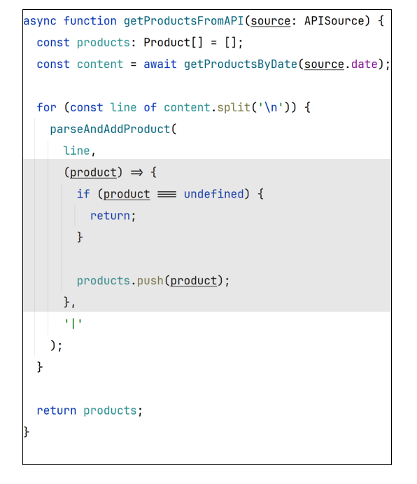

Пример использования общей функции

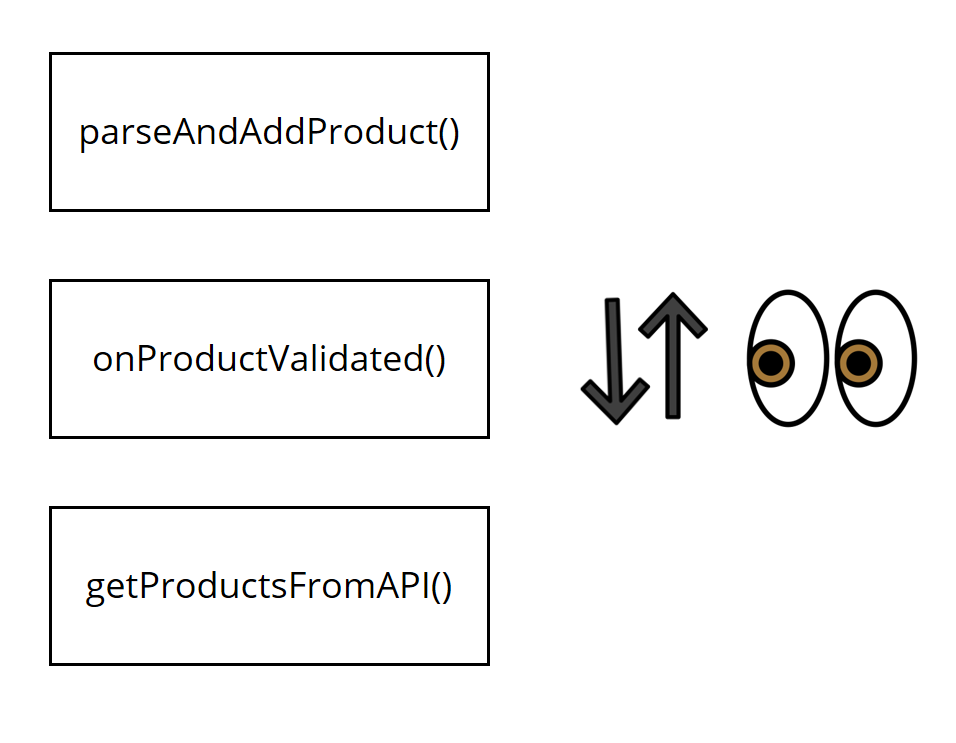

Внимание будет *скользить* по разным слоям системы

Всё увеличивающаяся разница в поведении между `getProductsFromAPI` и `getProductsFromFile` будет со временем
делать `parseAndAddProduct` всё абстрактнее, проявляя описанные проблемы всё сильнее.

## Решение проблемы

Каким же образом можно поступить в данном случае? Одним из вариантов решения проблемы является тактика выжидания. Вместо
того чтобы спешить и избавляться от того, что нам кажется одинаковым, стоит взять таймаут и понаблюдать над тем каким
образом система будет развиваться со временем.

Поступающие от заказчика и других пользователей системы изменения будут указывать нам на ответсвенности разных
компонентов. Беря во внимание данную информацию и учитывая схожесть (либо различие) в поведении, можно с гораздо большей
точностью и успехом сможем верно отличить истинное дублирование от ложного. Например, вот так могла бы выглядеть
система, если была бы разработчики решили немного подождать:

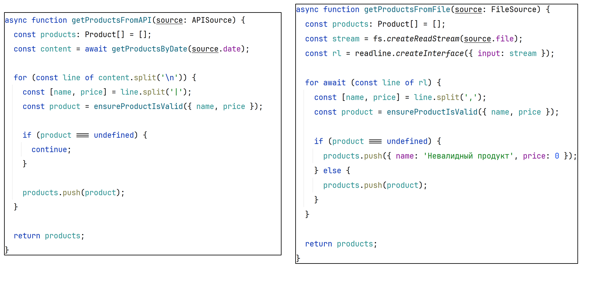

Функции с учётом всех требований если-бы общей части не существовало

Безусловно, между процедурами по-прежнему присутствуют некоторые пересечения, но тенденция очевидна: ввиду наличия
разных
ответственностей, разных причин для изменений, со временем они скорее всего будут отличаться все сильнее. Обратите
внимание на то,
что такая реализация уже не обладает признаками жесткости и хрупкости, а конкретное поведение гораздо проще понять.

Другим вариантом может быть простая *денормализация* - функцию `parseAndAddProduct` можно просто удалить, как только
система проявила бы свои истинные ответсвенности. Но обычно избавляться от общих компонентов сложно, ведь работа уже
сделана и жалко потраченного времени, поэтому в общем случае рекомендуется следовать первому предложенному варианту.

## Выученные уроки

Если взглянуть на прецедент с функцией `parseAndAddProduct` повнимательней, то можно обнаружить достаточно интересный
факт: основными индикаторами ответственностей оказались её *клиенты*, а именно функции `getProductsFromAPI`
и `getProductsFromFile`. Истинным индикатором ложного дублирования стали не чутьё разработчика, не идентичность
исходного кода, а именно пользователи `parseAndAddProduct`.

Со временем, программа имеет очевидную тенденцию изменяться, в частности изменяются её внутренние сущности, которые
могут оказаться пользователями общих компонентов:

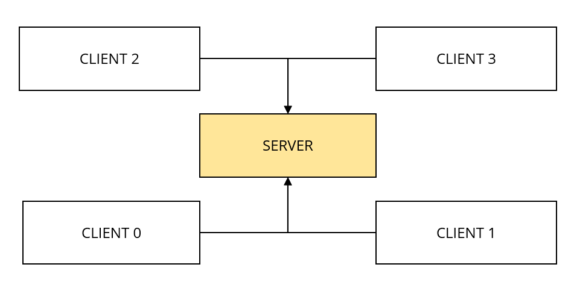

Каждый клиент может потенциально потребовать изменений у общего компонента SERVER

Отсюда и ещё одно определение SRP - "Модуль должен быть ответственен за одного и только одного актора". Актором здесь
представляется некоторый пользователь, который выступает в роли источника изменений. Общий компонент объединяющий всех
своих клиентов по одному актору, считается правильно спроектированным. Если тот же самый компонент, содержит в себе
*разных* акторов от разных клиентов, то это признак явного нарушения SRP и появления потенциальных проблем в будущем,
схожих с теми, что были рассмотрены ранее.

Чем больше ответственностей у общей части, тем чаще она будет изменяться, вызывая жесткость и хрупкость всех своих
клиентов. Во избежание данной ситуации, инженер должен убедиться в следующем:

* Каждое изменение в общем компоненте полезно остальным клиентам
* Изменения, полезные только конкретным клиентам реализуемы без модификации общего компонента, через расширение

К сожалению, редко получается сразу правильно определить ответсвенности компонента и элементы истинного дублирования как
следствие. Для этого всегда нужно некоторое время, в рамках которого будет происходить анализ входящих в систему
изменений и их источников.

## Новый способ вывода

Следующим испытанием для нашего мини проекта стало требование следующего характера - вывод любой информации должен
осуществляться не в консоль, как сейчас, а на сторонний клиент по специальному запросу.

После детального анализа было обнаружено, что несколько функций ссылаются на конкретный способ ввода:

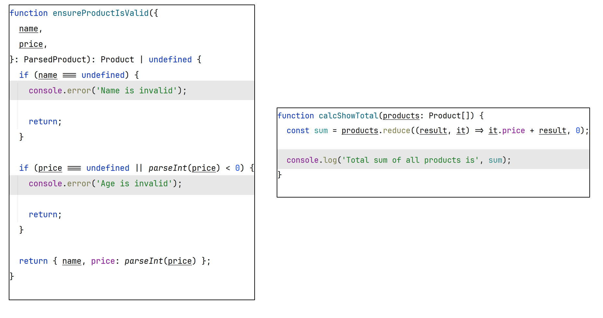

Функции подсчета и валидации ссылаются на конкретный источник вывода

На диаграмме ответственностей это выглядит следующим образом:

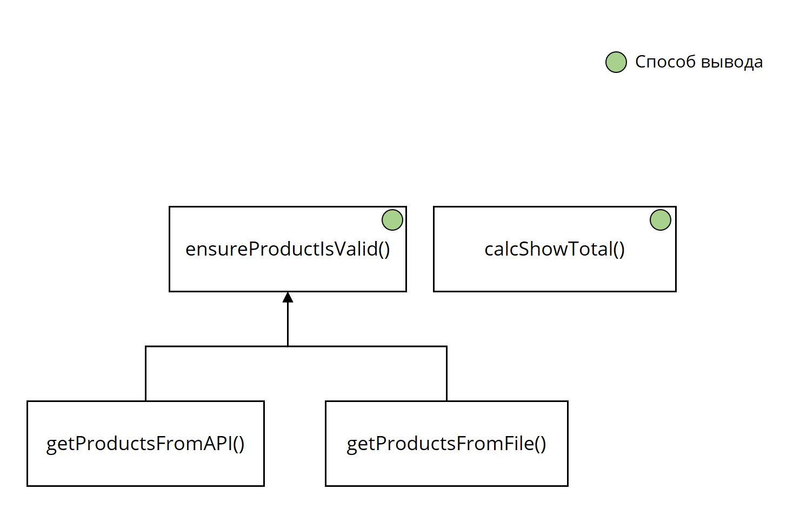

Исходя из схемы ясно, для того чтобы реализовать требуемое поведение, прийдется скорректировать реализацию перечисленных
функций. Это крайне нежелательно, особенно в случае с `enusreProductIsValid`, ведь она имеет нескольких клиентов.

Давайте подумаем, а как сделать так, чтобы эта же ответственность, при срабатывании в будущем не вызывала у нас столько
же сложностей, что и сейчас.

### Сила связи

Основная причина по которой у нас нет другого выхода кроме как изменить код напрямую заключается в наличии связи на
методы объекта `console`. Проблема здесь заключается не столько в самом факте присутствия связи, сколько в её *силе*.

Общее определение гласит следующим образом - если изменение одного компонента вызывает неизбежные изменения в другом, то
такие компоненты считаются сильно связанными. Иначе связь между ними называется *слабой*. Разберем данное утверждение по
порядку, для начала начнем с перечисления разных типов связи и их силы (элементы приведены в порядке возрастания силы
связи):

#### Тип

Большинство более менее популярных языков включают в себя строгую и статическую систему типов. Где каждый элемент имеет
внутри себя явное описание контракта. Без него, было бы невозможно каким-то образом взаимодействовать с объектом, ведь в
таком случае не совсем понятно какие операции являются для него валидными, а какие нет.

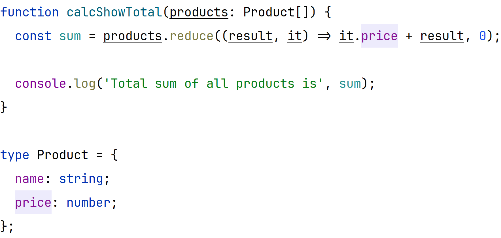

calcShowTotal зависит от типа Product

В случае, если один из элементов контракта `Product` будет изменен, функция `calcShowTotal` также потребует своей
модификации*.

В то время как изменение фабрики данного объекта, никак не затронет `calcShowTotal`:

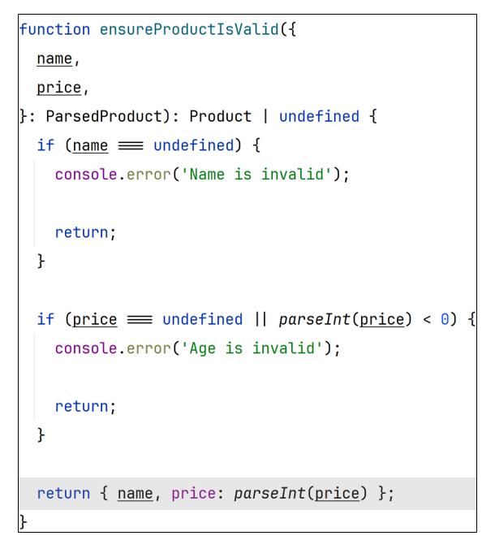

Место, где создаются используемые в программе экземпляры Product

* На самом деле, только изменение поля price (в несовместимую сторону) может негативно повлиять на функцию

#### Семантика

Следующий тип связи - *семантический* представляет собой все те свойства, что присутствуют внутри объекта, но
не описаны явно, через тип. Они исходят из *наблюдаемого поведения* объекта.

Представим что существует метод возвращающий список администраторов:

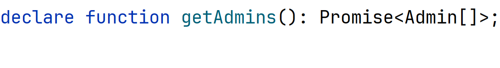

В требованиях сказано, что в системе, в любой момент времени, всегда должен быть *хотя бы один* администратор. Другими
словами, массив всегда должен быть не пустым. Один из клиентов данной функции опирается на данный факт:

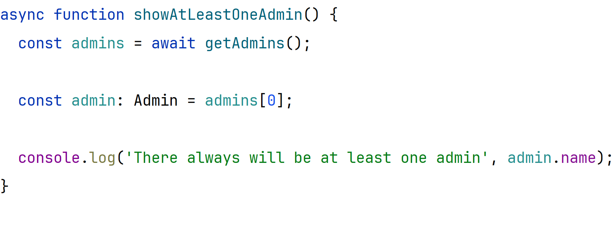

Функция `showAtLeastOneAdmin` без всяких проверок спокойно достает первый элемент по индексу, ведь существует такая
договоренность, хоть и не в явном виде, но на уровне фактического поведения.

Достаточно очевидно, в чем заключается минус данного типа связи, а именно в его непрозрачности. Если вдруг вследствии
каких-то причин, программа попадет в такое состояние, где список администраторов окажется пустым, единственным вариантом
это узнать - будет прямая эксплуатация системы. Другими словами, программу нужно будет запустить и привести в
соответсвующее состояние, для того чтобы словить дефект.

С другой стороны, если семантические условия изменятся, например ослабнут, то будет не совсем понятно, а какие функции
при этом будут затронуты и придется перепроверять всё в ручную.

Для того чтобы лучше понять недостатки семантического типа связи, попробуем выразить условие из примера явно, на уровне
типа:

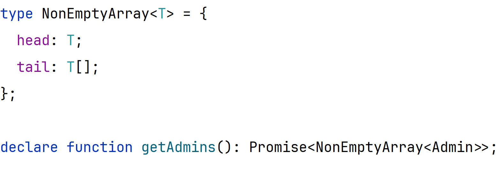

Добавлен новый тип NonEmptyArray фиксирующий на уровне своей структуры контракт

Теперь, система явно описывает данный контракт и в случае его ослабления, компилятор сам подскажет разработчику все
места для исправления.

Стоит отметить, что явное выражение семантического условия на уровне типа не ослабило саму связь, она лишь сделала её
более прозрачной, за счет чего тип и считается лучшей альтернативой. Однако, статическим контрактом не всегда возможно
адекватно описать все свойства объекта. Рассмотрим простой интерфейс:

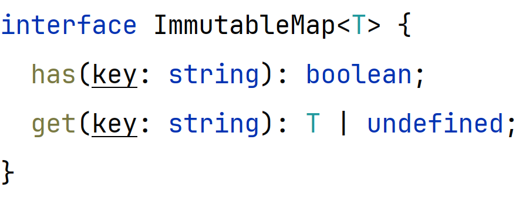

Здесь присутствует очевидное семантическое условие - если метод `has` вернул для какого-то ключа `true`, то для него
метод `get` всегда должен вернуть значение `T`, хотя сигнатура в общем случае справедливо указывает на возможность
отсутствия элемента.

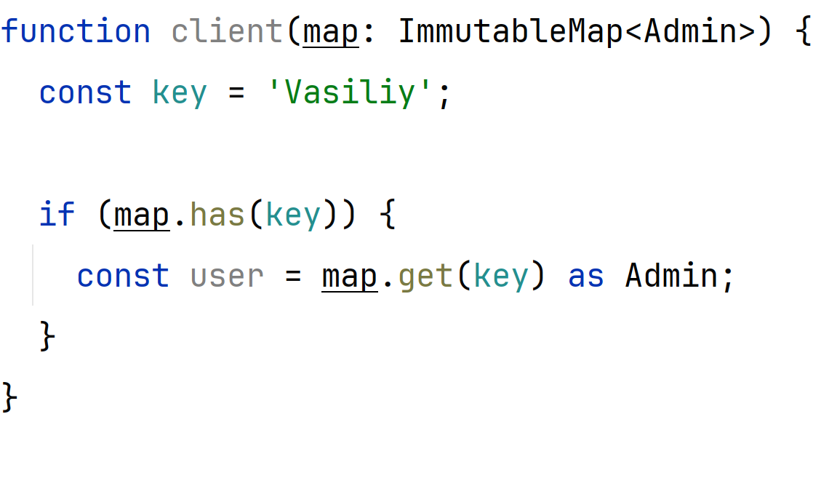

Компилятору приходится подсказывать, ведь он не знает о наличии семантического условия

Если, в какой-то момент времени, *поведение* `ImmutableMap` изменится так, что данное условие перестанет быть истинным,
разработчику прийдется в ручную скорректировать всех её клиентов, чья логика опирается на данный, более не
действительный факт.

Другим, возможно менее очевидным примером семантической связи может послужить следующее:

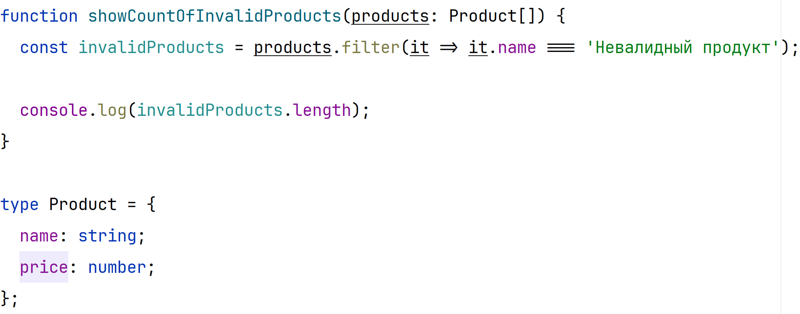

`showCountOfInvalidProducts` показывает общее количество невалидных продуктов. Здесь важно обратит внимание на то, что
такие продукты она определяет по *специальному* значению, которое полностью совпадает с типом представляющим нормальные
наименования товаров*.

Семантика здесь проявляется в том, что конкретному значению подставляют строго определенный смысл, который описывает и
другие свойства невалидных продуктов, в том числе, например то, что их цена всегда равна `0`.

Решением в данной ситуации также будет явное описание контракта на уровне типа:

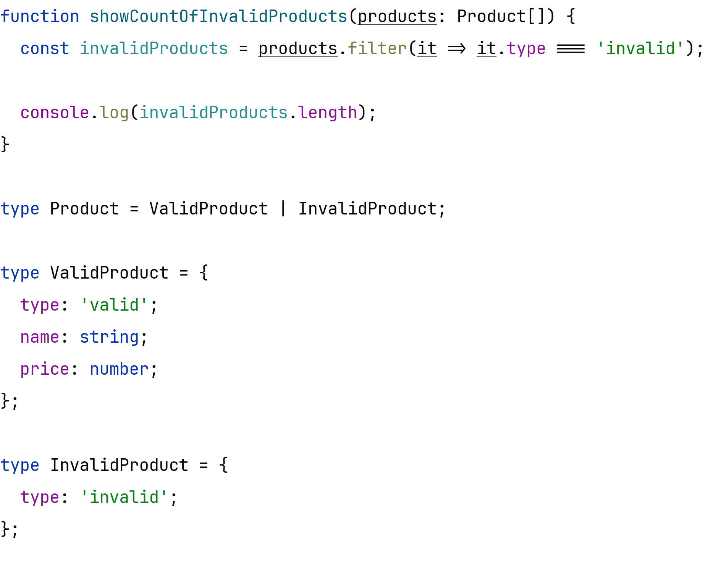

* Стоит отметить что помимо наличия семантической связи, здесь также присутсвует проблема связанная с сущестованием пересечения между специальным и нормальным случаем. То есть чисто теоритически может существовать нормальный продукт который называется "Невалидный продукт", это создаст конфликт в наблюдаемом поведении программы.

Еще одним примером семантической связи является зависимость от порядка вызова методов, рассмотрим такой пример:

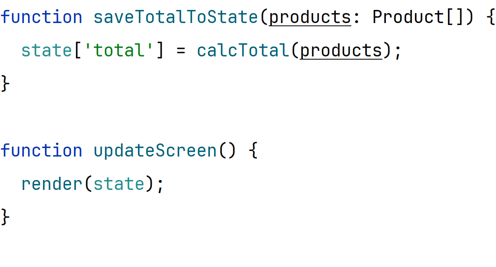

`saveTotalToState` записывает общую сумму в состояние, `updateScreen` обновляет информацию на экране. Важно, чтобы эти
методы были вызваны строго в определенном порядке, иначе на экране может отобразиться неактуальная информация:

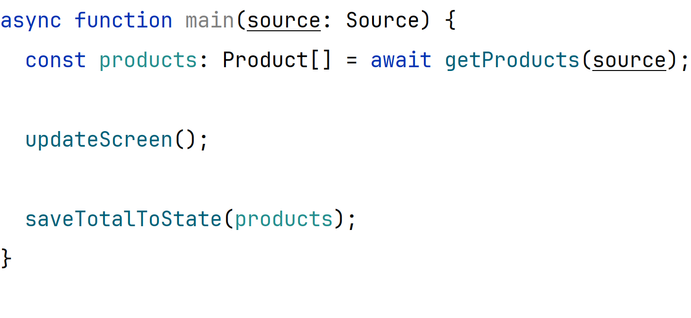

Из-за некорректного порядка вызовов, отображаемая информация на экране не будет актуальной

Существует масса способов избавиться от ситуации подобного рода, можно объединить две разные функции в одну или сделать
порядок однозначным на уровне типов, хотя это будет сделать несколько сложнее.

Данный пример находится уже на стыке со следующей категории силы зависимости, а именно зависимость от деталей
реализации.

#### Детали реализации

Представим что разработчики решили интегрировать в свою систему тесты, для того чтобы упростить её поддержку. Первым
подопытным была выбрана функция `calcTotal`:

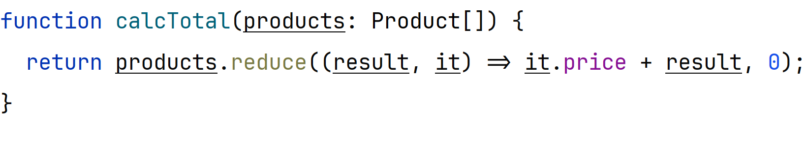

Для неё был описан соответсвующий тест:

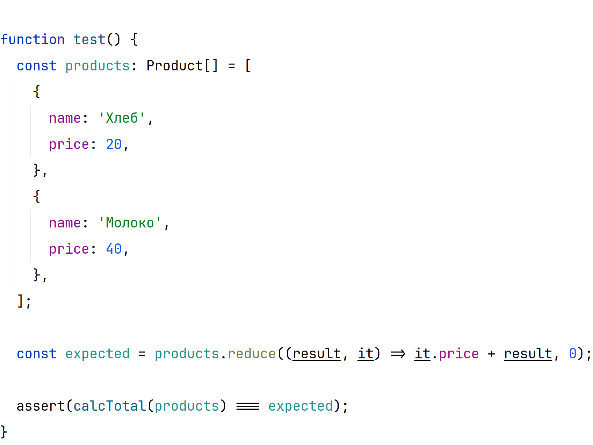

Обратите внимание на то, что внутри теста, для получения ожидаемого результата используется абсолютно такой же алгоритм,
что в `calcTotal`. Тест связан с тем, как реализован `calcTotal` внутри. Такая зависимость считается сильной, например в
примере выше `test` нужно будет вручную корректировать каждый раз когда алгоритм внутри тестируемой функции изменился*.
Здесь явно прослеживаются признаки *истинного* дублирования.

* Строго говоря, менять такой тест нужно будет только в случае изменения наблюдаемого поведения функции, его возвращаемого значения в данном случае 

Решить конкретно данную проблему можно несколькими способами: прописать конечное значение вручную или сгенерировать его
автоматически.

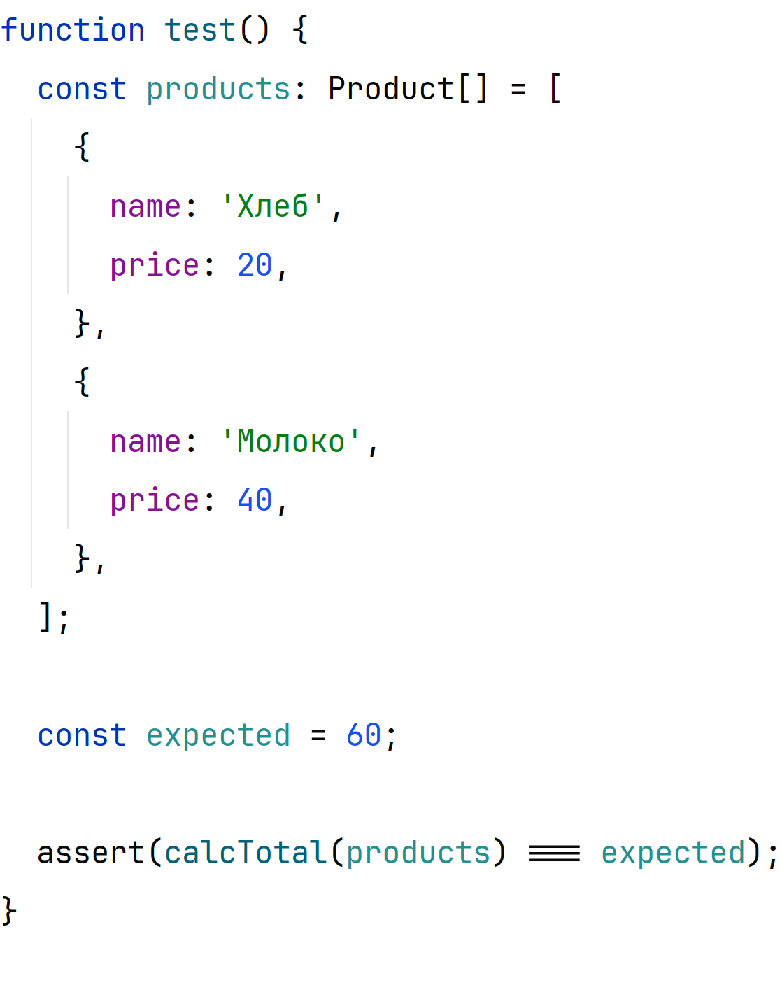

Ожидаемый результат прописан вручную, это убирает зависимость от деталей алгоритма

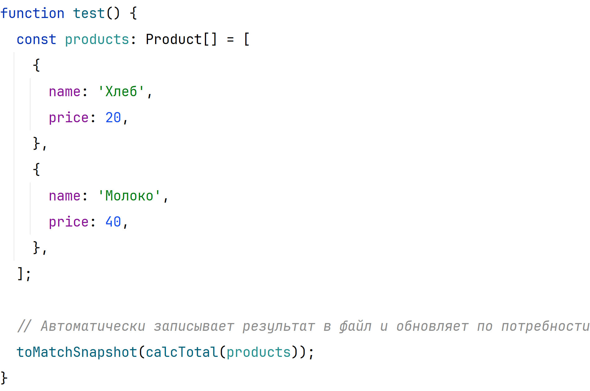

Автоматически сохраняет/обновляет результат функции

Проблема не всегда проявляется настолько явно, рассмотрим еще один пример:

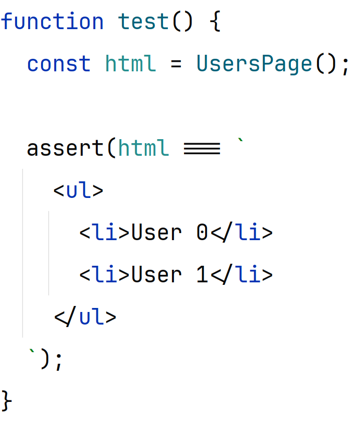

Тест явно проверяет разметку страницы, которую возвращает компонент. Это также считается зависимостью от деталей
реализации, так как в случае их изменения, например рефакторинге, тесты также придется модифицировать, даже в случае
если наблюдаемое поведение осталось прежним.

Одной из основных проблем возникающих у разработчиков при организации тестирования - это слишком сильная зависимость
последних от тестируемых компонентов:

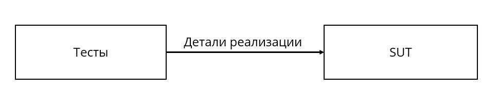

SUT - system under test, тестируемая система/компонент

Сила связи, как и говорилось ранее проявляется в необходимости изменять зависимые компоненты, при изменении
ответственного элемента, того, от которого зависят. Это происходит либо явно вследствие *жесткости*, либо неявно из-за
*хрупкости*. В лучшем случае, тесты должны изменяться тогда и только тогда, когда меняется наблюдаемое поведение
системы.

Несмотря на то, что основные примеры использовали контекст тестирования, многие согласятся что и в обычных сценариях
такой вид зависимости часто используется, важно его уметь вовремя распознать и исправить, *если потребуется*.

Различных категорий связи на самом деле гораздо больше, но в целях данной статьи достаточно только рассмотрения
перечисленных трех: тип, семантика (поведение) и детали реализации.

### Ответственность и сила связи

Между приведенными ранее категориями связи существует отношение преемственности, в чем оно заключается? Рассмотрим
семантическую связь от функции `getAdmins`:

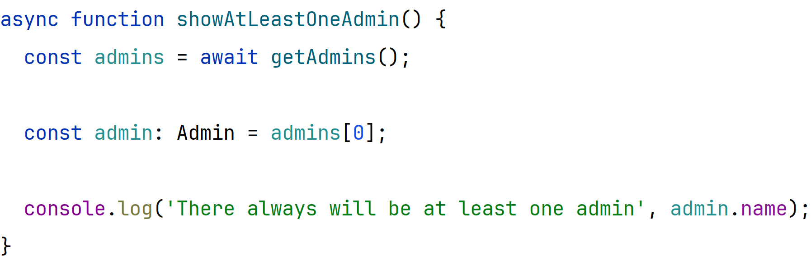

Как и говорилось ранее, функцию `showAtLeastOneAdmin` прийдется модифицировать если нарушится контракт на не пустой
массив администраторов. Но важно отметить и то, что данную процедуру также прийдется изменить в случае корректировки
сигнатуры (типа) функции `getAdmins`!

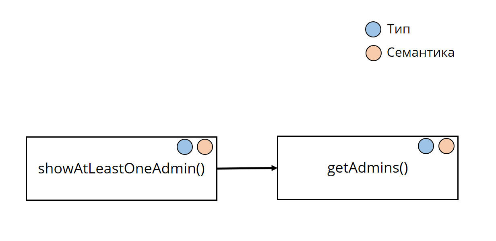

Можно сказать, что существуют как минимум два источника изменений, две ответсвенности, которые разделяют между собой
данные два компонента.

В то время как зависимость от типа, предполагает только один источник*

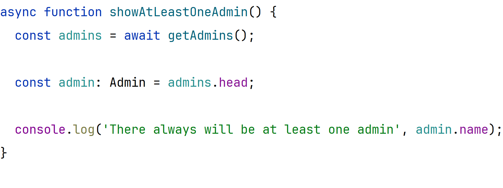

Реализация основанная на явном контракте

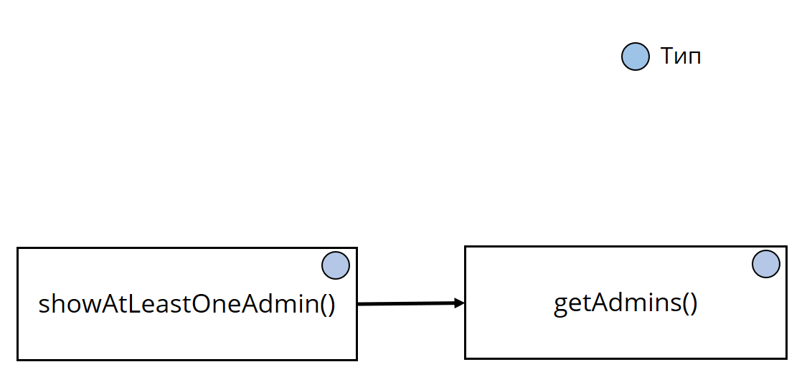

* Это не значит что связь становится слабее в данном конкретном случае, но общая тенденция является таковой 

Это объясняется простой закономерностью:

* Если компонент зависит от деталей реализации, то он также зависит и от семантики или конкретного поведения.
* Если компонент зависит от семантики, то он зависит и от типа, но не от деталей реализации, ведь одно и то же поведение
  может быть реализовано с помощью абсолютно разных алгоритмов.
* Если компонент зависит от типа, то он зависит только от тех свойств, что из этого типа следуют, ни больше ни меньше.

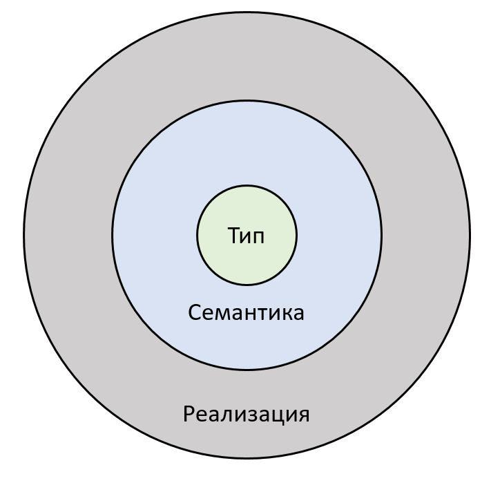

Чем сильнее зависимость, тем больше существует причин или ответственностей по которым оба связанных компонента могут
измениться. Это объясняется правилом преемственности слоев, которое было описано ранее.

Чем больше сила зависимости тем больше и количество ответственностей

### Инверсия зависимости

Используя ранее описанные определения можно с уверенностью сказать, что функции `ensureProductIsValid` и `calcShowTotal`
имеют сильную связь со способом вывода.

Ссылаясь на конкретный объект, функции ссылаются на конкретное поведение. Из-за этого, в случае когда данная конкретика
меняется, данные сущности также должны быть изменены. Они приобрели данные ответсвенности из-за величины силы связи.

Для того чтобы решить задачу и при этом подготовить систему для подобных казусов в будущем, необходимо ослабить связь
между упомянутыми элементами. То есть сдвинуть зависимость ближе к ядру на схеме ниже, то есть на уровень типа*.

* В реальности существуют менее инвазивные способы расширения портов вывода: можно аугментировать само окружение либо направлять поток вывода программы во время запуска используя внешние средства. Для простоты данные варианты специально игнорируются 

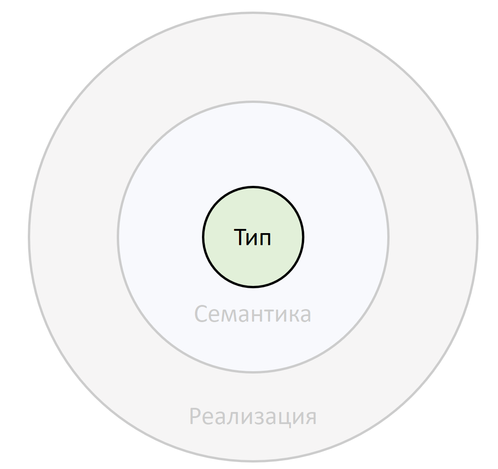

Зависимость ослабевает если двигаться к центру ядра

Объявим тип, от которого будут зависеть указанные функции:

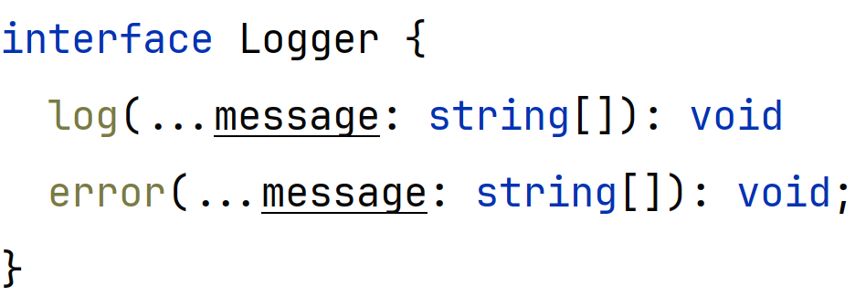

Дальше, данную зависимость нужно каким-то образом поставить компонентам, ограничимся простой
передачи через аргументы функции:

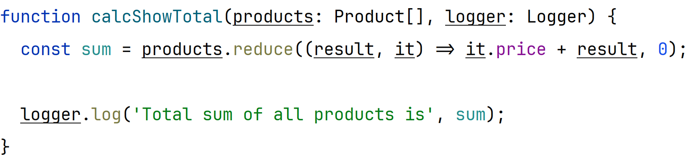

Теперь, все, от чего зависят данные компоненты - это всего лишь тип объекта отвечающего за вывод. Зависимость
действительно в данном случае ослабла, доказательством этого является тот факт, что в будущем, в случае добавления
дополнительного источника вывода, функции `calcShowTotal` и `ensureProductIsValid` затронуты не будут.

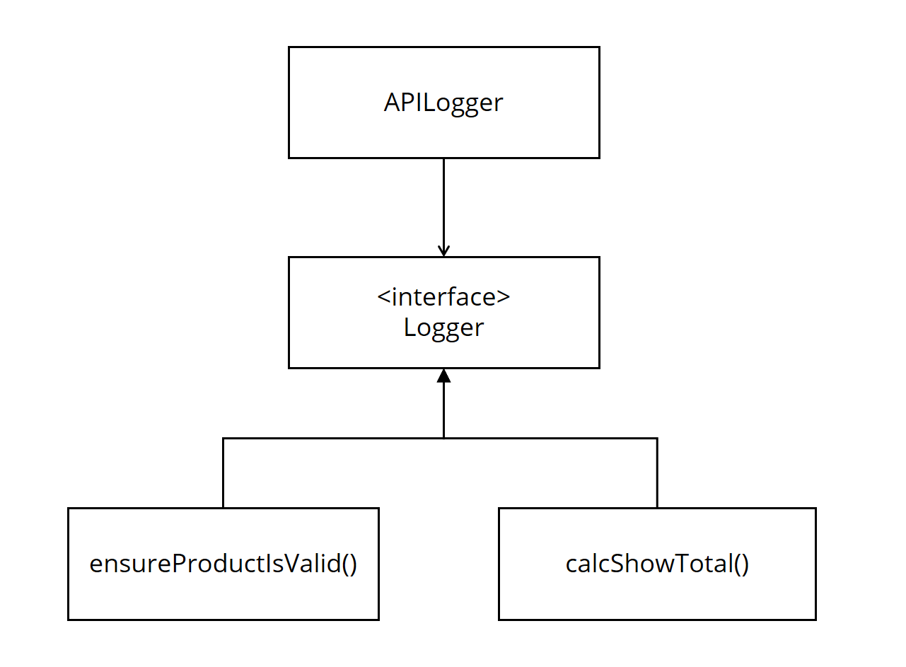

Функции зависят от интерфейса Logger. APILogger реализует данный контракт и передается в качестве имплементатора всей программе

### Изменение типа

Несмотря на то, что зависимость теперь ослабла, она все равно *существует* и в случае изменения типа в несовместимую
сторону, функции должны будут изменены:

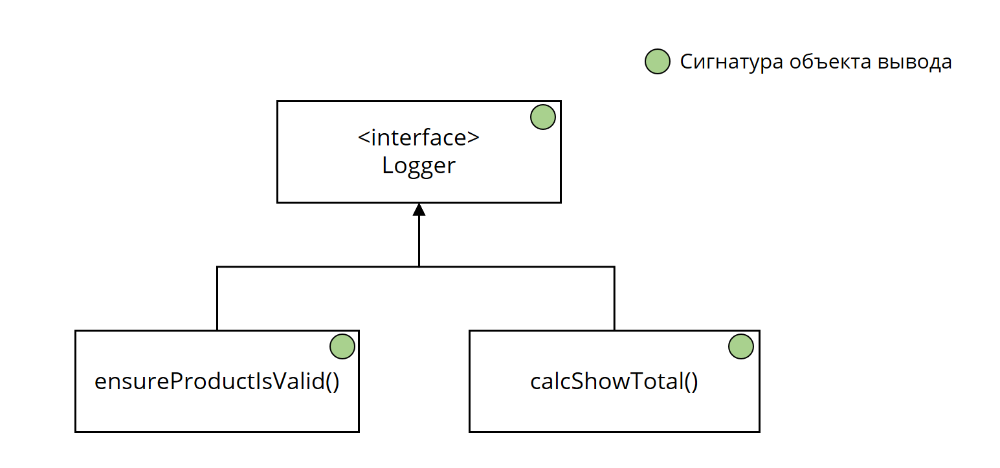

Для того чтобы это продемонстрировать, представим, что разработчики стороннего клиента, куда складываются логи, требуют
с каждым запросом отправлять ключ аутентификации:

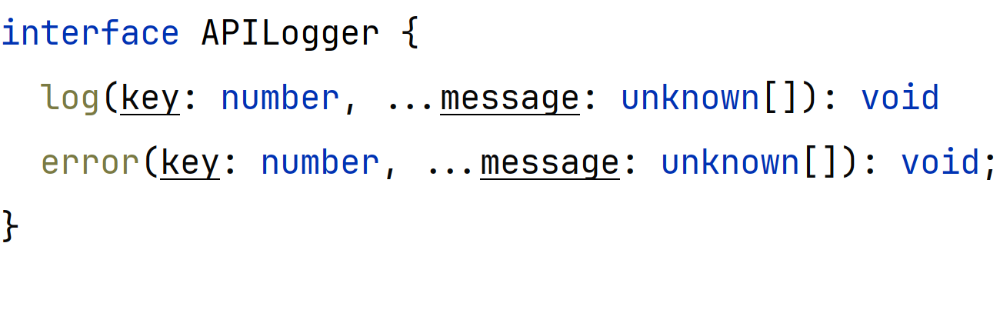

Очевидно, что такое изменение не является совместимым с существующим интерфейсом `Logger`:

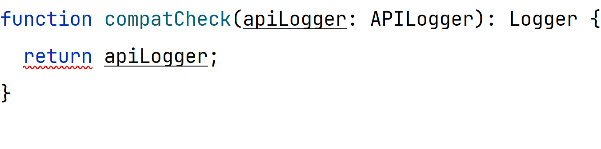

Компилятор показывает ошибку, так как нельзя использовать APILogger вместо Logger

#### Адаптер

Неужели все что остается разработчикам, так это изменить каждый компонент, который использует `logger` в своём исходном
коде? К счастью, это не так. Можно воспользоваться паттерном *адаптер*:

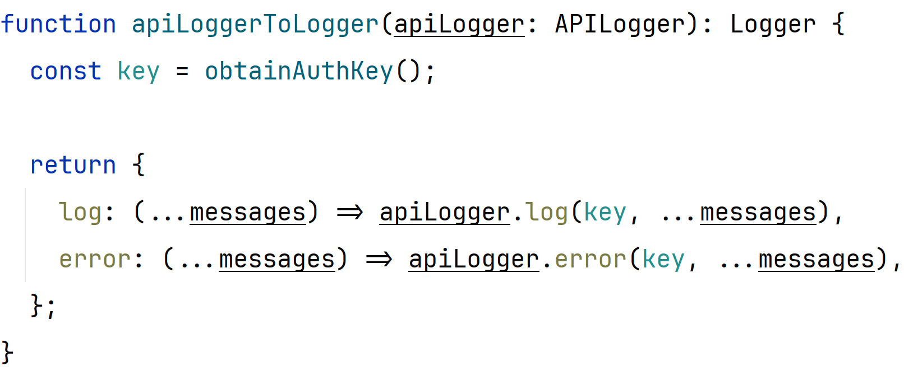

Теперь новую версию `APILogger` можно использовать вместе со старым интерфейсом, все клиенты при этом останутся без
изменений.

Почему это в целом возможно? Причина достаточно проста, адаптер работает на уровне конкретного поведения, на
семантическом уровне, согласно приведенной схеме. Так как зависимость компонентов от `logger` слабее, на уровне типа,
применение данной техники в целом осуществимо.

Можно сказать, что функции `calcShowTotal` и `ensureProductIsValid` стали открытыми к расширению с точки зрения
конкретного способа вывода. Такая расширяемость стала доступна благодаря избавлению данных процедур от лишних
ответственностей, показанных на схеме раннее.

### Эффект

Существует еще один способ, который используется гораздо реже в стандартных принятых парадигмах, но также эффективно
борется с похожими на представленную ситуациями. Возьмем функцию `calcShowTotal`:

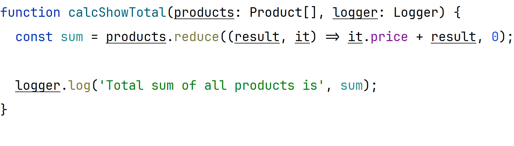

Сейчас она явно делегирует вывод объекту `logger`, но что если вместо этого она бы делала нечто подобное:

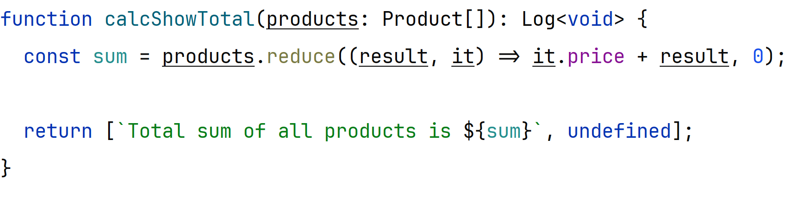

То что возвращает `calcShowTotal` называется *эффектом*. Эффект - это любые данные, которые являются дополнением к тому
что возвращает функция*.

* Смысл передачи undefined вторым элементом картежа следует из композиционных свойств структуры эффектов. В данной статье он игнорируется для простоты 

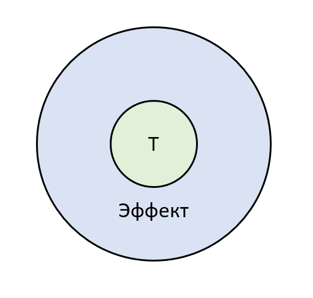

T это шаблонный тип обозначающий основной результат функции. То что его обрамляет, это некоторая дополнительная информация, как-бы еще один результат

Обратите внимание на то, что зависимость от `logger` исчезла, но заменила собой зависимостью от структуры `Log`. Можно
сказать, что такой объект, в данном случае это картеж, это тот же самый вызов `logger.log`, только представленный в
несколько ином виде.

Далее, для осуществления непосредственно процесса логирования реализуется специальный *интерпритатор*:

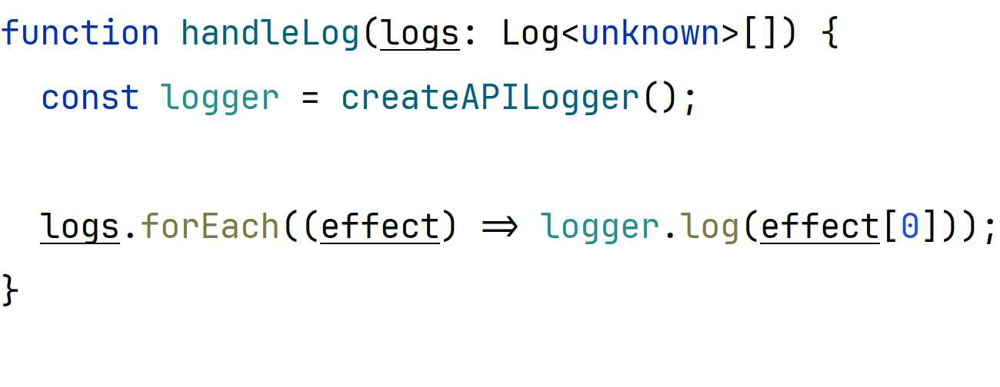

Условно весь процесс можно представить так:

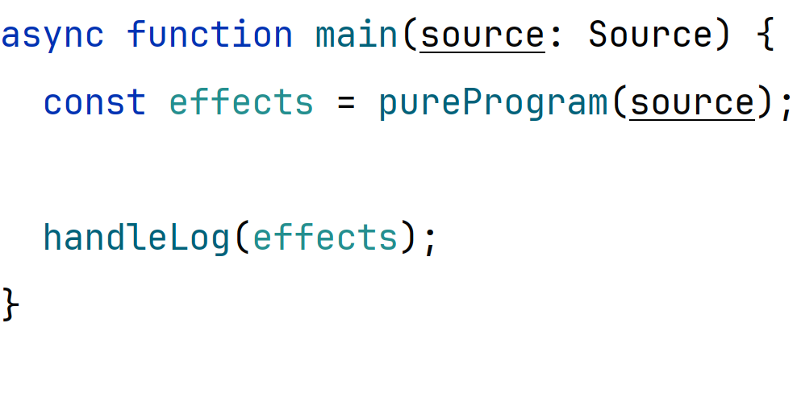

Основная программа `pureProgram` осуществляет основной процесс системы: обработка и валидация продуктов и подсчет суммы.
Результатом программы является простой перечень логов, которые по итогу должны отобразиться пользователю. Само
отображение происходит внутри `handleLog`.

В случае изменения сигнатуры `APILogger`, сам процесс адаптации происходит внутри интерпретатора:

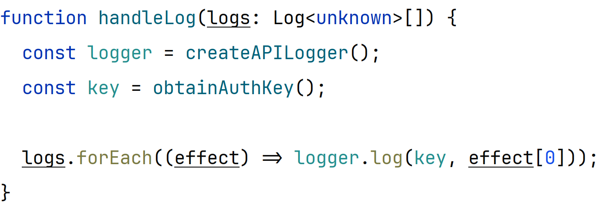

Таким образом, зависимые функции также остаются закрытыми от данной ответсвенности.

Несмотря на кардинальную визуальную разницу между двумя подходами: инверсии через интерфейс и эффект, оба способа с
одинаковой эффективностью справляются с нерасширяемыми системами, ослабляя зависимости между компонентами, путем
избавления их от лишних ответственностей, делая их более абстрактными в конечном итоге.

# Повторяющиеся ответсвенности

По итогам рассмотренного мини-проекта должно быть очевидно, что одним из важнейших свойств хорошего дизайна системы
является адаптивность к модификациям. Программу легко изменять, когда отсутствуют элементы жесткости и хрупкости. Это
требует правильного разделения и *распределения* ответственностей, что крайне трудно достижимо без основного фактора -
*времени*. Именно с течением времени система подвергается различным модификациям, которые и выявляют основные
ответсвенности компонентов. Следовательно, хороший дизайн требует терпения и внимательности. Более того, сами
ответсвенности не всегда статичны и также могут меняться. Дизайн который хорошо работает сегодня, не факт, что окажется
таким же полезным завтра, когда условия на проекте изменятся.

## Разделительные паттерны

С одной стороны хороший дизайн требует времени, с другой - обычно самые серьёзные архитектурные решения принимаются в
самом начале проекта. Ошибиться очень просто. К счастью, существует перечень ответственностей, которые достаточно часто
встречаются на разных проектах, независимо от области их применения.

### Логирование

Вспомним наш пример с которого начиналась статья:

На момент, когда данная функция была написана впервые, не было абсолютно никакой информации о её ответственностях,
следовательно, и разделять её каким-либо образом не стоило, ведь это может только усложнить дизайн, добавив в него
избыточные элементы.

Но что если в процедуру добавиться элемент логирования?

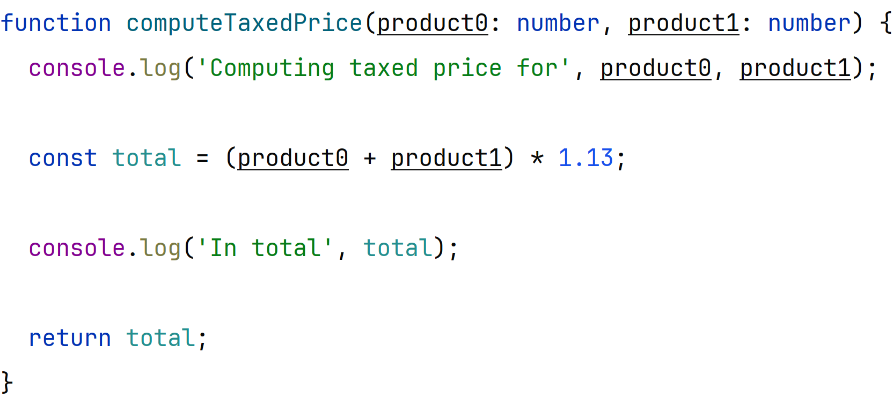

Помимо своей изначальной функции, `computeTaxedPrice` теперь выводит отладочную информацию в консоль. Заметим:

* В случае если поменяется логика подсчета итоговой суммы, будет затронуто только выражение `total`
* В случае если поменяется формат или источник логирования изменятся строчки с вызовом `console.log`

Обратите внимание на то, как данные модификации абсолютно параллельны* друг другу, это явный признак разных
ответственностей. Если бы эти части процедуры были бы разделены, то это несколько упростило бы внесение изменений
данного
рода. Но что если данные источники в итоге не подтвердятся? Что если на проекте никогда не возникнет ситуации при
которой в `computeTaxedPrice` поменяется логика подсчета, но не изменится формат логирования? В таком случае, система бы
считалась избыточной, или все же нет?

Рассматривая функцию с точки зрения поддерживаемости, не нужно забывать и про такой важный параметр как читаемость или
прозрачность. Давно известно, что инженер читает код гораздо чаще чем его изменяет, то же самое относится и к функциям.

* Одна модификация никак не касается кода, относящегося к другой. 

Логирование встречается в проектах очень часто и имеет тенденцию развиваться со своей определенной скоростью, изменяться
по своим причинам. Возьмем данное утверждение как данность и посмотрим каким образом может преобразиться функция, если
провести разделение явным образом:

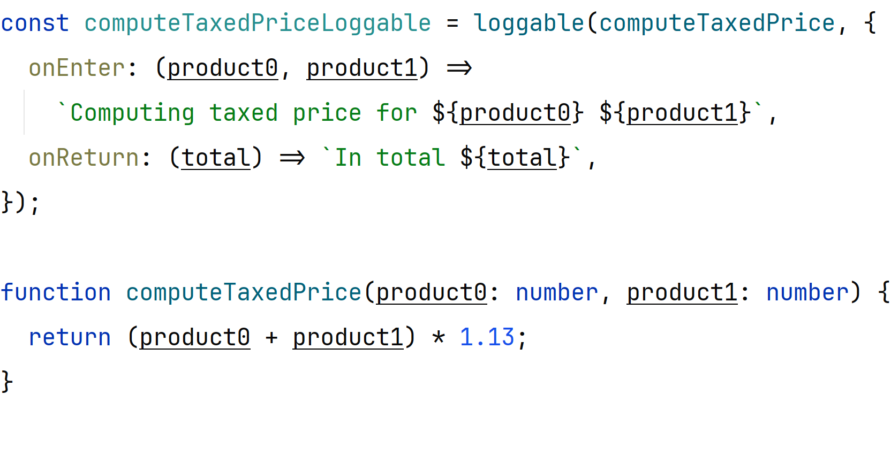

`computeTaxedPrice` остается с потенциально единственной ответственностью. Если разработчик будет рассматривать данную
часть программы в контексте работы с логикой - всё что ему нужно находится в данной функции. Если же
инженера интересует вопрос логирования, он также разделен в рамках выражения к константе `computeTaxedPriceLoggable`.

То что представлено во фрагменте кода выше описывается паттерном *декоратор*. Декоратор это некоторая сущность которая
примешивает некоторые поведения уже существующим классам, функциям и подобным элементам программы.

Сам по себе паттерн имеет множество форм реализации, наверное самая простая из них это обычная функция высшего порядка.
В данном примере это функция `loggable`. Существуют и другие, например классы высшего порядка или "декораторы" как
специальный синтаксический элемент:

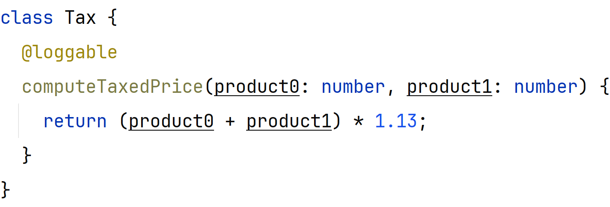

Логирование это пример так называемого *cross-cutting concern*, функционала, который может потребоваться на разных слоях
системы. При этом, общий механизм его работы одинаковый, вне зависимости от контекста исполнения, все что может
меняться, так это детали: содержание сообщения и параметры. При этом, если поменяется например источник логирования, то
это скорее всего будет актуально для всех его клиентов. Это пример истинного дублирования - явного индикатора *отдельной
ответсвенности* которую лучше держать в стороне от основной логики.

### Производительность

Представим что существует функция `suggestProductPriceByKind`, которая предлагает клиенту цену на продукт основываясь на
схожих товарах. Похожесть здесь проверяется по численному атрибуту `kind`:

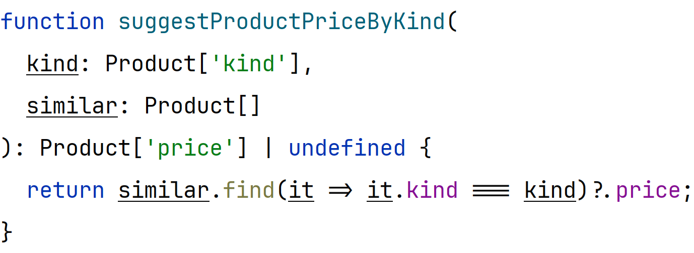

В ходе эксплуатации системы, было обнаружено, что при большом количестве товаров, скажем 10 000, программа начинала
вести себя медленно. После сеанса профилирования виновником стала процедура приведенная выше. Так как продукты в списке
всегда отсортированы по возрастанию `kind`, было решено оптимизировать алгоритм следующим образом:

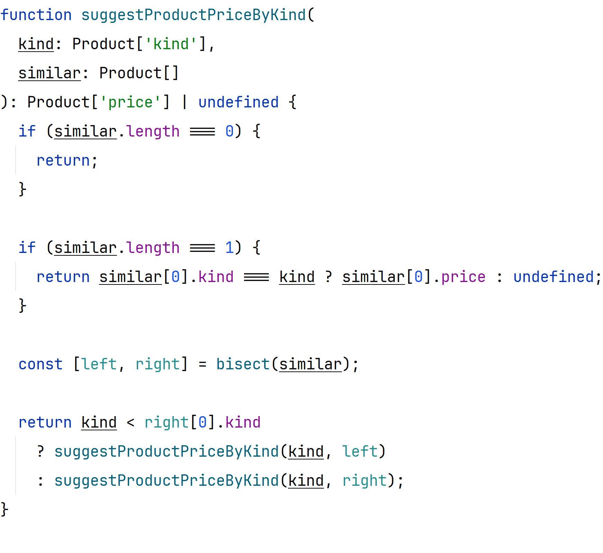

Для простоты считаем что в runtime отсутствует ограничение на размер стэка вызовов

Очевидно что функция стала сложнее, если бы не её название, понять что она делает будет непросто. Представим, что
заказчик приходит к нам с новым требованием: "Если автоматически определенная цена продукта меньше 10, то нужно взять
цену следующего за ним товара в списке похожих, если такой присутствует и если его цена больше 10 и так далее". Жадности
клиента нет границ, тем не менее мы как инженеры должны сконцентрироваться на своей части работы и проанализировать,
каким образом текущая структура среагирует на данное изменение.

Многие согласятся, что подобного рода модификацию гораздо проще внести в изначальную, не оптимальную
функцию `suggestProductPriceByKind`. Явно выделим несколько причин возникновения сложностей с новой функцей:

* Новое требование обязывает разработчика изменить алгоритм подбора цены продукта
* В то же самое время, производительность функции не должна измениться, она обязана остаться на том же уровне

На лицо, две разные ответсвенности:

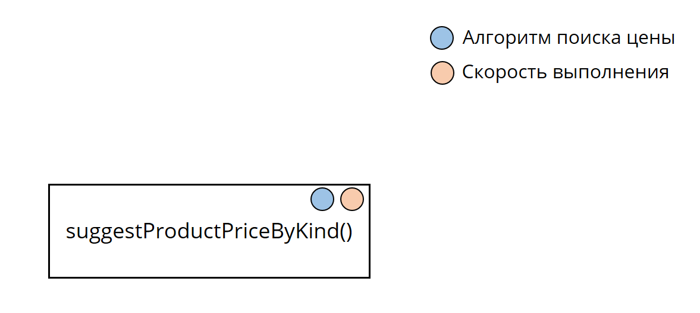

Можно ли каким-то образом разделить данные два аспекта? К сожалению, нет решения которое подошло бы ко всем ситуациям,
но можно попробовать использовать следующее:

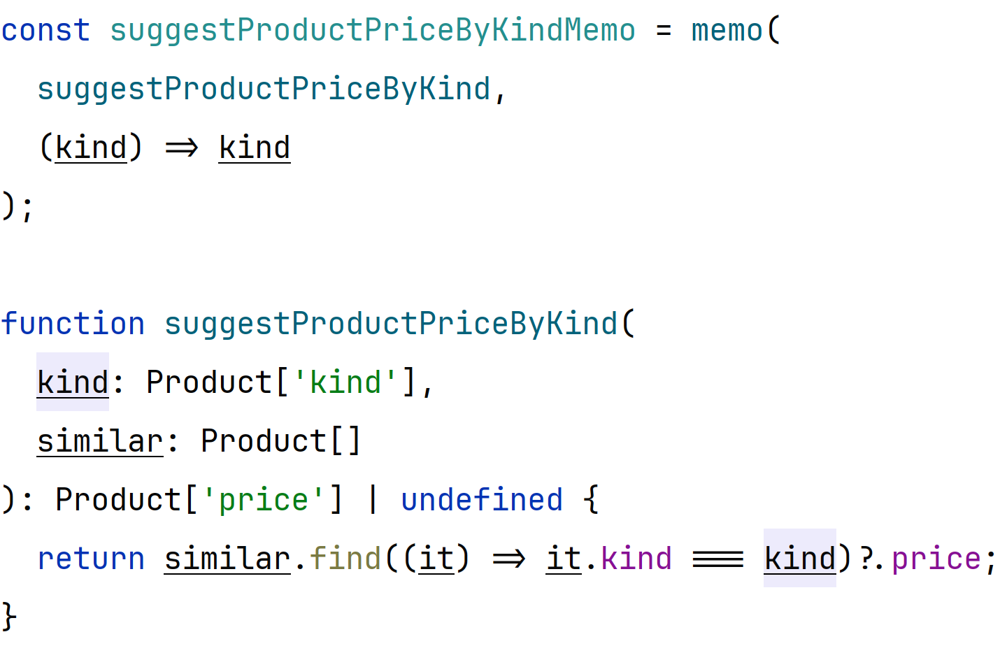

Функция `memo`* запоминает то, что вернула suggestProductPriceByKind для взятого `kind`. Когда в процедуру передается
уже
ранее подсчитанное значение - оно достается из кэша**.

Логика работы `memo` является наглядной демонстрации закона большинства техник оптимизаций, которые по сути обменивают
более выгодное время выполнения (избегание повторных вычислений) на большие затраты по памяти (использование словарей с
раннее подсчитанными результатами).

Так как теперь сама функция `suggestProductPriceByKind` является достаточно простой, реализовать требуемое будет гораздо
проще:

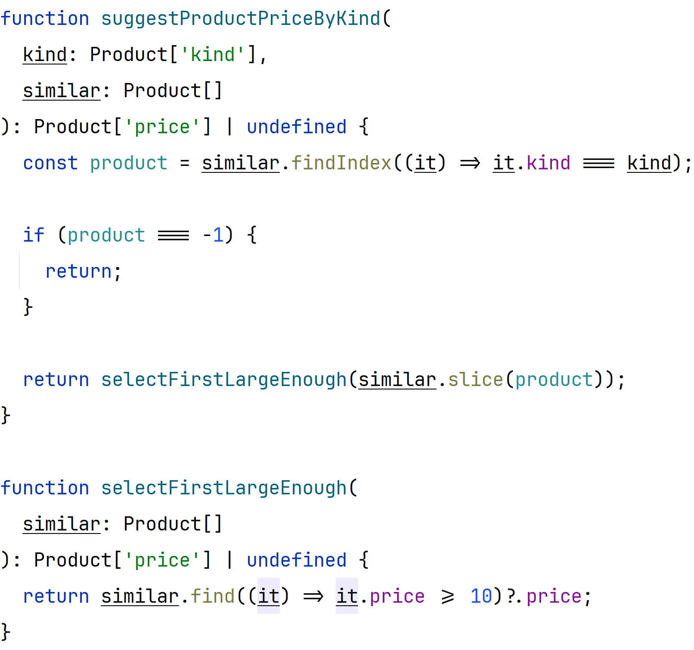

Один из вариантов реализации

Работая над новым требованием, разработчик не обязан загружать свой мозг нерелевантными для задачи деталями, в данном
случае производительностью. В идеале, она должна реализоваться автоматизированным образом, на стороне окружающей
программу инфраструктуры, при этом минимальным образом затрагивая исходный код системы.

* Сама по себе функция хоть и является внешне простой, требует от своих пользователей,
других функций, соблюдения специальных свойств, больше по этой теме можно узнать изучая функциональную парадигму и
чистые функции в частности.
 
** Для наглядности и тривиальности считаем что список similar является константным, меняется только сам kind по которому и формируется ключ. 

### AOP

Сходства между `memo` и `loggable` - очевидны. Обе являются проявлением паттерна декоратор, а также реализуют отдельную
ответственность, которую выгодно держать в стороне от остальной логики системы. Такие *cross-cutting* элементы называют
аспектами. Аспектно-ориентированное программирование это парадигма, которая описывает методы работы с данными
сущностями.

Основная идея заключается в реализации таких функциональностей как отдельных модулей. Отдельных - значит содержащих в
себе свои ответсвенности, не связанные с остальным кодом. Важным здесь является и то, что такие отдельные аспекты могут
легко комбинироваться между собой:

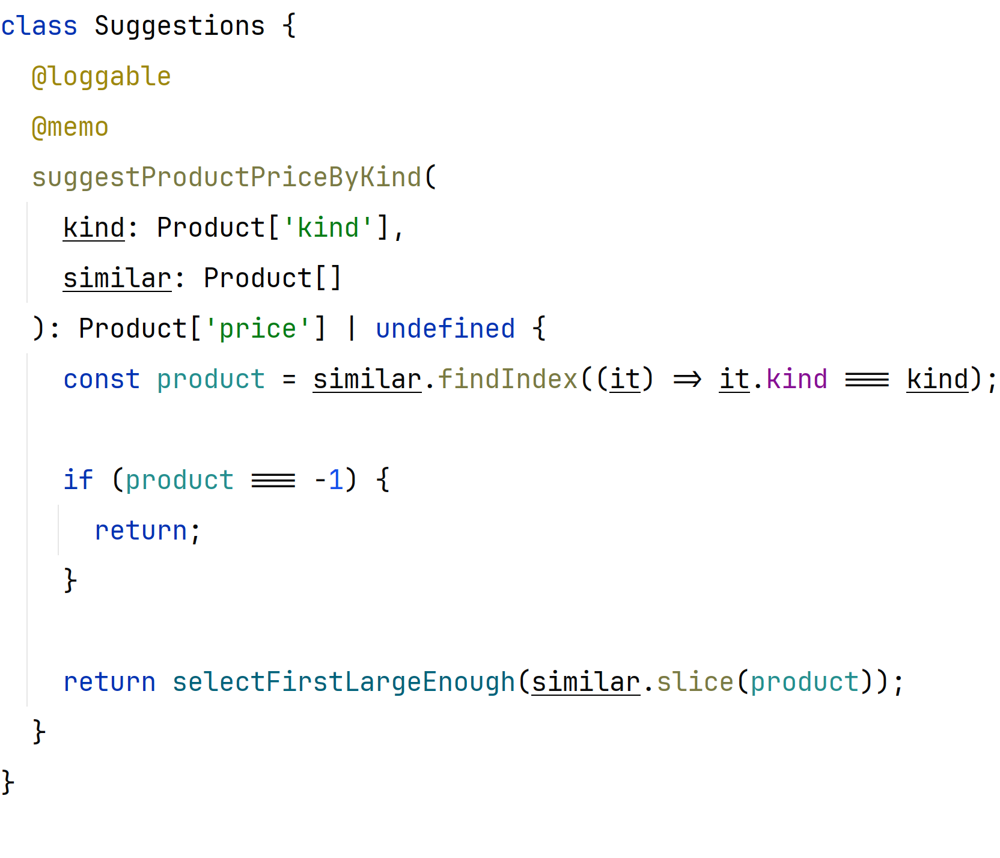

Если бы `suggestProductPriceByKind` выполняла логирование напрямую, при этом явно реализуя оптимальный алгоритм - её
сложность возросла бы в разы:

* Её стало бы тяжелее читать, так как ответсвенности бы смешивались между собой, размазывая искомое поведение.
* Её стало бы тяжелее изменять, разные ответсвенности по определению предполагают разные причины для изменений. Меняя
  искомое поведение, нужно также убедиться и в сохранности остальных аспектов процедуры, другими словами риск регресса
  повышается.

Продолжим двигаться дальше в исследовании стандартных ответственностей и перейдем к рассмотрению более крупных элементов
системы, а именно - её слоёв.

### Пользовательский интерфейс

Единственный способ взаимодействия программы с внешним миром - это использование периферии.

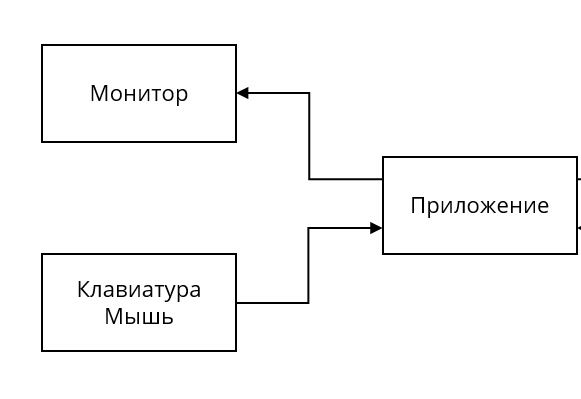

Если говорить о выводе информации, то это чаще всего экран компьютера или мобильного телефона. Конечно, современное ПО
редко манипулирует с пикселями напрямую, для этого используются специальные решения построения пользовательского
интерфейса, будь то обычная консоль, браузер или нативное приложение.

Важным моментом здесь является то, что такие визуальные элементы зачастую имеют свои, отдельные причины для изменения,
вот некоторые примеры из них:

* Рынок пользователей было решено расширить на другие страны, поэтому необходимо поддержать новую локаль
* Было решено интегрировать большее количество конфигураций экранов, сделать дизайн более адаптивным
* Дизайнеру не понравился цвет/размер/композиция определенного визуального элемента

Эти и многие другие причины имеют очень хорошие шансы оказать своё действие исключительно на отрисовку приложения, при
этом не касаясь других аспектов системы.

Возьмем к примеру Telegram, это наглядный пример кросс-платформенного ПО, где общая логика мессенджера остается
неизменной, но при этом интерфейс самого приложения повторяет нативные паттерны той платформы, на которой оно
запускается:

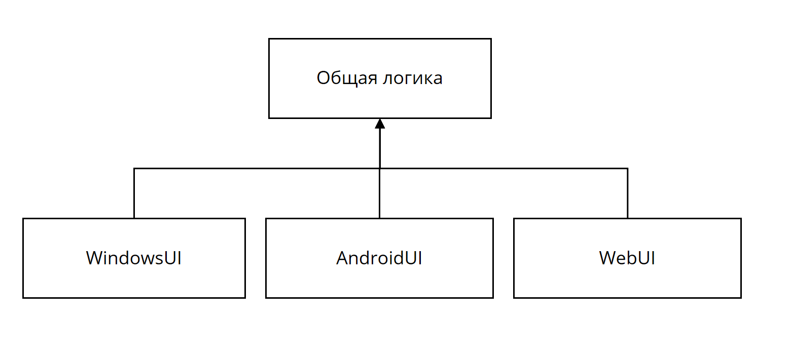

Общая логика приложения остается неизменной между платформами, в то время как оболочка и пользовательский
интерфейс в частности выбирается в соответствии с окружением. Отметим следующее:

* Общая логика избавляет от истинного дублирования. Например, правила получения премиума являются одинаковыми для каждой
  из платформ.
* Конечные реализации оболочек могут изменяться, не затрагивая при этом общий компонент и других клиентов. Например,
  если нашли дефект с отображением кнопки отправки сообщения в Windows, то будет исправлен только один модуль/слой.

Некоторые решения идут еще дальше и абстрагируют саму платформу, предоставляя абстрактные компоненты построения
пользовательского интерфейса:

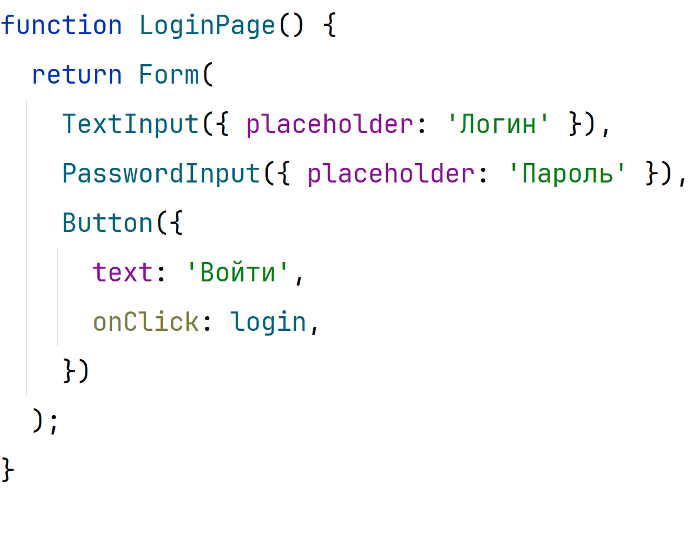

Компоненты `Form`, `TextInput`, `PasswordInput` и `Button` представляют в совокупности *абстрактную фабрику*, реализация
которых выбирается в зависимости от платформы.

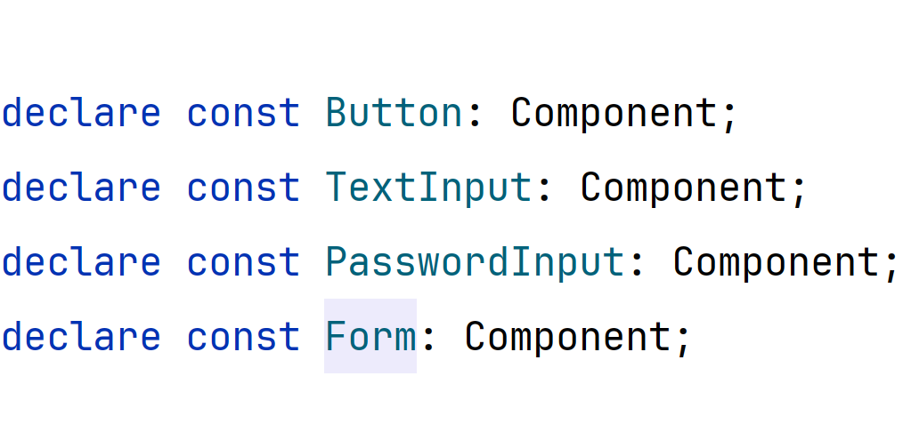

Конкретная реализация элементов определяется на этапе когда присутсвует контекст конкретной платформы. Клиентский код ссылается только на типы.

Таким образом, общая композиция и типы элементов представляются как
истинное дублирование*. Множество популярных фреймворков построения кросс-платформенных приложений работают именно таким
образом.

* Несмотря на кажущуюся полезность, зачастую невозможно или очень сложно реализовать такой интерфейс, который будет полностью идентичен между платформами настолько, что это позволит избежать явных проверок на env в коде UI компонентов. 

### Доступ к данным

Очередным примером часто встречающейся ответсвенности является доступ к данным, за которым чаще всего скрывается
некоторое хранилище, будь то локальное или удаленное.

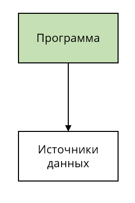

Для приложения на клиенте, таким источником данных может выступать удаленное API. Для серверной стороны, за данным слоем
будет располагаться настоящее БД. Почему слой доступа к данным имеет иную ответственность нежели слой представления?
Рассмотрим следующий пример:

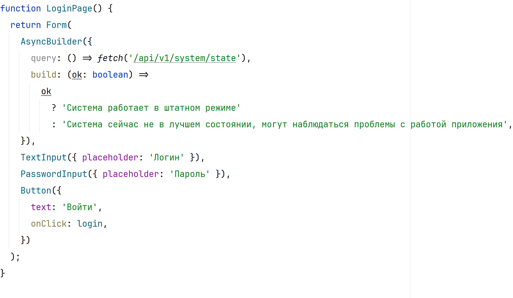

Интерфейс обращается к API

Представим что разработчики API решили изменить логику получения состояния системы. Вместо одного API, нужно вызывать
целый каскад и выполнять агрегацию результата:

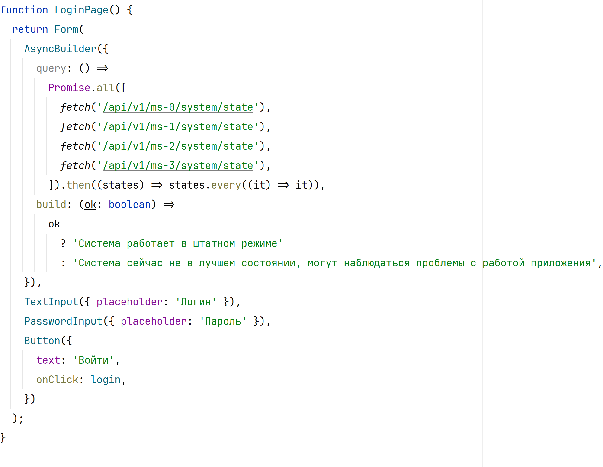

Обратим внимание на то, что только определенная часть реализации компонента была полезна в контексте данного изменения,
мы уже встречались с похожим паттерном ранее.

Далее представим, что после долгих консультаций с аналитиками, было решено несколько изменить стиль текста отображения
статуса работы системы:

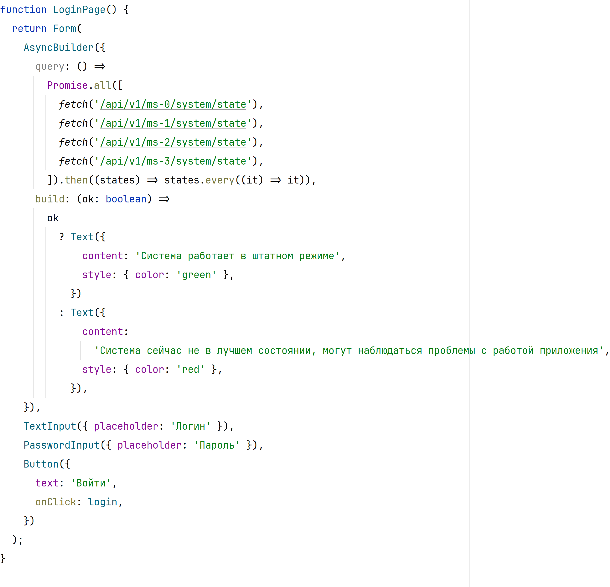

Данные изменения сильно отличаются друг от друга прежде всего своими источниками. В одном случае это были разработчики
API. В другом, заказчики и дизайнеры.

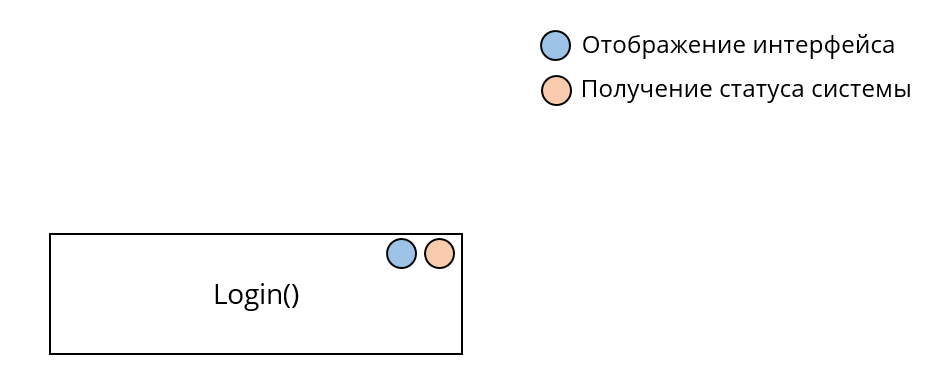

Как отмечалось ранее, клиенты являются явными индикаторами ответственностей, так
как именно они являются пользователями компонента, именно они диктуют ему требуемые поведения. Разные клиенты с высокой
долей вероятности являются источниками разных ответственностей.

Для того чтобы исправить проблему, возникшую выше, можно вынести получение статуса в отдельную процедуру:

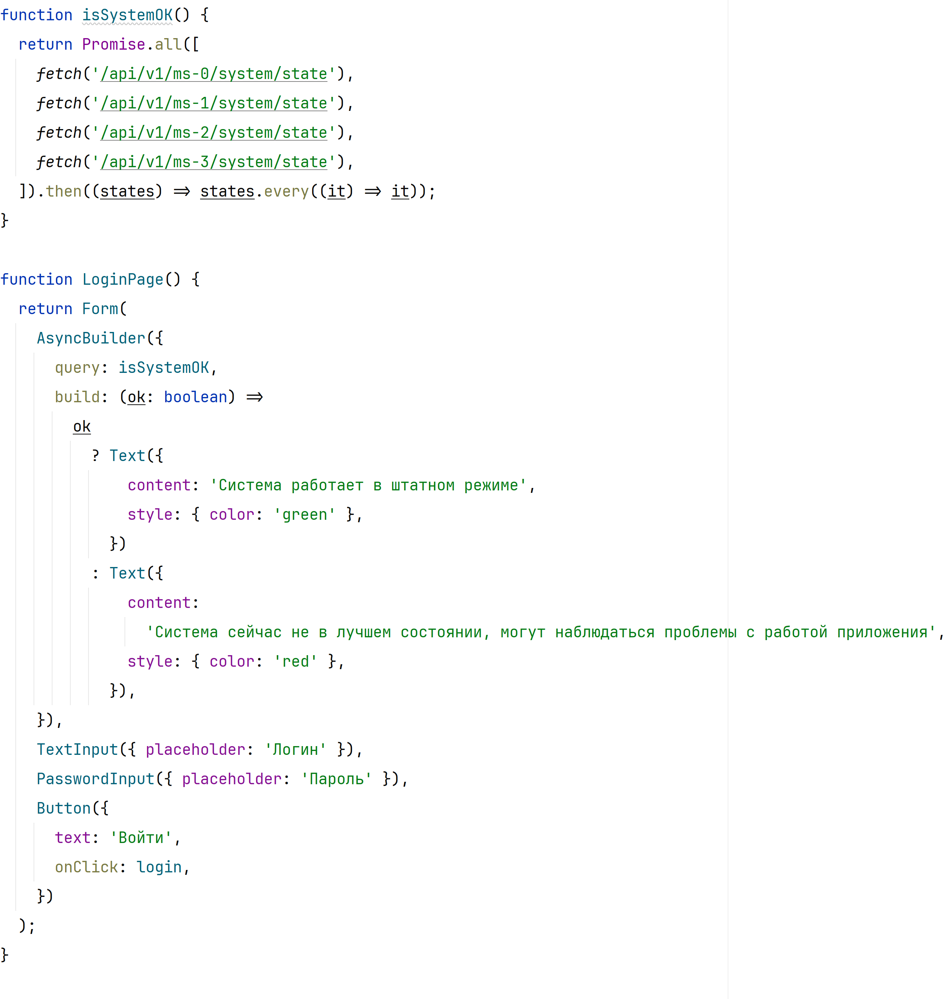

Теперь, изменения со стороны доступа данных и со стороны интерфейса полностью разделены.

### Доменный слой

Если попробовать разделить приложение на слой UI и слой репозиториев, то можно обнаружить выделение чего-то третьего,
что нельзя полностью отнести к ответсвенности отрисовки и к хранению данных. От примитивной валидации данных, до моделей
сущностей и функций описывающих зависимости между ними - всё это зачастую называют бизнес логикой, здесь мы назовем его
доменным слоем.

У термина "модель" есть достаточно много интерпретаций, в рамках данной статьи он будет рассматриваться как
представление поведения ввиде сущностей и взаимосвязей между ними. Рассмотрим пример описывающий
модель поведения формы входа:

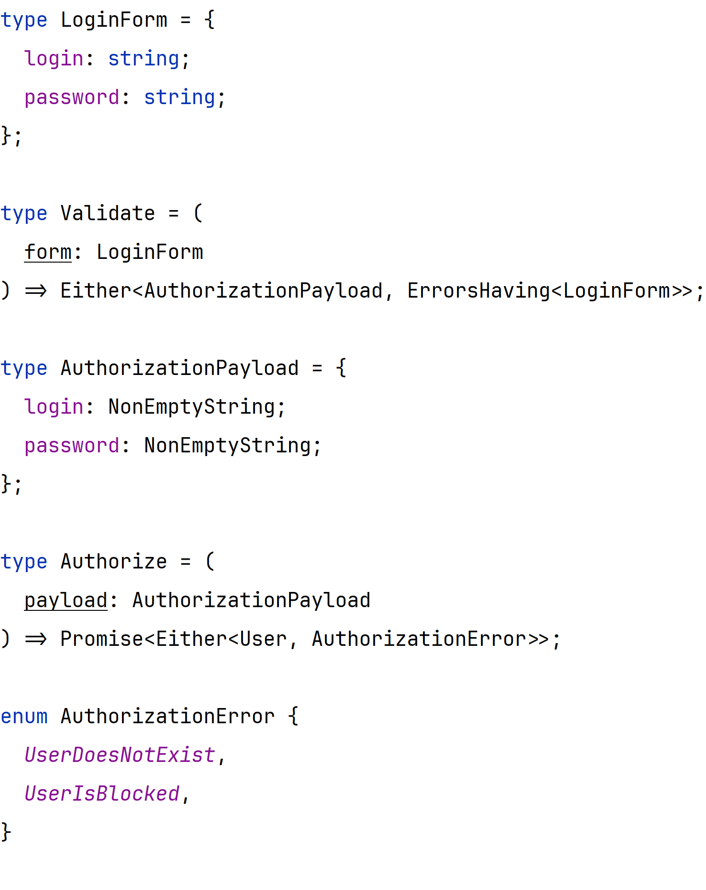

Реализация скрыта в целях упрощения

Разберем представленную модель детальнее:

* `LoginForm` - описывает модель состояния формы входа, где каждое поле это обычная строка.
* `Validate` - функция, которая выполняет проверку введенных данных. Если она прошла успешно, то
  возвращается `AuthorizationPayload`. В случае наличия ошибок, возвращается объект с ошибками.
* `AuthorizationPayload` - модель которую ожидает сервер. Принимаются не любые строки, а только те, что не являются
  пустыми, о чём явно в типе и говорится.
* `Authorize` - ассинхронная функция, выполняющая вход по проверенным данным формы. В случае успеха возвращает объект
  пользователя. При неудачной попытке входа, возвращает код ошибки описанный в перечислении `AuthorizationError`.

Обратите внимание на то, насколько содержательной является описываемая модель, даже несмотря на то, что все детали
реализации были специально скрыты. Но это не самое важное, важно отдельно отметить то, что данные правила *обычно* имеют
тенденцию изменяться по разным причинам по сравнению с UI и доступом к данным.

Но не всё так просто.

### Общие изменения

Описывая часто встречающиеся ответсвенности мы неизбежно столкнемся со следующим противоречием:

* С одной стороны говорится что ответсвенности это чрезвычайно относительное понятие, которе диктуется характером и
  направленностью изменений, возникающих на проекте.
* С другой стороны утверждается что есть некоторые четкие, всегда работающие паттерны, которые обозначают *всегда
  разные* ответсвенности.

Как второе утверждение может работать если соглашаться с истинностью первого? К сожалению, несмотря на то, что инженеры
в основном имеют дело с формальными системами, достаточно тяжело и порой невозможно систематизировать все процессы и
проблемы возникающие при разработке программ.

Первое утверждение является аксиомой, незыблемым правилом. Второе - лишь результат эмпирического метода. Да, указанные
ответсвенности имеют тенденцию быть разными, меняться по разным причинам и по запросам разных акторов. На каких-то
проектах это проявляется больше, на каких-то меньше.

Нельзя также не отметить наличие изменений которые будут затрагивать сразу несколько слоев:

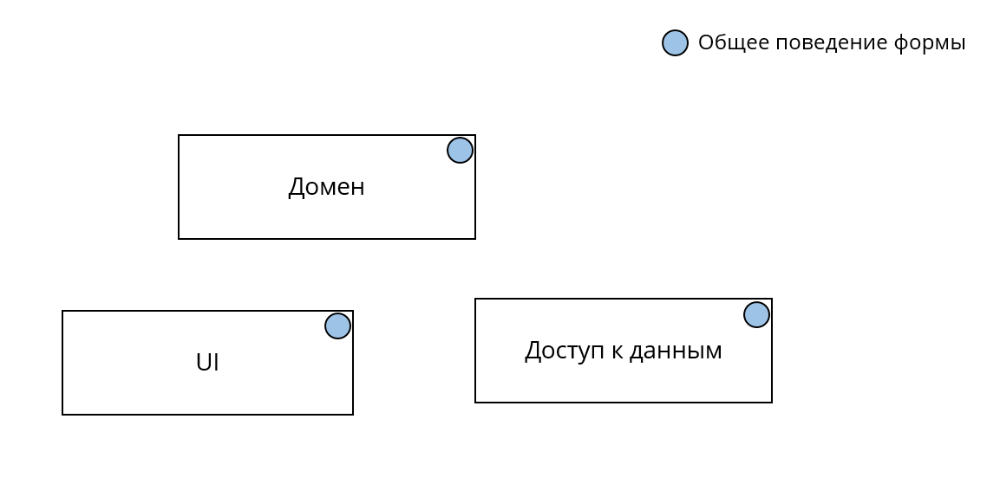

Зависимости между слоями специально скрыты

Из самого очевидного - реализация формы входа. Полная имплементация потребует изменения всех указанных слоев. Также
вероятны и последующие корректировки поведения, которые также будут глобальными: добавление нового поля, изменение
формата данных и так далее.

Вывод здесь одновременно простой и сложный - не нужно воспринимать перечисленные слои за чистую монету, за рецепт
который всегда будет давать ожидаемый результат. Это скорее лишь рекомендация. Что касается определяющего фактора - это
именно характер и направленность фактически возникающих изменений на конкретном взятом проекте.

### Опыт

В конечном итоге, самым эффективным и мощным оружием в руках любого инженера является его опыт, а точнее те знания, что
из него были выведены. Только благодаря всем тем ошибкам, что были совершены, и тем урокам, что были выучены,
разработчик может иногда осознано, а иногда на уровне инстинкта предсказывать компоненты, которые будут меняться по
определенным причинам в будущем.

Рассмотрим частую для многих ситуацию: требуется реализовать приложение для отображения отчетов, которое
должно интегрироваться со сторонней системой, предоставляющей необходимые данные.

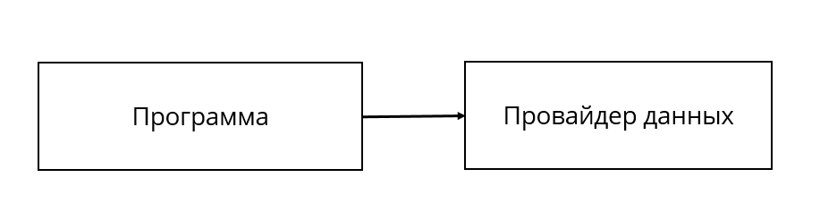

Но есть один нюанс - провайдер данных ещё не был разработан. Выбора нет, работать надо уже сейчас, даже не смотря на
отсутствие одного из критичных элементов системы. Раз его нет, а показывать и тестировать что-то нужно, инженеры решают
разработать эмулятор:

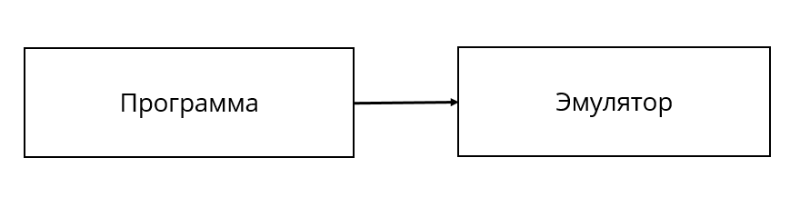

Любому должно быть понятно, эмулятор рано или поздно нужно будет заменить на реальную систему, когда она будет готова и
чем меньше компонентов системы при этом нужно будет изменить, тем лучше. Иначе говоря, чем меньше компонентов будут
обладать зависимостью от конкретной реализации провайдера данных, тем лучше. Эта зависимость формирует ответственность,
один из способов от неё избавиться, это её ослабить:

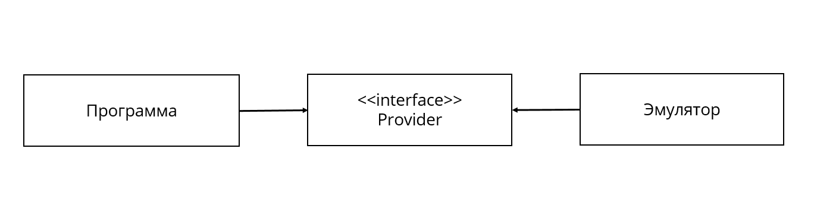

Теперь, основная программа зависит от типа, а не от конкретного поведения. К тому же, контракт `Provider` теперь можно и
нужно передать сторонним разработчикам реального провайдера данных в качестве строго перечня ожидаемых поведений:

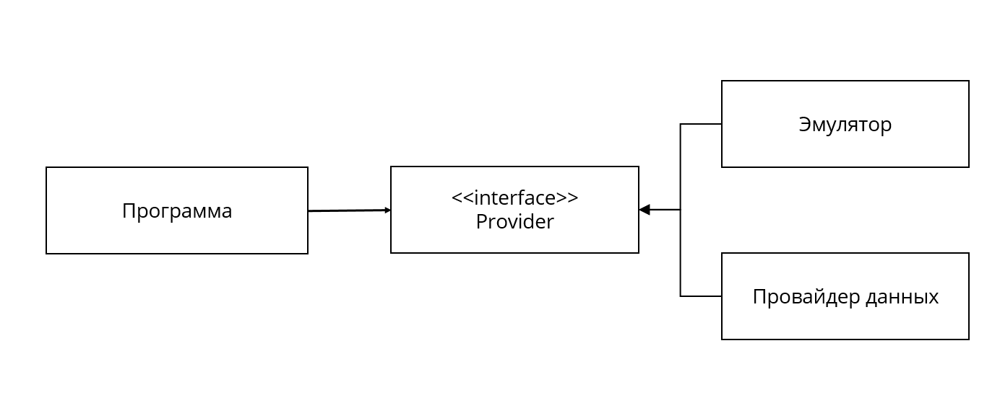

Это лишь один из примеров, он самый простой, тем не менее хорошо демонстрирует один из аспектов инженерной мысли.
Однако, с таким предвосхищением можно легко перебрать, итогом чего станут интерфейсы с одним единственным
имплементатором, абстрактные классы с одним наследником, все те элементы, возможности к расширению которых, так и не
были реализованы в полной мере, приведя дизайн в состояние избыточности.

## Архитектуры

Одного разделения на слои - не достаточно, необходимо также организовать их правильное взаимодействие между собой,
расставить зависимости, определить их направленность и силу.

### Чистая архитектура

Чистая архитектура, являющаяся одной из самых известных архитектур, послужит отличной демонстарцией того, каким образом
и по каким правилам происходит установка зависимостей между слоями.

Рассмотрим её структуру:

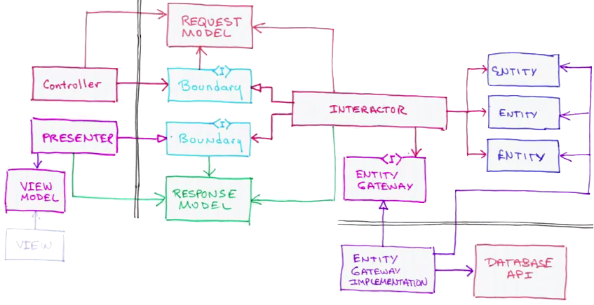

По началу, схема может показаться сложной, поэтому разберем её по порядку. Начнем со слоя доступа к данным, здесь эту
роль выполняют данные два компонента:

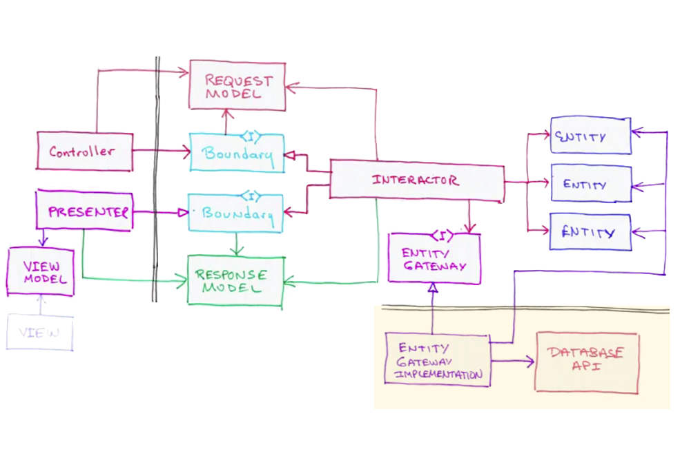

Область доступа к данным обозначена цветом

`GatewayImplementation` это так называемые репозитории, функции через которые осуществляется работа с данными, через
обращение к БД, API удаленного сервера и другим источникам постоянного состояния приложения.

От блока `GatewayImplementation` проходит полая стрелка к `EntityGateway`. `EntityGateway` - это интерфейс, иными
словами контракт, который `GatewayImplementation` должен реализовывать. Начиная с данного момента мы переходим к
доменному слою приложения:

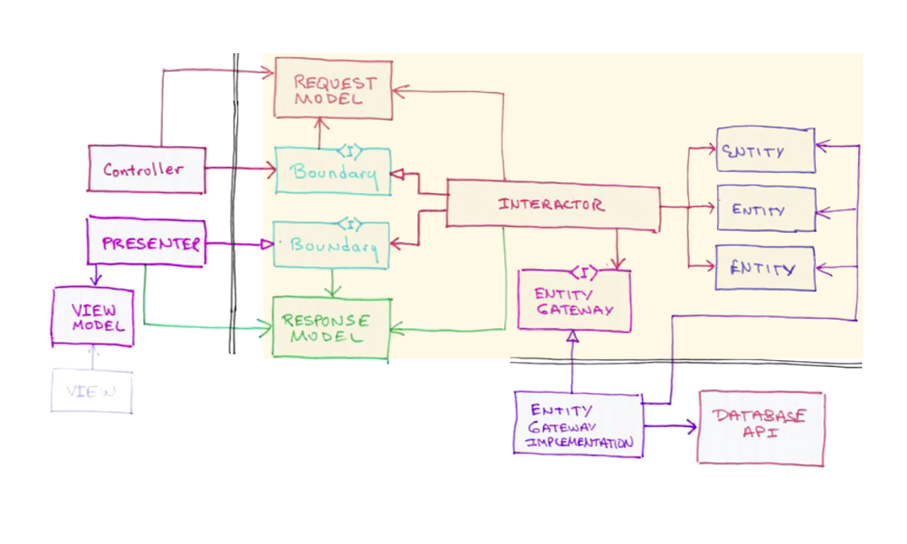

`EntityGateway` является частью ядра системы, того места где описываются доменные сущности и зависимости между ними. Для
нас не должно быть удивительно что слои ядра и доступа к данным разделены, ведь они имеют разные ответсвенности. Что
важно отметить, так это то, каким образом это сделано - через промежуточный интерфейс. Это сильно напоминает ситуацию с
логированием рассмотренную ранее:

calcShowTotal использует логирование через интерфейс

Как `calcShowTotal` использует объект логирования через интерфейс, так и ядро обращается к репозиторям не напрямую, а
через специальный тип `EntityGateway`. У этого есть как минимум две причины:

* У интерфейса может быть много разных реализаций. Слой ядра может использоваться отдельно от конкретных источников
  данных. Домен может тестироваться отдельно от остального приложения, в более изолированном окружении.
* Инверсия зависимости через контракт выступает дополнительной защитой ядра от возникающих изменений в слое доступа к
  данным. Тем самым как бы поддерживая раздельность их ответственностей, через ослабление связи.

Важным нюансом здесь является то, что интерфейс `EntityGateway` находится именно на стороне ядра, тем самым
дополнительно подчеркивается, что именно домен диктует правила (контракт) для репозиториев, но не наоборот.

Теперь ненадолго переключимся на слой UI:

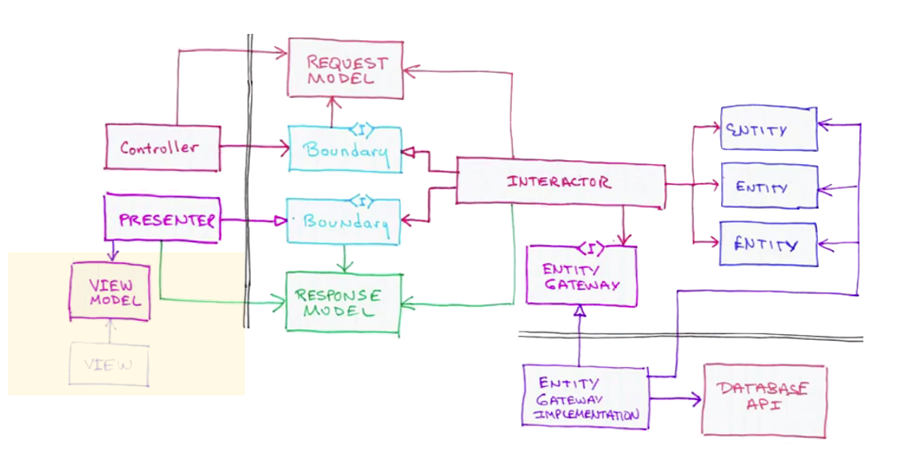

* `View` - это компонент содержащий в себе описание пользовательского интерфейса: композицию элементов и их стили
* `ViewModel` - это описание модели данных с которым работает представление. Но почему автор не разрешает использовать
  доменные сущности напрямую?

Ответ прост - для поддержки разделения ответсвенности. Обратим внимание на данные компоненты:

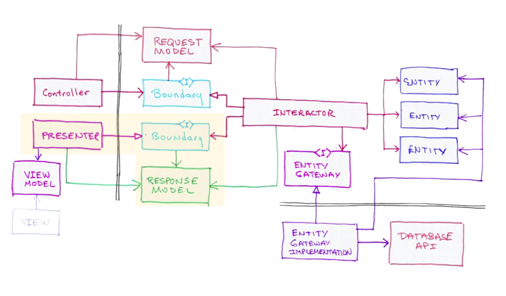

`Presenter` - это элемент, который принимает данные от ядра в виде `ResponseModel`. Дальше, его задача заключается в
*преобразовании* доменной
модели в модель представления. По сути, данная сущность выполняет роль адаптера. Таким образом, если доменная модель
изменится, у разработчика будет возможность сократить жесткость системы, внеся точечные изменения в сам `Presenter`,
адаптируя новый тип из ядра под старый `ViewModel`, тем самым оставляя UI не тронутым.

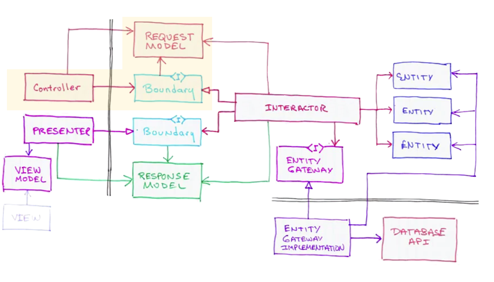

Связка `Controller` и `RequestModel` выполняют ту же роль, только в ином порядке. Если `Presenter` является принимающей
стороной (получение данных из ядра в UI), то `Controller` наоборот, передает их в сторону домена от пользовательского
интерфейса (обычно это происходит по событиям взаимодействия с пользовательским интерфейсом). `Controller` также
выполняет роль защитника ответственностей. В случае
если модель представления изменится, домен имеет высокие шансы быть защищенным путем возможной адаптации модели в
обработчике события.

Теперь попробуем избавиться от всего лишнего оставив только фактические compile-time зависимости:

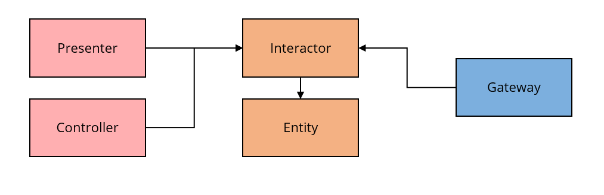

Если приглядеться, то можно заметить следующие свойства:

* В центре находится самый абстрактный компонент. Доменный слой со своей отдельной ответственностью. Так как данный
  компонент системы имеет множество клиентов, он должен быть максимально стабильным. Изменения в UI и слое доступа к
  данным имеют мало шансов проникнуть в данный слой благодаря наличию интерфейсов и адаптеров между ними.
* Зависимости направлены в сторону повышения конкретности. То есть, компонент зависит от более абстрактного элемента, не
  наоборот. Это положительно сказывается на свойствах дизайна, определяющих его восприимчивость к изменениям.

Стоит напомнить отдельно - определяющей характеристикой любой архитектуры является её поддерживаемость. Это то,
насколько она является прозрачной, не избыточной и адаптивной к входящим в неё изменениям. Многое здесь зависит от
правильного разделения ответственностей, с учетом конкретной ситуации на взятом проекте. Это означает, что способ
организации слоев предлагаемый в рамках чистой архитектуры имеет высокие шансы оказаться неподходящим под нужды
конкретно взятого проекта.

### Функциональная архитектура

Функциональная архитектура рассматривает вопрос построения приложения несколько в ином формате. Предположим, что перед
нами стоит задача спроектировать библиотеку для работы с асинхронными списками. Если мы решаем структурировать данный
проект используя функциональную парадигму, то первое, что нужно сделать, так это объявить набор *аксиом*.

Аксиома - это фундаментальное свойство системы, принятое за данность. В случае с нашей библиотекой, такие аксиомы могут
принять следующий вид:

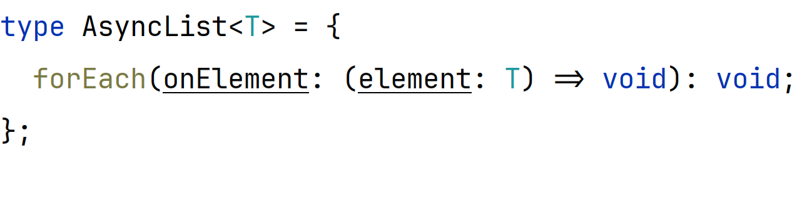

AsyncList с одной единственной операцией

Это формирует фундамент дизайна системы:

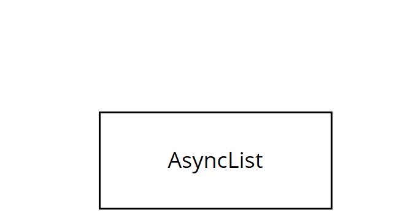

Все последующие свойства и утверждения будут как бы следовать из факта существования объекта `AsyncList<T>` с
операцией `forEach`:

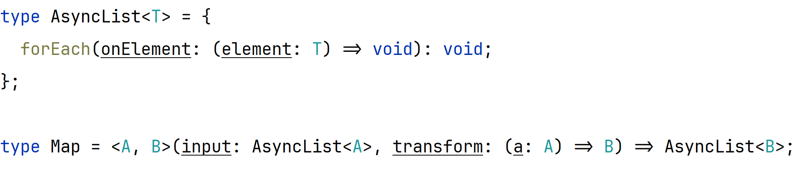

Реализация скрыта для простоты

Код выше как бы говорит следующее: "Если существует такой тип `AsyncList<T>` с операцией `forEach`, то тогда должна
существовать операция `Map`, преобразующая `AsyncList<A>` в `AsyncList<B>`".

Важно то, что `Map` зависит от `AsyncList`, но не наоборот:

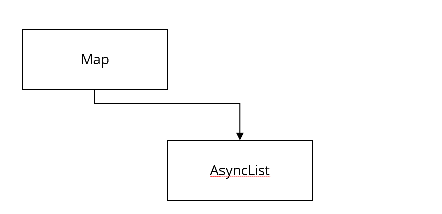

Продолжим исследовать мир, где единственным объектом является `AsyncList`. Отметим, что также возможна и подобная
операция:

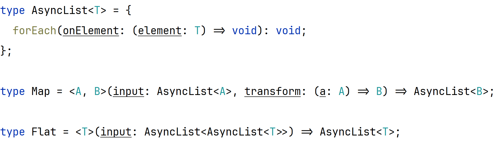

На схеме это выглядит следующим образом:

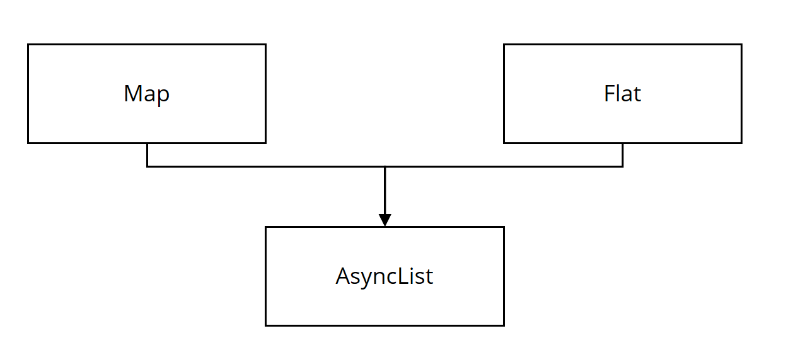

Дальше происходит самое интересное, исходя из того что имеются `Map` и `Flat`, существует `FlatMap`:

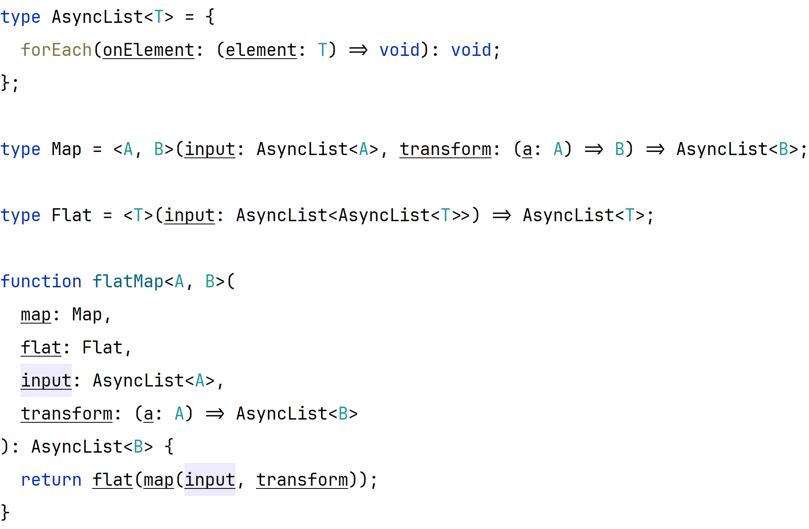

Все зависимости flatMap получает из своих аргументов для наглядности. В реальности, на большинство из дочерних процедур функция будет ссылаться напрямую

На схеме это можно отобразить так:

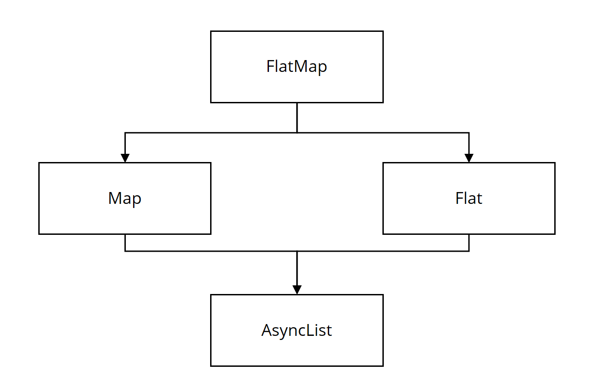

flatMap располагается "этажом" выше остальных модулей

Логика процесса построения функциональной структуры должна быть предельно ясна к этому моменту:

* В начале строятся базовые атомарные блоки
* Далее, шаг за шагом из них "выращиваются" остальные поведения
* Чем выше по иерархии зависимостей находится компонент, тем больше блоков внутри он использует

Это можно сравнить с достаточно популярным конструктором Lego, где базовые кирпичики являются монолитными, абсолютно
неделимыми. Дальше, из этих небольших блоков собираются отдельные компоненты. Они, в свою очередь, соединяются вместе,
для того чтобы образовать финальную конструкцию.

Каким образом это связано с ответсвенностями и принципом SRP в частности? Обратимся еще раз к структуре компонентов:

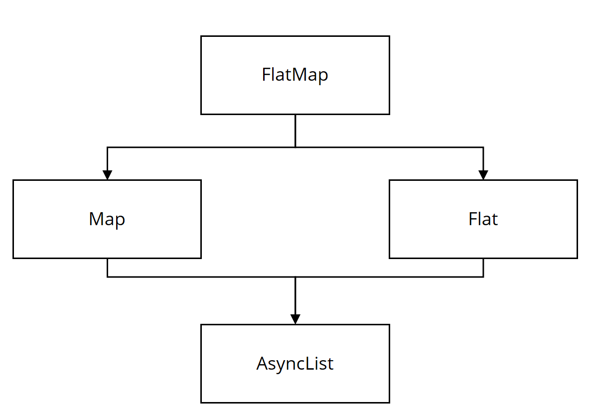

Как было отмечено ранее, чем больше зависимостей имеет компонент, тем выше он располагается по иерархии. На диаграмме
выше, самым зависимым элементом является функция `FlatMap`. Это означает, что её очень просто *изменять*, она не вызовет
жесткость или хрупкость, ведь у неё нет клиентов.

С другой стороны, объект `AsyncList` располагается в самом низу дизайна. Это делает его *чрезвычайно* ответсвенным, ведь
у него много клиентов. Если он будет изменяться часто, то дизайн начнет проявлять серьёзные признаки жесткости и
хрупкости из-за наличия большого числа зависимых от него элементов.

#### База

Чем ниже по иерархии располагается компонент, тем *реже* он должен изменяться. Единственный способ сделать компонент
менее изменяемым - это сократить количество его ответственностей. При этом, те что остались, не должны срабатывать
слишком часто, в противном случае компонент так и останется нестабильным.

В каких-то случаях сокращение причин для изменений происходит неявно, как с `AsyncList`, он естественным образом ни на
что не ссылается:

В других же это достигается путем внедрения абстрактных сущностей, через ослабление зависимости от элементов, что
изменяются по другим причинам, как в примере с `calcShowTotal` и объектом логирования:

#### Надстройка

Компоненты, которые изменяются часто, или по крайней мере инженер считает что так будет происходить в будущем, должны
как бы всплывать вверх. Чем выше компонент по иерархии, тем меньше клиентов он имеет, тем меньше вреда получит система
от прямых модификаций в нем.

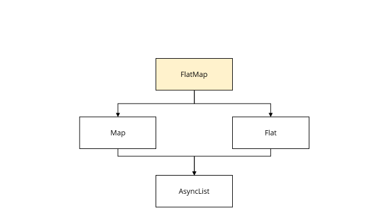

При функциональном подходе, данное правило соблюдается само собой, элемент `FlatMap` естественным образом имеет
тенденцию изменяться часто, ведь для этого у него имеется много причин:

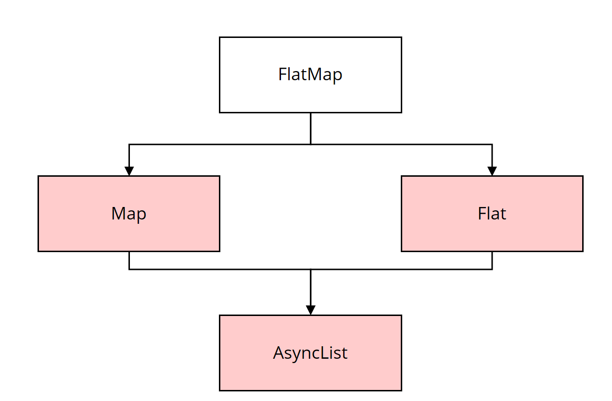

При прямых модификациях низлежащих компонентов, `FlatMap` будет требовать дополнительного к себе внимания, например для
адаптации и/или верификации поведения.

Помимо избавления изменяемых компонентов от клиентов, необходимо дополнительно убедиться в их простоте. Частые изменения
должны быть сгруппированы по своим источникам. Ранее было показано на сколько сложной для поддержки может стать даже
самая простая функция, если внутри будут смешаны разные ответсвенности.

#### Основное правило

Исходя из сказанного можно сформулировать простое правило - зависимости должны быть направлены в сторону понижения
количества ответственностей, в сторону более стабильных и реже изменяемых компонентов. Представим, на секунду, что
AsyncList обрел сильную зависимость от часто изменяемого элемента:

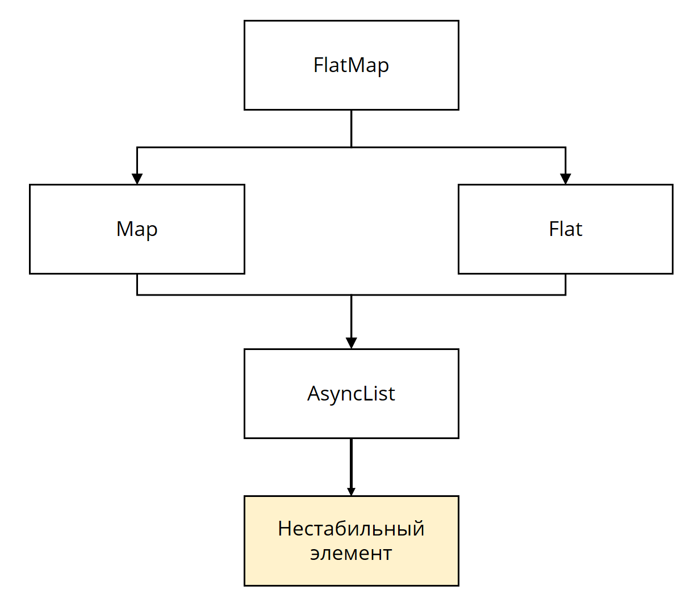

Это серьёзно усложнило бы поддержку всей системы, ведь при каждой модификации, каскад зависимостей выражался бы в
сильном проявлении жесткости и хрупкости всего решения. Это часто происходит незаметно для разработчиков, ведь мы редко
перепроверяем вручную всех клиентов после изменения общей части. Чаще всего это проявляется в виде большого числа
дефектов, которые являются вовсе неожиданными для инженеров и возникают в, казалось бы, совершенно не относящихся к
изначальной задаче местах.

Помимо грамотного разделения ответственностей, проблему могут частично решить тесты, как в статическом, так и
динамическом виде.

# Многомодульные приложения

Исследование вопроса разделения неизбежно привело нас к приложениям, состоящим из двух или более модулей. В последнее
время (на самом деле уже достаточно давно) особенно популярны микро-(сервисы/фронты) и это не удивительно. Программы
растут в сложности, вместе с этим и увеличиваются количество разработчиков, которые их создают и поддерживают. Для
упрощения управления их разделяют на *независимые* команды, каждая из которых занимается своей частью системы.

Вопрос грамотного разбиения программы, с учётом фактических ответственностей как никогда остро стоит при проектировании
архитектур подобного рода. Для наглядности, рассмотрим одну из самых встречающихся проблем.

## GOD модуль

Инженеры разрабатывают систему по управлению документами клиентов некоторого банка. В приложении присутствуют два
модуля: мои документы и поддержка. Оба элемента предоставляют возможность оставить отзыв.

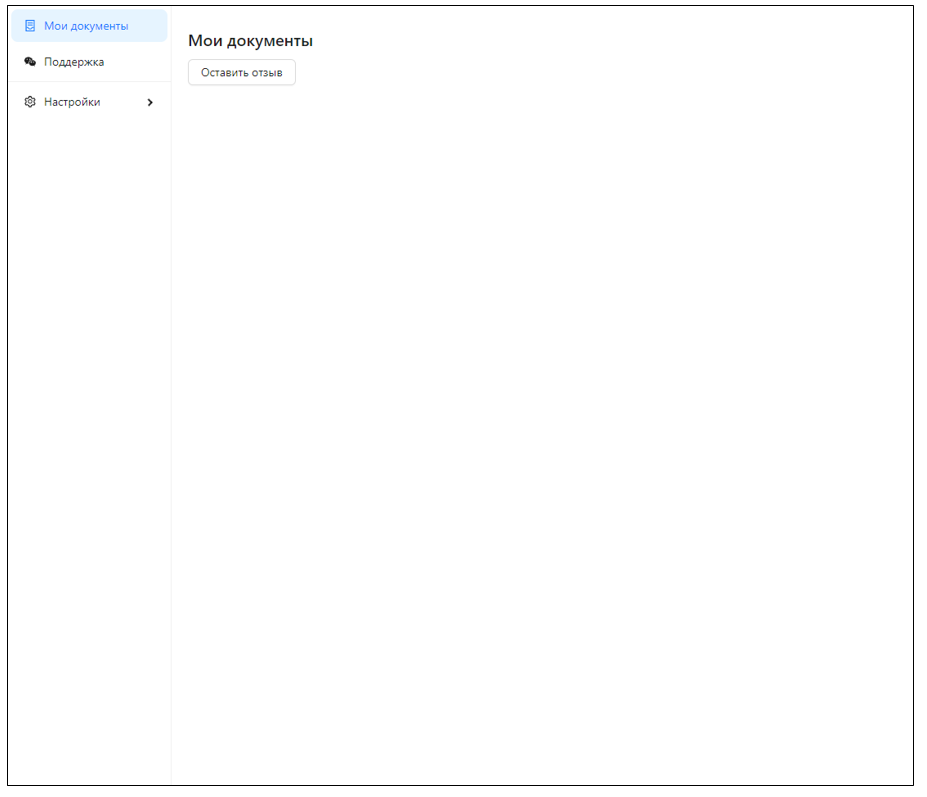

Каждый модуль подгружается по конкретному элементу меню

По нажатию на кнопку "Оставить отзыв" открывается форма:

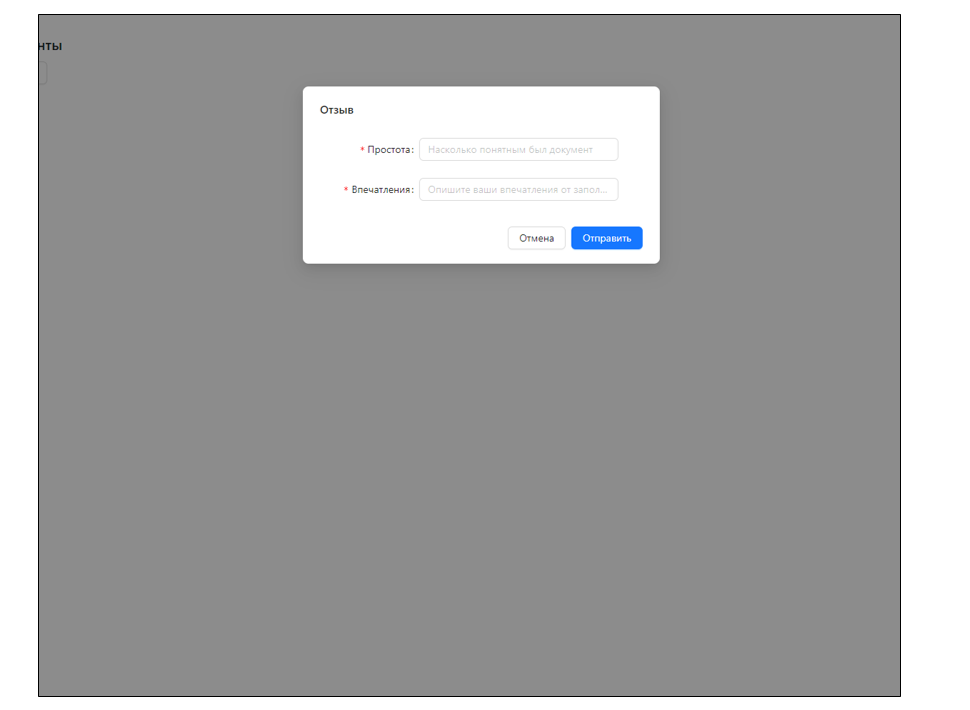

То же можно сделать и для раздела с поддержкой, правда поля формы несколько отличаются:

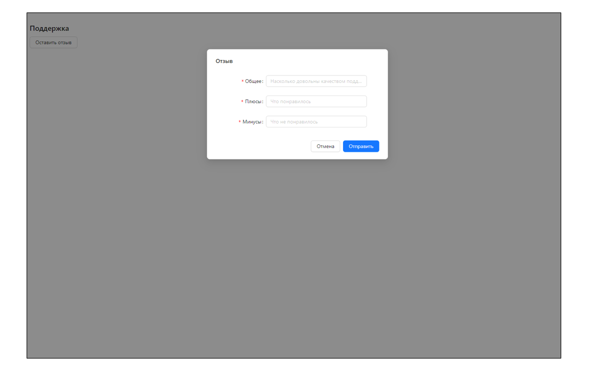

По нажатию "Отправить", происходит сохранение отзыва в рамках общего для отзывов API метода. На этапе проектирования,
инженерами было принято решение вынести отзывы в отдельный модуль:

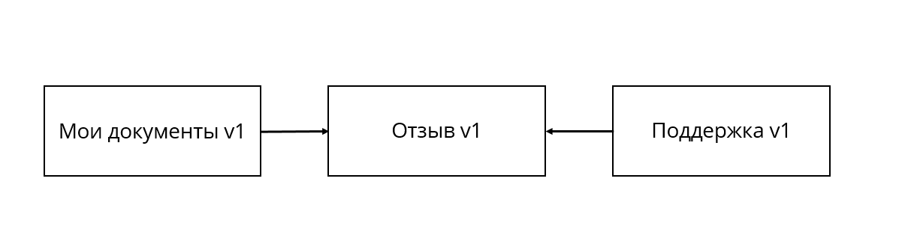

У модулей специально указана версия, это пригодится нам позднее

Использование данного модуля выглядит следующим образом:

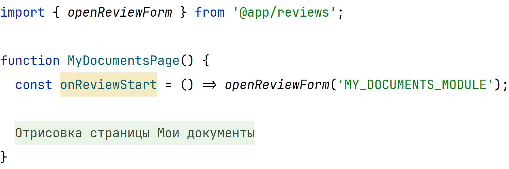

Содержимое модуля "Мои документы"

Модуль "Мои документы" вызывает функцию `openReviewForm` в которую передает некоторый идентификатор. Далее, посмотрим на
исходный код `openReviewForm`:

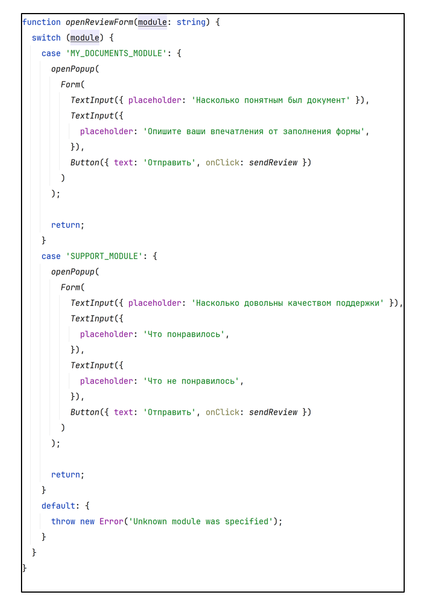

Содержимое модуля "Отзыв"

Внутри `openReviewForm` содержится `switch` проверяющий аргумент `module`. Далее, в зависимости от того кто является
клиентом, строится форма содержащая указанные поля, по нажатию "Отправить" данные передаются в общий сервис через
функцию `sendReview`.

Как всегда, самым первым и зачастую очевидным признаком смешивания ответсвенностей является размер функции. Это,
конечно, не значит что всякая большая функция обязательно имеет несколько источников для изменений. Это стоит
воспринимать как признак требующий более пристального внимания от инженера.

Второй момент, который также бросается в глаза, это наличие `default` кейса. То есть с точки зрения модели, возможна
такая ситуация при которой в `openReviewForm` передается такой модуль, поля формы для которого еще не были реализованы.

Не будем спешить и заниматься преждевременными оптимизациями, вместо этого мы, как всегда, понаблюдаем за тем, как такой
дизайн будет реагировать на входящие *изменения*.

### Новое поле

Аналитик из команды "Мои документы" решил, что оставляемой в отзыве информации не достаточно, пользователь также должен
указать свои пожелания по заполняемому составу. Разработчики вносят необходимые изменения в модуль "Отзыв":

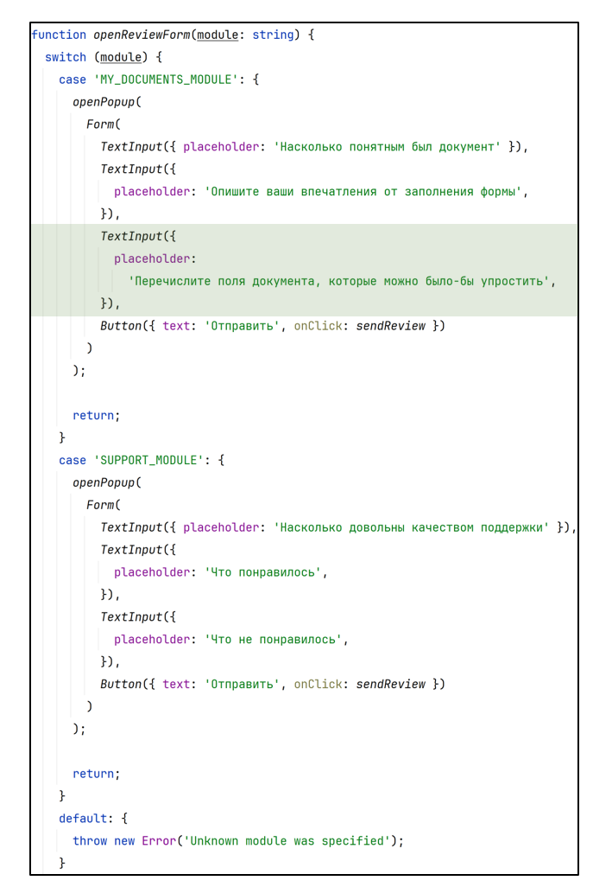

Теперь, дело осталось за простым, отправить новую реализацию в тестирование и дело в шляпе, верно? Не совсем. Прежде
всего, необходимо выпустить новую версию модуля "Отзыв" со свежими изменениями:

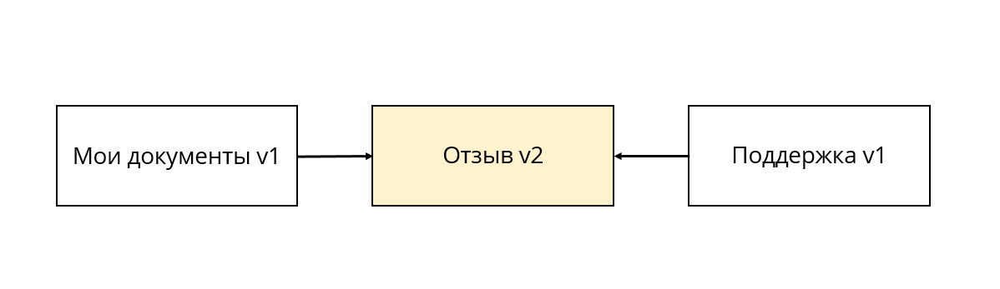

Далее в файле зависимостей модуля "Мои документы" нужно поднять версию модуля "Отзыв", тем самым также увеличив его
версию:

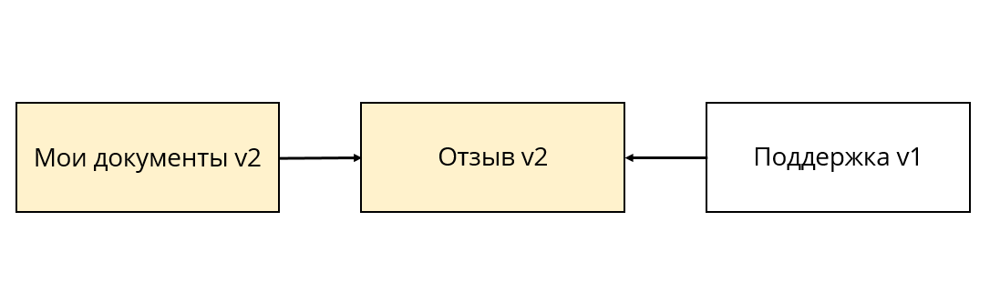

Теперь, необходимо собрать приложение целиком, но вдруг, при попытке сборки всей системы мы получаем ошибку:
модуль "Поддержка" не совместим с новой версией модуля "Отзыв". У нас не остается другого выбора кроме как явно указать
в мета-файле зависимостей вторую версию отзывов, что, в свою очередь также вызовет новый релиз:

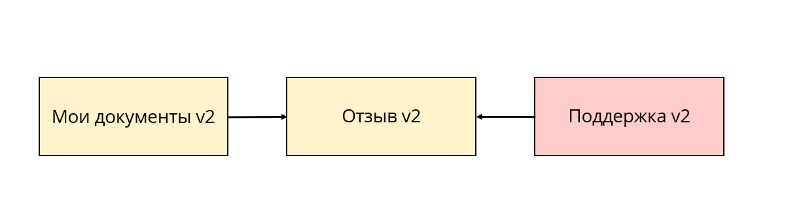

Обратите внимание на то, что текущий дизайн, а именно необходимость прямой модификации общего модуля, вызвало новый и,
что самое главной, *лишний* релиз для модуля поддержки. Это проявление *жесткости* системы.

Конечно, можно организовать версионирование таким образом, чтобы сборщик принимал новые версии отзывов как совместимые
со старыми клиентами, например средствами семантического версионирования. Это лишит дизайн жесткости, но *хрупкость*
никуда не денется. С каждым новым релизом отзывов, все его клиенты должны быть протестированы заново, во избежании
вероятного регресса.

Без сокращения общности можно сказать что ситуация полностью симметрична с обеих сторон. Рассмотрим диаграмму
ответственностей:

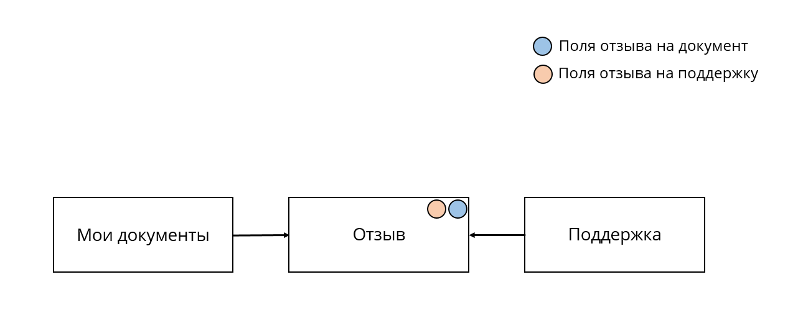

Ничего не напоминает? Именно, это ровно та же ситуация с ложным дублированием, что мы рассматривали ранее:

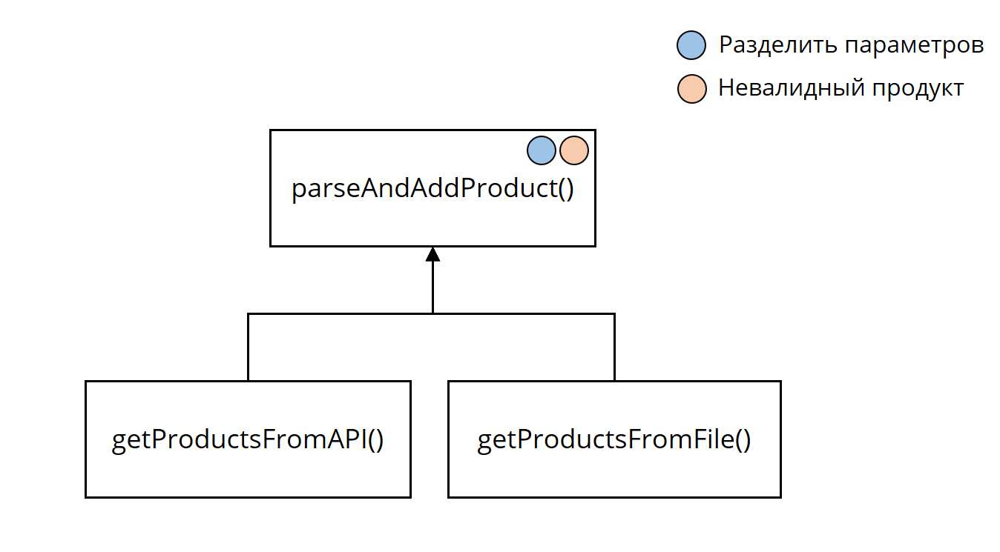

Хотя на этот раз ситуация не связана с дублированием, а скорее с неверным определением *функции* модуля, что мы
встречали ранее. Такая реализация обладает всеми негативными свойствами, что были рассмотрены ранее. Более того, в
данном случае ситуация гораздо хуже, ведь *расстояние* между элементами выше.

Расстояние между элементами - это метрика, которая характеризует, насколько легко те или иные части изменять
единовременно.

* Расстояние между двумя функциями в одном файле минимальное, ведь их легко изменять вместе
* Расстояние между двумя модулями программы с раздельными релизными циклами максимально, так как их гораздо сложнее
  изменять синхронно.

Не стоит забывать и про команду, работающую над отзывами. У них тоже могут быть свои задачи и собственные приоритеты,
что может негативно сказаться на скорости отладки и поставки функционала. Модуль "Мои документы" начнет зависеть от
того, насколько сильно загружена команда модуля "Отзыв". В таком случае дизайн начинает проявлять признаки *вязкости*.

Каким образом можно исправить данную ситуацию? Путем разделения ответсвенностей по своим клиентам конечно-же:

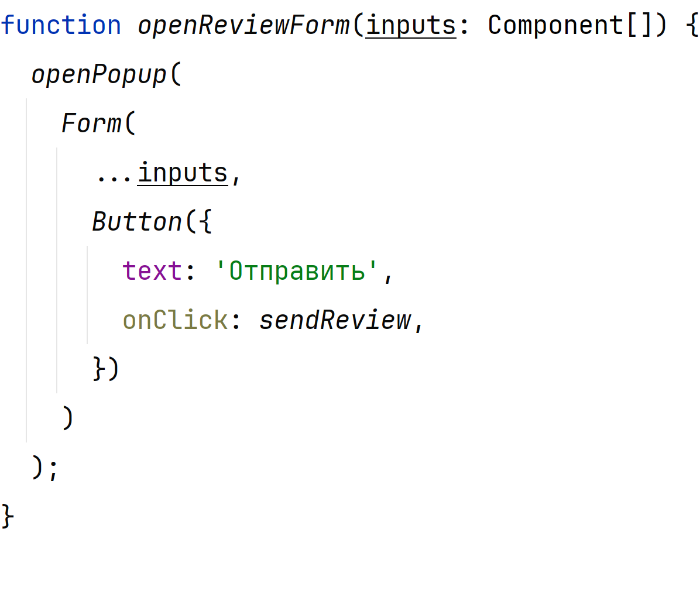

Содержимое модуля "Отзыв"

Функция `openReviewForm` теперь содержит истинно общую часть: внешнее обромление формы и логику отправки данных. От
конкретных полей она полностью отвязана через ослабление связи.

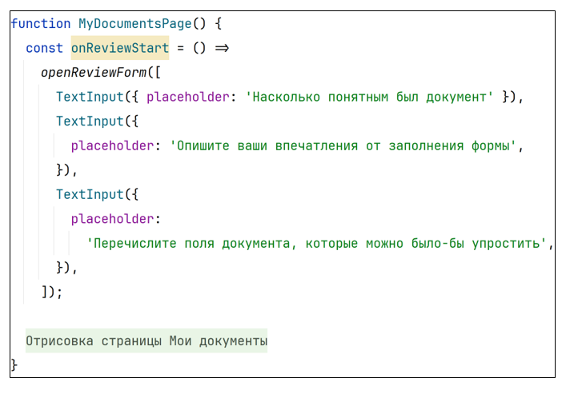

Содержимое модуля "Мои документы"

Должно быть предельно ясно, что теперь в случае возникновения подобных изменений в будущем, общий модуль отзывов
останется без изменений:

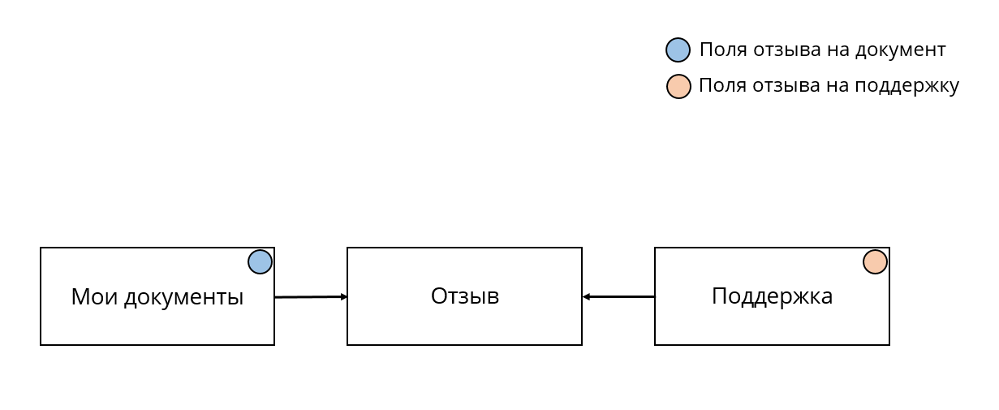

При этом, в случае изменения общей части отзывов, части характеризующийся истинным дублированием, все его клиенты будут
также затронуты, по определению.

## Компонентный модуль

Во время работы над проектом, между тремя модулями: "Мои документы", "Отзыв" и "Поддержка" образовалась общая часть -
контейнерные типы. Асинхронные списки и деревья - пока единственное содержание данного пакета:

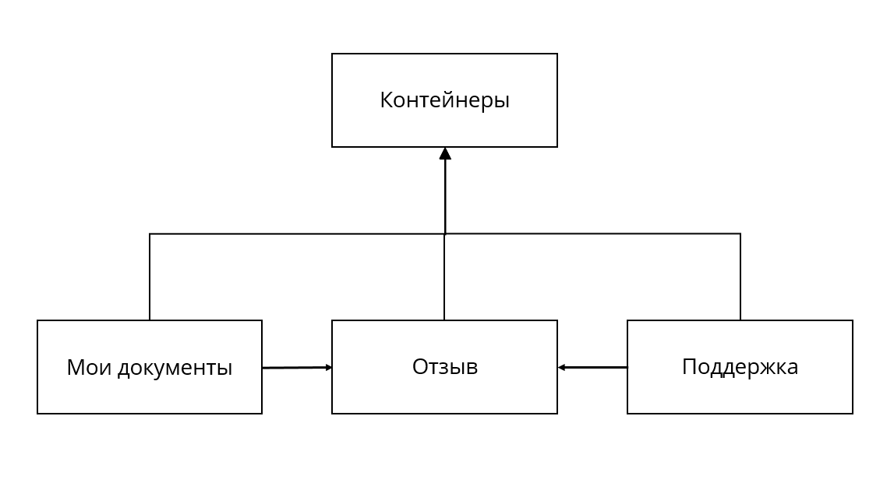

Спустя некоторые время, в рамках модуля "Поддержка" добавляется новый контейнер - очередь. Встаёт закономерный вопрос -
какому модулю данный элемент должен принадлежать? Все контейнеры лежат в отдельном общем модуле и логичней будет
поместить новый тип туда же, верно?

Одним из основных свойств дизайна является его устойчивость к изменениям - это основная мысль, пронизывающая от и до
данную статью. Если поместить очередь в модуль "Контейнер", это создаст лишнюю зависимость для остальных его клиентов,
так как будет являться ложным дублированием:

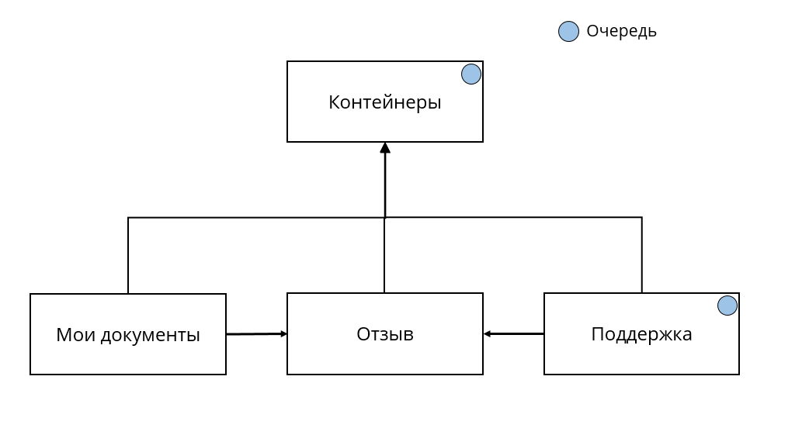

Отсюда и будут исходить все те нежелательные свойства, что были описаны много раз прежде. Но всё ли так просто?

### Общее поведение

Представим, что через некоторое время инженеры решили, что все контейнеры, использующиеся в проекте, должны быть
итерируемыми, они должны реализовывать данный интерфейс:

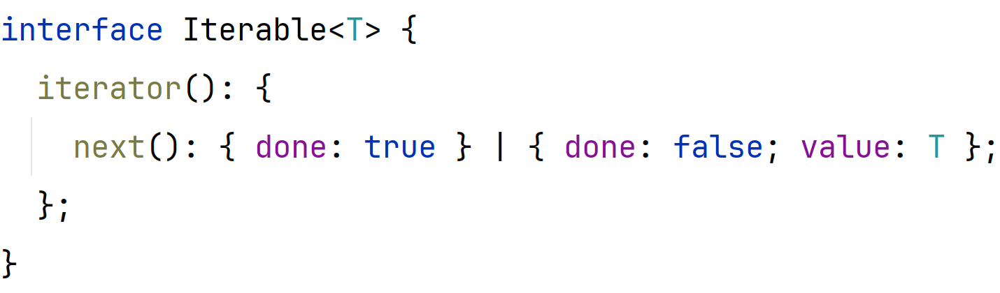

Проблема заключается в том, что разного рода структуры разбросаны по отдельным модулям и только общая их часть
сконцентрирована в модуле "Контейнеры". Это несколько усложняет работу, ведь вероятно было бы проще если бы ей занимался
один инженер и только в рамках одного модуля. Вместо этого, задачу нужно распределить между командами и синхронизировать
приоритеты и оценки таким образом, чтобы миграция была завершена к определенному и заранее известному сроку.

На диаграмме ответственностей это выглядит следующим образом:

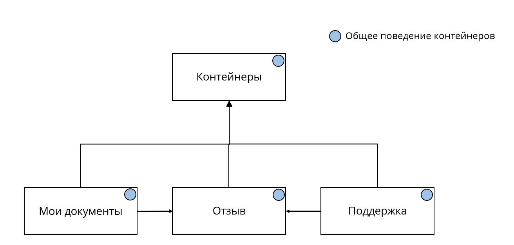

Изменение, как бы дробью распространяется по многочисленным модулям. Проблема здесь вызвана не только самим количеством
затрагиваемых элементов программы, но и расстоянием между ними, оно очень большое, ведь на проектах с подобным
устройством труда, циклы и процессы разработки разных модулей могут отличаться значительно, а координация потребует
особых усилий со стороны управленцев.

На лицо явное противоречие: с одной стороны говорится, что элементы, которые *используются вместе*, должны располагаться
максимально близко друг к другу (CRP*), с другой, элементы которые *изменяются вместе* должны также быть достаточно
близки (CCP**). В случае с примером выше, одно правило говорит нам оставить очередь в модуле "Поддержка", другое
утверждает что структура должна отправится в общую часть.

* Common reuse principle (CRP) - элементы использующиеся вместе, должны принадлежать одному модулю. Использующиеся вместе - значит имеющие одних и тех же клиентов, это утверждение полностью эквивалентно истинному дублированию.
** Common closure principle (CCP) - элементы имеющие одинаковые причины для изменений, должны принадлежать одному модулю. В базовом определении используется термин "закрытость", как было показано ранее, закрытость от изменения это то же самое что и отсутствие лишних ответсвенностей. 

Каким же образом поступить? Обычно, только при начале работы над проектом, самой важной характеристикой является
удобство разработки, то есть прямое изменения кода. Когда клиентов еще не так много, простота в повторном использовании
не так важна:

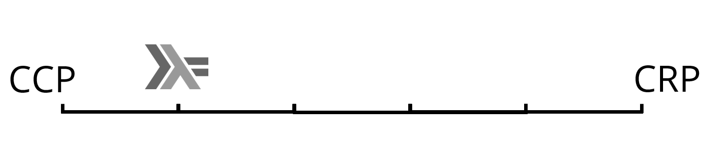

Но со временем, когда количество модулей растет, устройство элементов стоит немного смещать в сторону удовлетворения
CRP:

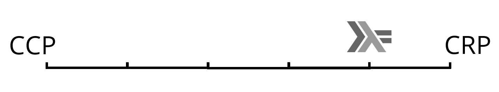

Но стоит помнить, что в конце концов, разработчик должен размышлять в рамках конкретно взятой ситуации, а
точнее - на то, какие ответсвенности срабатывают чаще, что изменяется чаще, общее поведение контейнеров или конкретные
структуры.

### Shotgun surgery

Проблема описанная выше, встречается на столько часто, что для него даже придумали общее название *Shotgun surgery*. Это
стандартная ситуация когда инженер при попытке реализации какого-то конкретно взятого поведения, обязан вносить
маленькие, а может и не очень маленькие, изменения в большое количество модулей. Чем больше расстояние между данными
сущностями, тем больше сил и нервов разработчик израсходует на реализацию требуемого поведения.

# Почти конец

На протяжении всей статьи с разных сторон демонстировался не столько сам принцип SRP, сколько та ключевая проблема,
которую он призван решить, а именно - адаптивность программы к изменениям. ПО которое плохо поддается изменению называют
*исскуственно сложным*. Для особо запущенных проектов существует даже отдельное понятие - устаревший (legacy) проект.
Устаревший он не потому, что ему много лет, а из-за того насколько сильно он сопротивляется входящим модификациям.
Устаревшим проект может стать и через неделю.

Существует лишь два инструмента борьбы с искусственной сложностью:

* Удаление - необходимо уметь определять избыточные конструкции и избавляться от них. Избыточном, называется такой
  элемент системы, без которого она также обладала бы требуемым от неё наблюдаемым поведением.
* Разделение - существует прямая корреляция между тем, какое количество ответственностей имеет функция и тем, насколько
  сложной она является. В статье это демонстрировалось ни один раз.

На бумаге всё звучит просто - функция должна иметь только одну ответственность, если она имеет больше, то просто
раздели! Однако самым сложным здесь является не столько разделение, сколько *определение* того, по каким причинам может
изменяться тот или иной компонент.

## Такомский мост

В США располагается достаточно известный Такомский мост:

Примечательным для нас его делает тот факт, что он строился дважды. Инженеры, проектируя его в первый раз, в основном
ориентировались на то, чтобы обеспечить достаточную устойчивость к нагрузке вызванной проходящим по нему трафиком.
Однако, спустя несколько месяцев после возведения он обрушился и произошло это не из-за того, что он не выдержал
избыточного веса машин, а из-за сильного ветра, что раскачивал его из стороны в сторону. Данный пример хорошо
иллюстрирует
основную проблему - до тех пор пока мост не был построен, инженеры не могли знать всех факторов, что могли
воздействовать на него в будущем.

Также и в программировании, мы редко можем знать заранее, в каком направлении будет изменяться наша система, какими
ответственностями она будет обладать в будущем. Единственный вариант - это выпуск первой, самой простой версии,
подопытного кролика за которым будут внимательно наблюдать и отмечать все те факторы, что влияют на него из вне.

Заказчик, зачастую, понимает чего он действительно хочет, только после того как увидит первую рабочую версию
продукта. С каждым новым релизом, программа должна учитывать весь предыдущей опыт, становится все адаптивней к
приходящим в неё модификациям, вырабатывать внутренний иммунитет к основным векторам изменений.

Инженеры учли полученный опыт после первой неудачной попытки возведения моста. Cпустя 10 лет Такомский мост был построен
вновь, на том же месте где стоит в целости и сохранности и по сей день.

