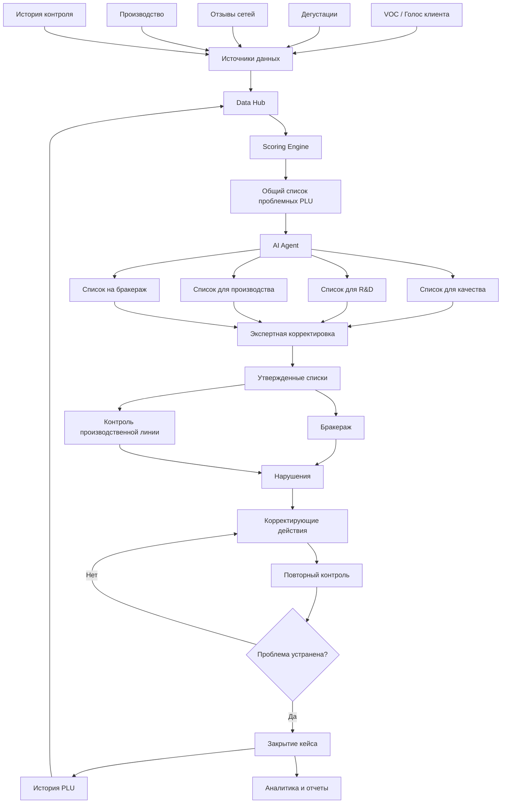

# Риски

* TO BE разрабатывается бизнесом и будет готов к 15.06 (сейчас есть только куски + AS IS)
* Только месяц на: собственный тикентный контур, интеграции с провайдерами данных, ИИ, UI,
  безопасность, отказоустойчивость, консистеность, производительность, observability, масштабируемость и расширяеомсть (
  новые провайдеры данных, системы скорринга, расширение UI)
* Разработка будет идти вместе с уточнением требований. Высокие риски по срокам.
* Отсутствует формализованный алгоритм отбора PLU.
* Не определены критерии успешности MVP и точность работы алгоритма
* Пробелы по историчным данным для ML
* Высокая зависимость от ключевых бизнес-экспертов для восстановления и формализации процесса

# Вопросы

* Что является основным объектом работы пользователя? (PLU, список PLU, нарушения)
* Кто является владельцем списка после его формирования? (возможны ли collaborative edits?)
* Как выглядит процесс утверждения списка? (статусная модель, история изменений, версии)
* Можно ли редактировать список после начала бракеража?
* Какой жизненный цикл нарушения?
* Что именно является результатом работы алгоритма отбора? (топ PLU? PLU с score?)
* Как формально определяется проблемный PLU?
* Что именно подразумевается под ИИ в MVP?
* Каким образом изменяется алгоритм отбора?
* Что считается успешным результатом работы системы? (Снижение жалоб? Сокращение времени реакции? Точность отбора PLU?
  Сокращение ручного труда?)
* Что входит в MVP, а что явно не входит?

# Допущения

### AI / Скоринг

* Для MVP достаточно NLP для обработки VOC + rule engine для принятия решения.
* Вероятно ИИ будет использоваться в парсинге VOC.
* Для MVP ML-модель на исторических данных не реализуется.
* Для MVP правила скоринга задаются через конфигурацию, без конструктора правил.

### Интеграции

* Интеграции реализуются только с согласованным минимальным набором источников данных.
* Исторические данные загружаются частично либо не мигрируются в MVP.
* Бумажные журналы остаются вне контура MVP.

### Workflow

* Для MVP достаточно простого жизненного цикла нарушения.
* Согласования, эскалации и сложные маршруты не реализуются.
* Повторный контроль назначается по фиксированным правилам.
* Корректирующие действия фиксируются вручную пользователями.
* Автоматический отзыв продукции не входит в MVP.

### UI

* Для MVP достаточно desktop версии UI.
* Для MVP дашборды простые, фиксированные виды, без оптимизации отрисовки.
* Для MVP поддерживается ограниченный набор ролей.
* Для MVP комментарии текстовые, без вложений и фотофиксации.
* Для MVP экспорт только в Excel/CSV.

### Аналитика

* Для MVP доступны только базовые отчёты по PLU, нарушениям и корректирующим действиям.
* Для MVP аналитика строится на оперативных данных без сложных витрин и OLAP-сценариев.
* Для MVP отчёты формируются по запросу, без сложной подписки и рассылок.

### Нефункциональные

* Для MVP допускается ручное масштабирование системы.
* Для MVP достаточно работы в одном контуре заказчика без геораспределения.
* Для MVP отказоустойчивость обеспечивается на уровне Kubernetes и PostgreSQL без сложных сценариев DR.
* Для MVP производительность рассчитывается на текущий объём PLU и пользователей без запаса под многократный рост.
* Для MVP используются стандартные механизмы безопасности платформы и корпоративные security controls заказчика без
  реализации дополнительных специализированных механизмов защиты.

# Общая концепция

Система управления качеством продукции, которая собирает сигналы о качестве из различных источников, автоматически
формирует списки PLU для контроля и бракеража, позволяет фиксировать результаты проверок, нарушения и корректирующие
действия, а также обеспечивает полный цифровой след от возникновения проблемы до её устранения.

# Модули

## Модуль интеграции (модуль а)

Набор интеграций с различными источниками информации внутри X5, реализуется на BE (складывается в общее хранилище и
приводится к общей модели)

## Модуль скоринга PLU (модуль б)

Ранжирует PLU по установленным правилам со своими весами и параметрами скоринга (жалобы, возвраты, брак на производстве)

## Модуль бракеража (модуль с)

Автоматически определяет какие PLU каким ответственным назначить (и какой срок)

## Модуль трекер (модуль d)

Позволяет управлять/контролировать процесс исправления дефектов по PLU (что-то вроде таск трекера, где задачи имеют ЖЦ,
ответственных, сроки, приоритеты и т. п.)
