What is programming? At the most basic level, programming is about telling the computer what to do. But even when we
program in assembly, the instructions we give the computer are an expression of something more meaningful. And how do we
solve problems? We decompose bigger problems into smaller problems. If the smaller problems are still too big, we
decompose them further, and so on. Finally, we write code that solves all the small problems. And then comes the essence
of programming: we compose those pieces of code to create solutions to larger problems. Decomposition wouldn’t make
sense if we weren’t able to put the pieces back together.

This process of hierarchical decomposition and recomposition is not imposed on us by computers. It reflects the
limitations of the human mind. Our brains can only deal with a small number of concepts at a time. The details of our
understanding of the human short-term memory might be changing, but we know for sure that it’s limited. The bottom line
is that we are unable to deal with the soup of objects or the spaghetti of code. We need structure not because
well-structured programs are pleasant to look at, but because otherwise our brains can’t process them efficiently. We
often describe some piece of code as elegant or beautiful, but what we really mean is that it’s easy to process by our
limited human minds. Elegant code creates chunks that are just the right size and come in just the right number for our
mental digestive system to assimilate them.

## Closure

Every morphism should be closed under a category, meaning that it should reference only to objects inside a category

## Group

We can go further and add additional constraints to the definition. Imagine that every morphism would have an operation
such that:

* g^-1 * g = id = g^-1 * g

In that case g^-1 is said to be the *inverse* element

In a group the one can compose anything with anything. But for a category this is often not the case. For that objects
must be *composable* so there should be morphism (direct or transitive) between objects.

## Programming category

It is useful for coding purposes use a category as a tool describing objects as types and morphisms as functions between
those types

## Time

Time is very hard to describe in mathematics, whereas in computation it is an important thing.

If it takes for a function infinite time to calculate so what is the return type for the function?
It is function that suppose to return an integer, but it never does because it goes into infinite loop. In that case
this function will return special value called *bottom* or *never*. It is isomorphic to an empty set which is contained
by every other set (including for example the set of all integers)

## Types

Types usually modeled as sets of values. It is mostly truth and is useful for practical purposes. So we can define
function between sets mapping objects from one set to objects in another one.

## Set encapsulation

Most of the properties of a set can be described without looking into its insides (its elements) completely via
morphism. These arrows for an interface that describes how one set relates to other sets. It is the most abstract
language we can think of. But why? For me, it looks just like another way to look at things. Maybe it is more abstract
because it contains fewer details.

# Functions, epimorphisms 2.1

A function in imperative programming is not exactly the same as function in mathematics. So the certain restrictions
need to be defined. Pure function is a name that describe procedures that map elements of one set to elements of another
set. These functions can also be *total* meaning that they are defined for all possible values in the set. The opposite,
partial functions are among the most problematic things in programming, they are sources of unhandled exceptions and
invalid results.

The function is considered pure if and only if it can be turned into a lookup table, meaning that it can be memoized.

## Building blocks

But what are the most primitive element to which we can decompose complex problems and then compose a solution? The
answer is a pure function. But why?

Sets joined with morphisms form a relation. It can be described using another ordered pair set which in turn isomorphic
to a memoization table. It is a subset of Cartesion product set. Every such subset is a relation by definition.

A {true, false}
B {0, 1, 2, 3}

A x B { [true, 0], [true, 1], [true, 2], [true, 3], [false, 0], [false, 1], [false, 2], [false, 3] }

isOdd B -> A { [true, 1], [true, 3], [false, 0], [false, 2] } is a subset of A x B

Function has one important property though - *directionality*. It means that one argument can not result in several
other result values. In previous example there would be impossible to have something like { [true, 3], [false, 3] }.

Total functions should map every element of argument set by definition. But it does not mean that every value in result
set will be touched as well.

## Domain

Argument set has special name - *domain*

## Codomain

Result set is called - *Codomain*

## Image

Function applied to argument set *domain* produces another set called *image* of the function which is a subset of
*codomain*

Image might equal to codomain, but it is not required so. Also, image set can be *smaller* than domain set. This
property is known as *directionality*. It also results in a condition that domain set is always greater or equal than
image set.

## Inverse

Suppose we have a function with `f :: a -> b` then procedure `g :: b -> a` is called inverse of f. g * f = id = f * g

Directionality can be tested by asking: "Is this function invertible?":

* If answer is "NO". So it is either:
    * There are at least two elements in domain set that result in one element on image set.
    * Codomain is larger than image. It means there are some values that do not have pair from domain.
* If answer is "YES" then domain and image sets have to be equal.

Interestingly enough that non-invertible functions increase entropy (loss of information). It exactly models an
abstraction where little details get lost in favor of important properties. It sifts information.

On the other hand, invertible functions represents process of modeling. It like recognizing certain patterns of domain
on image set.

Function that is invertible is automatically symmetric. Such function is said to be isomorphisms.

Isomorphisms using categorical language:

Given: A f -> B g -> A

g * f = id(A)
f * g = id(B)

Domain and image sets in that case are isomorphic, that is way it is named like that.

## Injective and surjective

Injective - Any x1, x2 belonging to X, result in f(x1) != f(x2)
Surjective - All y belonging to Y, have x belonging to X, such that f(x) = y

Suppose g1 * f = g2 * f. If f is invertible then g1 = g2. For f to be invertible it has to be injective (no collapsing)
and surjactive (image is equal to codomain). f is called epimorphism.

# Simple types 2.2

## Void

Let's consider empty set. In programming there is a type correspondence for this *Void*. Do not miss it with `void` like
in Java. Void does not contain any element, so it can not be created directly. We can have a function s.t.

> f :: Void -> Int

We can define such function but we cant call it, because there is no way to produce an element of type void.

> id :: Void -> Void
> absurd :: Void -> Int

The last name is not a coincidence. Void in logic corresponds to False statement. It means that we can not prove
something which is falsy. Prove in our case is a function constructing an element (or proof).
From False premises one can derive anything.

## Unit

Unit type has exactly one element. It can be constructed from nothing, it does not need additional information.
Single element set type corresponds to True statement in logic.

Suppose a function s.t. `a -> Unit` and there is only one such function.

Consider another function like `Unit -> Int`. It has to be constant. For example `one :: Unit -> Int` etc.

## Elements via morphisms

Interestingly enough, elements of a set can be described with a set of morphisms like Unit -> x where x belongs to X
set.

# Examples of categories, orders, monoids 3.1

## Zero object

Is it possible for a category to have no objects? There are no objects then there are no arrows (morphisms).
Conditions are satisfied because enumerator is "any". Zero is useless by itself but important in composition with other
nonzero categories.

## One object

Category having one object is also possible. It is just A id -> A. It has special name "
Monoid" 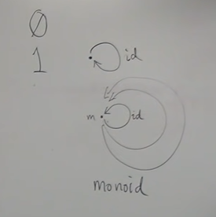
In general, category can have any number of objects.

## Graph vs Category

Category structure is very similar to graph, but there are some subtle differences:

* Graph might not have any arrows at all
* Every object should have identity arrows
* Every pair of composable arrows, there should be another arrow joining (composing) for
  result 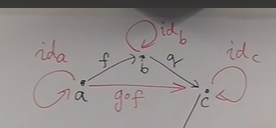

This construction in which we keep adding stuff in order to satisfy certain axioms is a very common construction in
category theory and is called "Free construction".

## Order

Order is a category where arrows are not functions. An arrow represents a relation. For example <=
relation. 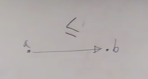
In other way we could say that A comes before B in some *order*. There are some conditions which Order must fulfill.

### Preorder

This kind of order satisfies minimum joining condition:

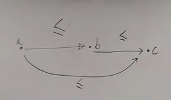

It is also associative (must be proven).

This relation also has to be reflexive, meaning that it contains an identity arrows for every
object. 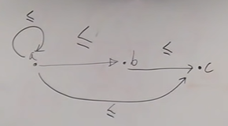

It can only have one arrow for each of two possible directions. 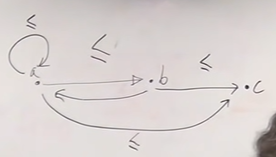

There can be objects with no relation at all.

### Partial order

It is an order which have all properties of Preorder, but it does not have any loops

### Total order

Is like partial order but every object has a one directional relation between any other object.

## Monoid from group theory

How is monoid defined in algebra. It is defined as a set. We have set of elements and an operator defined on them. For
example "multiplication" s.t. for every pair of elements a * b = c where c is an element of original set. It is called
binary element.

We can impose certain conditions on binary operator and the set:

* Closure. Follows from the fact that category has only one object and operation is an identity morphism.
* One element of a set to be a Unit. It is an element e s. t. a * e = a = e * a
* Associativity. (a * b) * c = a * (b * c)

String concatenation is another example of a monoid:

* Closure is satisfied
* Unit is an empty string
* It is associative

But is not symmetric (commutative). But it is still a monoid.

## Monoid and weak typing

In monoid, any two morphisms are composable. In programming, it means we can join any two functions together. In weakly
typed languages, any value has one exact type that corresponds to one object in a category, so any must operate on that
type meaning that it can be composed easily.


# Kleisli category 3.2

One interesting category is discovered by solving real life programming problem:
Suppose we have a library written in C++, then manager comes and says that every function should have some kind of
auditing trail. By logging for example input and output data. Now go and rewrite whole library for that!

## Imperative solution

For that case we could have global log function which could be use inside every procedure our library
contains. 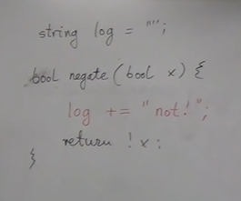

That what managers says, because this is the simplest solution. But what does it mean?
Functional programmers think that something is wrong with a solution. How we can explain that? It is really simple, it
has just a few lines of code. But is simplicity really measured in the number of lines of code?

Complexity and simplicity are not easy.

## Arguments

What it produces is hidden from the developer. Long distant interaction, link between several objects, so it is hard to
think of refactoring consequences making whole system to be fragile. Problems arise even more when multithreading
environment comes in place.

## Functional solution

It can be implemented like pure function as well. It may look more complex at first glance, but it is just an effect of
making things more explicit. 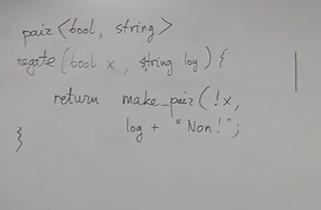

Memoization is a problem though, because it is now depends on `log` var. It is like making it to be depended on any
possible history of calls. Another problem is log concatenation. Now function have additional responsibility (e.g.
reason of change). For example, logging logic might change more often and with different reasons comparing with `negate`
function.

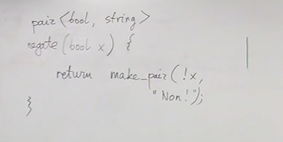

Now, responsibilities look clearer. But now the question - Who appends these logs?

## Monads

What we do with such functions? We compose them. What if we could modify the process of composing functions? Let's
define a new way of composing functions.

```typescript
type LogCompose = <GIn, GOut, HOut>(
  f: (arg: GIn) => [GOut, string],
  g: (arg: GOut) => [HOut, string],
) => (arg: GIn) => [HOut, string];
```

It is associative because function composition and string concatenation are associative.

Identity is also satisfied because there is an identity function and identity string

Logging will work for any monoid

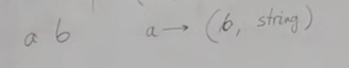

It has a name called Kleisli category. Monad is just a way of composing special kinds of functions. In imperative
programming we do not think in terms of composing functions. It is like okay I am calling this function and do something
with return value. Maybe I call another function with a result, or maybe not. In function programming we think in terms
of composing functions. What if we use different kind of composition.

Imagine a construction consisting of basis category and kleisli category:

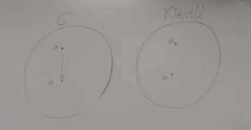

These two contain completely same objects. But morphisms are different!

A m -> (A, string). m is a mapping that maps objects to objects or types to types. It can be represented as follows

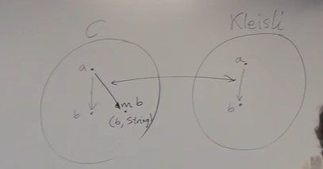

The key thing is that in C category these objects are not composable but in Kleisli they do.

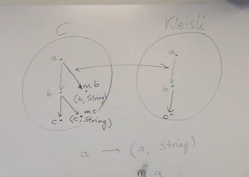

Kleisli category has, as objects, the types of the underlying programming language. Morphisms from type A to type B
are functions that go from A to a type derived from B using the particular embellishment. Each Kleisli category defines
its own way of composing such morphisms, as well as the identity morphisms with respect to that composition. (Later
we’ll see that the imprecise term “embellishment” corresponds to the notion of an endofunctor in a category.)

# Terminal and initial objects 4.1

When you google something you use patterns, then engine provides many matches that satisfy to it. We do not need all of
them, so some kind of ranking is needed. Order might be partial. It does not guarantee that there always will be the "
best" match.

## Defining singleton set

How to define such set in terms of other sets? Without talking about elements. Try to describe it in terms of morphisms.

* It has an arrow from any other set (including id) 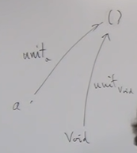
* Unit type (or singleton set) it has one and only one arrow (morphism) from any other set

This object is called terminal 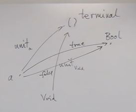

* Existence
* Uniqueness

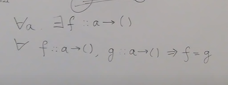

## Defining empty set

Categorically, empty set (or initial object) is an object that has outgoing arrow to any other object, and it is exactly
one.

## Picking an element

Morphism from terminal object to any other object is like picking concrete element from such object. Every construction
in category theory has inverse construction! For any category we can always create another category with all arrows
reversed.

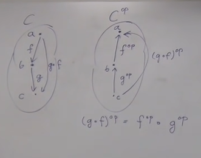

# Products 4.2

What are the properties of cartesian product? For every cartesian product there are two methods possible (or two
morphisms) `fst` `snd` s.t. 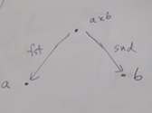

Any object allowing those methods can be called cartesian product.

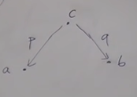

How to tell if an object is cartesian product? By using universal construction. Let's start from ranking them.

`c` is better than `c'` if there is a morphism between.

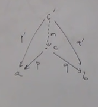

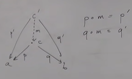

```typescript
// Real product is expressed like
type Tuple<TA, TB> = [TA, TB]

const fst = <TA>(tuple: Tuple<TA, unknown>) => tuple[0];
const snd = <TB>(tuple: Tuple<unknown, TB>) => tuple[0];
```

```typescript
// Example of bad product satisfying conditions
type A = number
type B = boolean

type BadCondidate_0 = number; // AxB

const badFst = (p: BadCondidate_0) => p;
const badSnd = (p: BadCondidate_0) => true;
```

```typescript
// But there should be a morhism from bad product to good one
const m = (p: BadCondidate_0) => [badFst(p), badSnd(p)];
```

This function shrinks stuff, meaning that it loses some valuable information from original function.

## Triple

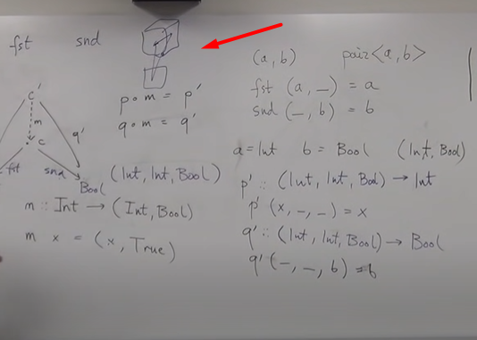

## Categorical product

Categorical product is two objects `a` `b` s.t.

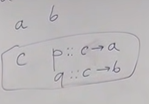

# Coproducts, sum types 5.1

Product and coproduct:

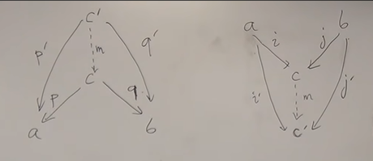

We want `i` and `j` to be injection (meaning it does not shrink anything). From set theory it means `a` and `b` to be a
subset of `c`. Even more, we want `(a & b) = c`. These are conditions of universal construction. `c` has to be
discriminated for morphism `m` to be able to map precisely.

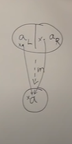

Otherwise, there is no possible solution (function can not return two objects simultaneously)


To extract information from `Either`, two functions must be defined:

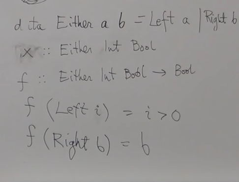

# Algebraic data types

Is there a product in types? Can we define monoid like behaviour?

## Monoidal product

In general types are not symmetric (they are not the same)

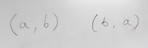

But the interesting thing is - they are isomorphic. Meaning there is a function converting in both ways (which is
injective and surjective)

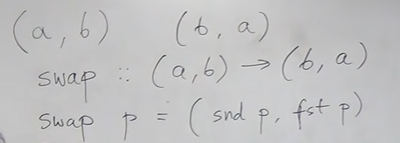

Let's look at associative property. Situation here is same - types are not equal but completely isomorphic.

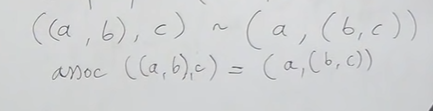

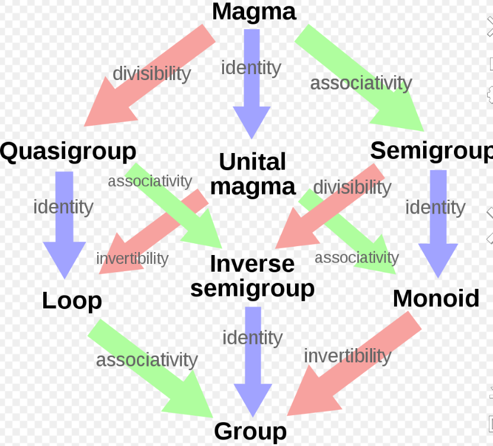

Does it have a unit? It has to have only one element. And such type is called `Unit`

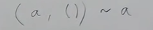

To repeat, these are not the same types! But they are isomorphic.

So as we have shown, types can be multiplied (using product) and all standard algebra rules are satisfied.

## Monoidal sum

`Either` type is symmetric (commutative)

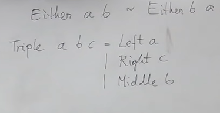

It does not matter in which pairs they are evaluated due to associativity.

Unit of a sum is a `Void`.

## Combining things

In algebra, we can for example multiply by zero:

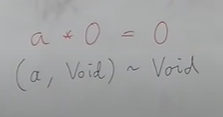

What about distributive law?

`a * (b + c)=a * b + a * c`

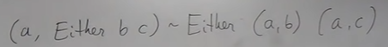

It is again, completely isomorphic.

We have a structure that is called *Ring*. We have multiplication and addition united. They are associative, have an
identity element, and they form a closure. But a true Ring also has an inverse of addition. Here we do not have
inverses. In our case it is called *Rig* or *Semi-ring*

```typescript
// Maybe = 1 + a
type Maybe<A> = null | A;
```

But what about equations?

`l(a) = 1 + a * l(a)`

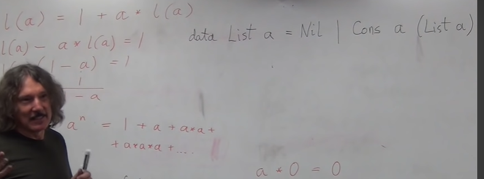

# Functors 6.1

Category is just a bunch of objects connected via morphisms and satisfying rules of composability, associativity and
identity element.

Consider a small category. If one want to map one category to another - we have to define a function on those objects.
Functions can collapse things, or they can just cover only some part of codomain.

Functions are primitive or trivial. We really interested in is mappings that preserve structure. Functions are mappings
between sets. But sets do not have structure! It is just a bunch of elements. This is one of the reasons behind
struggling implementing a Set.

It is important to find functions that preserve structure (monoid, geometric figures etc.). But what does it mean to
preserve structure? Category embodies structure. Is there a category that represents lack of one?

For example, discrete category:

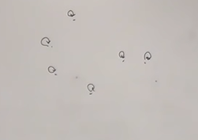

It corresponds to a Set. Every category that is not discrete (i.e. has arrows) has structure.

So to preserve structure, we must preserve all morphisms between objects.

Functor must map all arrows (home set, C(a, b)):

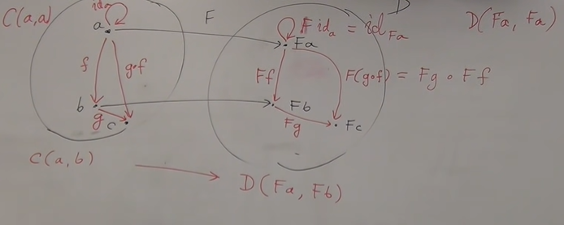

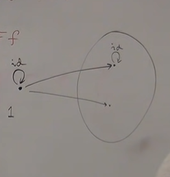

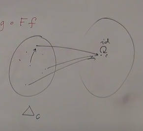

Endofunction (endo means inside). Endfunctor acts inside category of types (programming).

1. Objects become types
2. Morphisms become functions

Functor maps types and functions.

1. Functor maps types totally. In programming, it is usually represented as type constructor (or generic type)
2. Functor maps functions on those types.

```typescript
type Maybe<TA> = null | TA;

declare function fmap<TA, TB>(transform: (a: TA) => TB): (a: Maybe<TA>) => Maybe<TB>;

type A = string
type B = number

const countChars = (a: A): B => a.length

fmap(countChars)
```

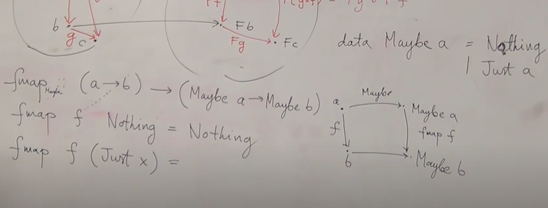

# Functors in programming 6.2

Every functor must preserve composition and identity. We can not express this in Typescript (or Haskel). Compiler can
not express these conditions.

`fmap id = id` - preserve identity rule

`fmap (g * f) = fmap g * fmap f` - preserve composition rule

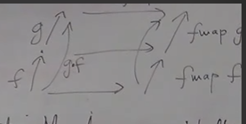

Functions are equal when they have equal results on equal arguments. Function usually described as an equality, meaning
it can be replaced anywhere (inlined, or reference transparent).

Equational reasoning is another word for that. Let's try and apply it here.

`id x = x`

`fmap id Nothing = Nothing = id Nothing`

`fmap id Just x = Just x = id Just x`

`fmap (g * f) Nothing = Nothing`

`fmap g * fmap f Nothing = Nothing`

`fmap (g * f) Just a = Just c`

`fmap g * fmap f Just a = Just c`

## Lifting

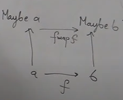

`fmap` is high order polymorphic function. For every specific function, different fmap is defined. It can not be defined
unconditionally. So depending on concrete case, implementation differs. This is an example of ad hoc polymorphism. Type
class defines family of types that share common interface.

`
class Eq a where
(==) :: a -> a -> Bool // this just one name that will serve us differently for many types.
`

`
class Functor f where
map :: (a -> b) -> (f a -> f b) // f is a type constructor
`

`data List a = Nil | Cons a (List a) // List of a is a coproduct of null and special recursive type`

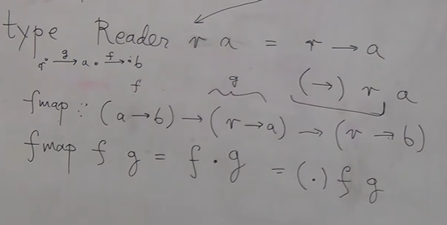

Functors are very much like containers, because they "contain" something related to wrapped type. Value in functor is
like radioactive, meaning we can not operate on it directly, only via function. Such restriction gives us unified way to
describe a lot of ideas (like Futures and Streams).

# Functoriality, bifunctors 7.1

Functors map objects and connections between them, thus preserving original category structure.

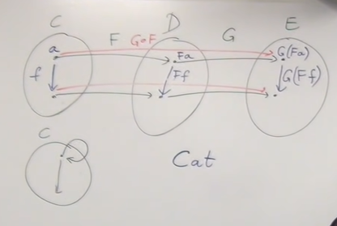

Algebraic data structures are formed using product or sums. Unit, never or some struct types are used like objects.

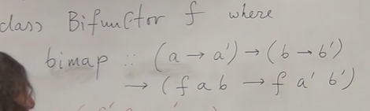

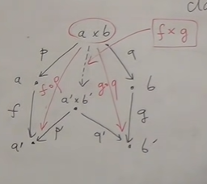

# Monoidal Categoies, Functoriality of ADTs, Profunctors 7.2

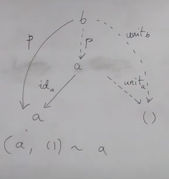

Categorical product for every pair of object and terminal object - together provide monoidal structure on objects shown
above.

## Covariant

That is usual functor, where directions of morphisms are the same. It provides you with a value of type 'A'.

## Contravariant

This functor implements separate method called contramap

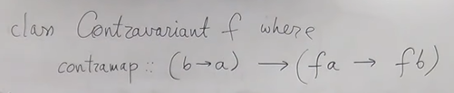

It not like container, it is more like requires a value. For example, we could say that instead of 'A' type values we
will be providing 'B' type. Quite obviously for a function to continue to work, it needs to know the way of converting '
B' into an 'A'.

## Invariant

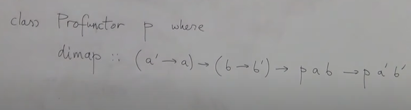

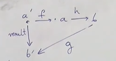
