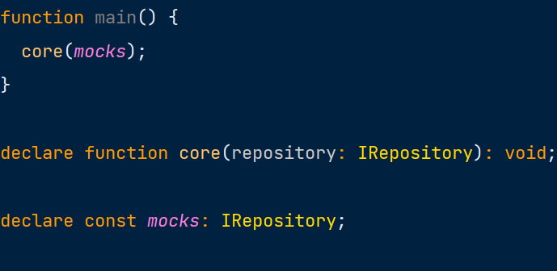
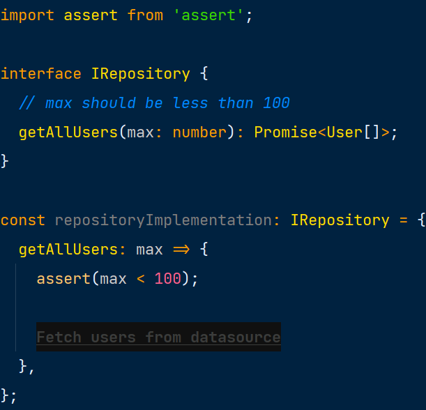
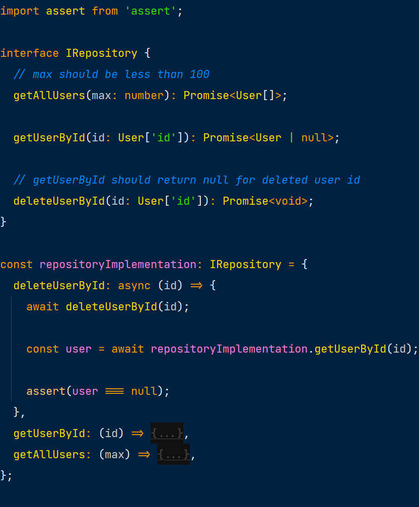
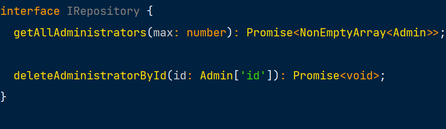
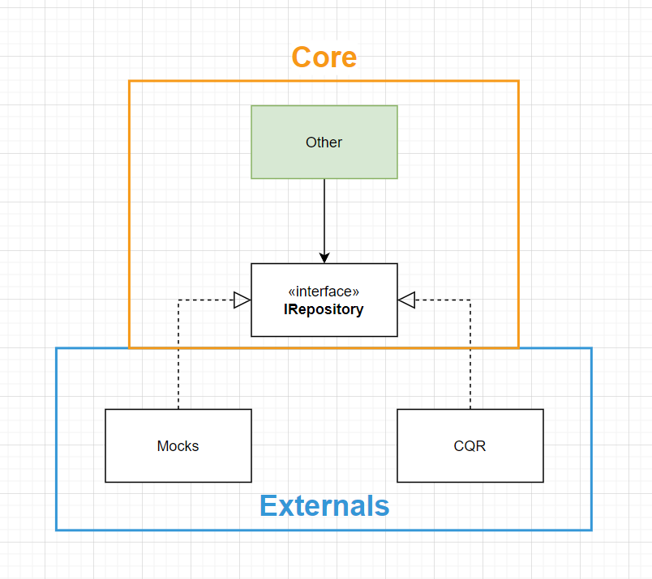
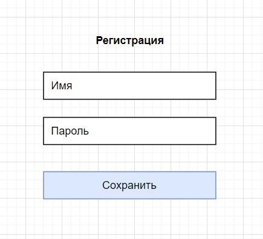
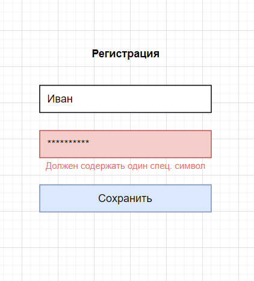
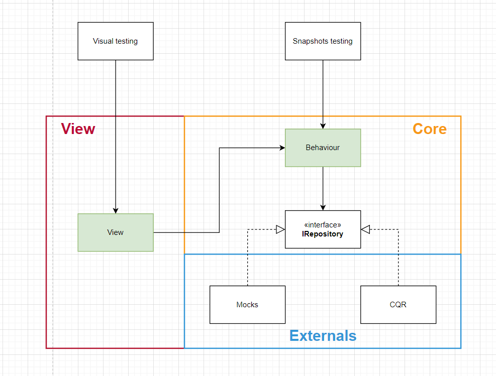
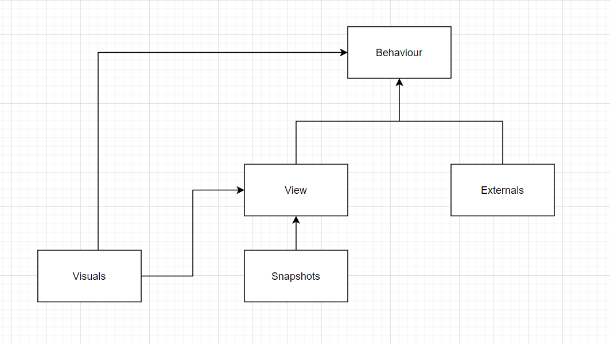

# Сложность ПО

Второй закон термодинамики гласит - Невозможен процесс, единственным результатом которого являлась бы передача тепла от
более холодного тела к более горячему.

Это связано с общей тенденцией нашей вселенной к повышению энтропии или меры неопределенности (равновесия другими
словами). Если квартиру не убирать неделю или две, то комнаты покроются пылью, разбросанными вещами и прочими
результатами жизнедеятельности.

Удивительно, но программы здесь не являются исключением. Любой разработчик на собственном опыте знает, как со временем,
над проектом становится все сложней и сложней работать. Как каждое новое требование принимается со скрипом, как с
большим страхом изменяется существующий функционал, с каким отвращением приходится работать с функцией написанной
разработчиком неумехой (в итоге оказывается что это и есть автор), как правда одно дефекта, вызывает новых три.
Перечислять можно и дальше, но основная идея понятна.

## Две ценности

Любую программу можно разбить на две составляющие:

* Поведение - все то что формирует наблюдаемое, то за что прежде всего платит заказчик, то на что заводят дефекты
  тестирование и требует к реализации аналитика.
* Структура - то что скрыто, детали реализации, паттерны, библиотеки, структуры данных, фреймворки и так далее.

Отсюда можно сказать, что общих причин роста сложности программы две:

* Доменная - *естественная* сложность присущая моделируемой области.
* Структурная - приобретенная или *искусственная* сложность, исходящая от выбранной структуры ПО.

Первый пункт является неотъемлемой частью работы программиста, где последний редко имеет особый контроль. К счастью,
домен редко является основной причиной.

Приобретенная сложность, в подавляющем своем большинстве, является основной причиной роста стоимости поддержки проекта.
Иногда сложность вырастает настолько, что начинает контролировать домен - подминая требования под себя, например,
отклоняя куски функционала по причинам: "архитектура под такое не заточена", "это не планировалось" и "на перенос формы
уйдет больше месяца работ". В последнем, к сожалению, лишь доля шутки.

Причин и точек влияние структуры программы на её сложность может быть масса, при всем старании нельзя перечислить их
все. Для наглядности попробуем привести лишь некоторые:

* Избыточность паттернов, парадигм, состояния, сущностей и структур
* Хрупкость системы, где изменение имеет высокий шанс порождения дефектов
* Ошибки в моделировании предметной области
* Несоответствия с компетенциями разработки

## Инструмент изменения ПО

Единственный инструмент борьбы с данными признаками - модификация структуры (рефакторинг, другими словами). Безусловно,
мы не хотим при изменении структуры, также случайно модифицировать поведение, ведь это приведет к нежелательным
отклонениям - дефектам. Ситуация, при которой, ранее работоспособные поведения вдруг ломаются, называется регрессом.

Представим что существует специальная программа с одной большой кнопкой. Нажав на неё у нас может быть два результата:
зеленый, если система работает корректно и красный, если что-то сломалось. Давайте попробуем исследовать её качества.

## Основные свойства программы

* Защита от регресса - одной из основных функций такой программы должна быть защита от регресса. Вся польза от упрощения
  структурной ценности сведется на нет, если система при этом потеряет в поведении.
* Сопротивляемость рефакторингу - программа не должна мешать основному методу упрощения ПО, а именно рефакторингу.
* Поддерживаемость - программа не должна требовать больших ресурсов на свою поддержку, ведь в противном случае вся
  работа потеряет смысл, так как проще не будет использовать эту программу вовсе.
* Быстродействие - если проверка забирает много времени на выполнения, то она будет запускаться редко. Чем реже запуск,
  тем больше пространства для дефекта к появлению и тем сложней его отыскать как следствие. В крайних своих проявлениях
  запуски будут игнорироваться вовсе, сводя все усилия на нет.

Такая программа имеет особое название - тесты. Тестирование при этом - это процесс при котором одна программа
верифицирует поведение другой.

# Связь ценности ПО и тестирования

Написание теста на первый взгляд имеет очевидную цель - верификацию наблюдаемого поведения. На самом деле, цель зависит
от формы, принятой за целевую в тестировании. Так, например unit тесты отличаются достаточно сильной привязанностью к
портам системы, так как исполняют её в сильно ограниченном окружении, и, таким образом верифицируют не только
поведение, но и саму возможность (и простоту) такого использования.

Если подняться выше, и задействовать больше компонентом системы в проверочных кейсах, то получится уже менее открытая
программа, больше напоминающая черный ящик, где соотношение связи со структурой и поведением будет в пользу последнего.
Интеграционные тесты характеризуются данным качеством.

Крайней точкой же в данном вопросе являются тесты, полностью использующие целевую среду выполнения и средства
взаимодействия с программой. Таким образом полностью или в большинстве своём закрываясь от структуры ПО, полностью
концентрируясь на его поведении.

## Полное тестирование

Можно попытаться вовсе закрыться от внутренней структуры программы и сконцентрироваться исключительно на наблюдаемом
поведении. В таких условиях, сопротивляемость рефакторингу будет максимальной, ровно, как и протекция от регрессии. К
сожалению, минусом здесь является скорость выполнения тестов и высокая сложность их написания.

Вот некоторые из причин:

* Прямое использование всех или большинства компонентов системы, естественным образом увеличивает время выполнения
  проверок, что может негативно сказаться на частоте запусков, а в некоторых случаях и в прямом игнорировании тестов.
* В случаях визуального тестирования, особого внимания заслуживает анимации, требующие отдельного контроля, так как
  может негативно повлиять на точность результатов тестирования. Также влиять могут и особенности отрисовки
  элементов, на которые может влиять аппаратное обеспечение компьютера.
* Корректность исполнения внешних эффектов программы не всегда просто верифицировать. Например, обращения к внешним
  системам. Ввиду отсутствия прямого контроля, поведение таких систем недетерминировано: нет никакой гарантии что
  система будет функционировать на момент запуска теста, в случае работоспособности, также остутствует гарантия времени
  ответа - он может занимать часы, а то и дни на выполнение.

В сумме, данные факторы могут сделать тестирование губительным процессом с точки зрения затрат на разработку, поэтому
выбор должен быть спланирован тщательным образом.

# Привет, мир

В качестве отправной точки возьмем экстремум, а именно тесты, ни коим образом не зависящие от структуры, целиком и
полностью проверяющие исключительно наблюдаемое поведение.

Как следствие, они не требуют ничего от программы, воспринимая её как один, неделимый компонент, монолит:

Зеленным цветом будут выделяться тестируемые элементы системы (в данном случае сама система является тестируемой).

Как показывалось ранее, такие тесты хоть и обладают наивысшей защитой от регресса и сопротивляемостью рефакторингу, их
чрезвычайно тяжело поддерживать и выполнять. В итоге это может вылиться только в большие затраты по времени (и по
бюджету как следствие). Тесты станут просто невыгодными и здравой альтернативой будет стратегия внесения изменений через
расширение, "ручные" проверки или частичное покрытие.

## Оптимизация

Сам собой встает вопрос, можем ли мы каким-либо образом изменить структуру так, чтобы наличие тестов стало оправданным?
Для этого нам нужно сделать их более поддерживаемыми. К тому же они не должны занимать так много времени для выполнения.

# Источники данных

Первым и одним из самых очевидных элементов системы, тяжело поддающихся тестированию, являются запросы к данным. Это
необязательно запросы к "удаленному серверу" в классическом понимании. Здесь подойдут любые функции которые обладают
двумя свойствами: наличие скрытых аргументов и/или внешних эффектов

## Скрытые аргументы

Функция считается зависимой от скрытых аргументов (скрытых, значит не передаваемых в аргументы функции), в случаях,
например, чтения данных из БД, состояние которой может отличаться от времени запуска тестов. Другим примером будет
процедура, возвращающая текущую дату - она также зависит от состояния внешнего окружения.

## Внешние эффекты

Внешним эффектом называется любое действие, оказывающее влияние на поведение системы, которое не выражается в
возвращаемом значении функции. Это может быть выброс исключения, изменение данных в БД, изменение глобальной переменной
и так далее. Возьмем к примеру local storage. Запись значения в данное хранилище может повлиять на работу системы, тем
самым усложняя процесс верификации поведения.

## Влияние на тестирование

В общем случае, оба признака в совокупности формируют общее состояния в системе, что делает невозможным параллельное
и/или селективное выполнение тестов. Порядок и содержание всегда задаётся строгим образом. Это негативно влияет на время
выполнения сценариев тестирования и увеличивает стоимость их поддержки.

## План А

Данную проблему можно попытаться решить, реализуя механизм ручной установки и сброса целевого состояния (setup и
teardown) функции. При этом, глобальное состояние необходимо изолировать в рамках конкретного потока выполнения тестов.
Это требует полного контроля над таким состоянием, что не всегда возможно. Примером может служить rand функции или
неизменяемые данные (история изменений бизнес сущности). Реализация предикатов на корректность поведения может
отличаться от случая к случаю.

## План Б

Выделим такие функции во внешний компонент системы и назовем их "Repositories"

Данный блок очевидно не является окрашенным, так как намеренно не покрывается автоматизированными проверками.

## Humble object

То, что Repositories не покрывается тестами, неизбежно приводит к пониженной защите от регресса, что можно частично
нивелировать упрощая не тестируемые компоненты. Данная техника имеет особое название "Humble object" (скромный объект).

Под скромностью здесь понимается отсутствие комплексной логики внутри компонента (это и делает бессмысленным его
тестирование). Чаще всего такие компоненты характеризуются своей конкретностью (тяжело поддаются расширению, т. к.
ссылаются на конкретные реализации) и простотой (содержат только тривиальные элементы, в основном обычные делегирования
внешним функциям).

Таким образом, разработчик должен обратить особое внимание на отсутствие управляющих конструкций в Repositories и
убедиться, что внутри нет ничего, что потребовало бы тестирования.

## Зависимость от конкретной реализации

Зависимость в общем случае выражается в коде как явная ссылка на компонент. Компонент может быть обычной переменной,
классом, функцией, типом, библиотекой и так далее.

Ниже, функция UsersList напрямую ссылается на конкретную реализацию getAllUsers. Изменить поведение компонента не меняя
исходного кода обеих функций нельзя:

Таким образом можно сказать, что компонент UsersList не является расширяемым с точки зрения данного требования. Это и
определяет зависимость от реализации.

На диаграмме такая связь отображается следующим образом:

## Зависимость от интерфейса

Попробуем выполнить небольшое изменение:

Теперь, функция UsersList ссылается не на конкретную реализацию функции, а на её интерфейс. Это открывает нам
возможность подмены поведения getAllUsers, без изменения исходного кода UsersList. Компонент становится расширяемым в
данной плоскости.

Изобразить это можно следующим образом:

getAllUsers (часть Repositories) реализует (или удовлетворяет) интерфейсу GetAllUsers, который в свою очередь
используется в UsersList.

## Заглушки

Расширяемость тестируемого компонента можно использовать следующим образом: можно создать отдельную функцию
getAllUsersMock, которая вместо реального запроса к api, будет брать данные из локального источника.

Функция легко поддается тестированию, так как лишена проблем перечисленных ранее. Она является "чистой".

## Содержание компонентов

Далее, для общности, клиентом будет называться импортирующий компонент, а сервером - импортируемый.

* Изменения в клиенте нередко вызывают изменений в интерфейсе, что в свою очередь порождает изменения во всех его
  реализациях, которых обычно подавляющее большинство.
* Используя клиент (UsersList) разработчик неизбежно использует интерфейс, в отличие от его реализаций.

Из этого следует что нам выгодно держать интерфейсы и клиенты в одном компоненте:

* Пара (UsersList, GetAllUsers) образует "ядро" системы. То есть компонент с наивысшей ответственностью, изменение
  которого вызовет многочисленные модификации в зависимых серверах (конкретных реализациях). Это облегчает применения
  основных методов борьбы с изменением: абстрактности и направлении зависимостей.
* Клиент и интерфейс имеют тенденцию изменяться по одним и тем же причинам, что делает их ответственность единой.
* Инженер, используя UsersList, может внедрить собственные имплементации серверов, либо выбрать только некоторые из
  существующих. Это ярче всего проявляется в вопросах тестирования, где тип замещается заглушкой, удобной в целях
  верификации поведения.

По итогу структуру можно изобразить следующим образом:

Сам собой также образуется второй компонент системы - Externals, содержащий в себе конкретные реализации интерфейса. При
этом не сильно важно где находятся Mocks в данном контексте, они с тем же успехом могут быть закреплены в рамках
конкретных тестовых сценариев, но не в самом компоненте Core по причинам высказанным выше.

## Форма и содержание

Полезной будет следующая аналогия: возьмем слово "лук". Оно состоит из двух компонент:

* Форма - буквы "л", "у" и "к" идущие друг за другом образуют "лицо" или "внешность" слова
* Содержание - смысл слова "лук" не фиксирован и зависит от контекста. Так, в рамках кулинарного шоу речь скорее всего
  будет идти о луке как об овоще. В случае обсуждения, например, войн средневековья значение скорее всего будет
  совершено иным.

Ровно такая же ситуация и здесь. Форма GetAllUsers может включать в себя множество разных содержаний (т. е. реализаций)
в зависимости от потребностей разработчика ПО.

## Инверсия

Мы поняли, что теперь можно изменить реализацию сервера не касаясь при этом исходного кода его клиентов, но можно ли
сказать то же самое и про форму?

Представим что функция getAllUsers вместо простого списка пользователей теперь возвращает данные с дополнительной
оберткой. Казалось бы, это изменение не является совместимым с установленным интерфейсом и не остается ничего другого,
как изменить тип.

Однако, мы можем воспользоваться техникой, называемой "адаптер", как показано на примере ниже:

getAllUsersAdapted может быть передана компоненту GetAllUsers без модификаций исходного кода последнего.

Обратим внимание на то, что в случаях изменения реализации и интерфейса Repositories, исходный код компонента не
потребовал изменения. Это явно говорит об отсутствии зависимости UsersList от Repositories. С другой стороны, сами
репозитории теперь зависят от их клиентов!

Можно сказать что у нас появилось две картины происходящего:

* На уровне исполнения программы, на этапе runtime, вызовы передаются от Core к Externals:

* На уровне структуры, как мы с вами увидели, зависимости обращены ровно в обратную сторону, то есть инвертированы:

Инверсия зависимостей произошла за счет внедрения дополнительного интерфейса и расположения его в границах компонента
Core. Без этих двух условий, направление зависимостей между runtime и compile time было бы идентичным.

Между элементами Core и Externals формируется так называемая *неполная архитектурная граница*. Неполной её делает тот
факт, что Externals ссылается напрямую на компонент Core. Так, мы можем использовать Core с разными Externals, но
Externals только с одним конкретным Core.

## Открытость и закрытость

Таким образом, компонент Core является *закрытым* от изменений в Externals, но *открытым* к добавлению новых наследников
интерфейсов, т. е. к расширению.

## Верификация репозиториев

Мы определили то, каким образом будет оптимизироваться компонент Core (ранее Other) под задачи тестирования. Но
по-прежнему остается открытым вопрос проверки корректности поведения.

## Наблюдаемое поведение

Первое, что необходимо определить при проектировании тестов - это клиенты (или границы) системы. В случае визуальных
тестов, клиентом системы является человеческий орган восприятия - глаза. Таким образом, "наблюдаемое" поведение системы
есть ничто иное как изображение на мониторе. Отсюда и исходят соответствующие методы верификации.

Когда речь идет о репозиторях, здесь также многое зависит от выбора границ. Для целей оптимизации процесса тестирования,
выгодно определять сетевой интерфейс как своеобразный "монитор". Стандартное изображение в нем заменяется простым
снимком вызова методов. Важно контролировать в каком порядке и с какими аргументами последние были вызваны, ведь все это
будет "замечено" сервером, т. е. повлияет на его наблюдаемое поведение в реальных условиях.

Проверка может быть представлена следующим образом (в комментариях приведен пример слепка запросов):

## Команды и запросы

Заметим, что помимо вывода информации (будь то монитор либо сетевой интерфейс), система также ожидает и ввода.
Очевидными источниками в случае человека являются, например, клавиатура и мышь:

Сохраняя не совсем очевидную аналогию, можно то же самое сказать и про сервер. Вводом здесь будет считаться любой метод,
возвращающий отображаемую информацию, например любой GET метод. В общем случае здесь подойдет любая функция у которой
отсутствуют внешние эффекты, т. е. та, что не изменяет состояния приложения. Для простоты далее будет называть такие
функции запросами (queries).

Все остальные методы, т. е. те что изменяют состояние (например методы группы DELETE), назовем командами (commands).

Как изображение на мониторе зависит от совокупности логики системы и действий пользователя, так и ответ от сервера будет
зависеть от команд, исполняемых приложением.

## Верификация CQR

Представим что мы хотим проверить поведение простой функции складывающей два числа

На таком простом примере очевидно, проверять имеет смысл только возвращаемое значение функции, так как именно оно и
будет "наблюдаться" её клиентом. В то же самое время, верификация её аргументов, т. е. входных данных теряет всякий
смысл и, напротив, приведет только к большей зависимости тестов от внутренней структуры функции (деталей её реализации).

Программа для нас в таком случае не является исключением, её можно представить в таком виде:

Сам процесс тестирования будет не сильно отличаться от аналогичного с функцией sum (сами аргументы естественно будут
иметь более сложную структуру):

Пример выше является несколько идеализированным с одной единственной целью - показать связь между целью функции (как
запроса или команды) и способа её верификации.

## Проверка запросов

Если говорить откровенно, то всегда игнорировать проверку корректности запросов - не верно. Чтобы наглядно это
продемонстрировать, рассмотрим принцип подстановки.

## Принцип подстановки

Взглянем на схему еще раз:

Обратим внимание на то, что в процессе тестирования, в качестве реализации интерфейса IRepository будет *подставлен*
блок Mocks:

### Compile time

Для успешного прохождения статического анализа и последующей компиляции, подставляемый mocks (далее называемый
*подтипом*) должен удовлетворять типу IRepository. Всю работу на верификацию данного условия берет на себя компилятор
TypeScript, но, к сожалению, этого не всегда достаточно.

### Preconditions

Помимо самого типа, IRepository также может подразумевать под собой некоторые дополнительные условия. Возьмем к примеру
функцию getAllUsers.

Как видно из примера выше, интерфейс устанавливает дополнительное условие на входящие аргументы (также известные как
pre-conditions). Любой имплементатор IRepository, имеет право предъявлять условия *не строже* указанных в интерфейсе
pre-conditions:

В случае более строгих требований, репозиторий не будет считаться подтипом интерфейса хоть и будет считаться валидным с
точки зрения типов:

Тестовые заглушки здесь не исключение, они также должны удовлетворять всем условиям на аргументы. Разница заключается в
том, что в тестовом окружении preconditions и так проверяются, через снимки взаимодействий клиента (или тестируемой
сущности) с подставленными mocks.

### Post-conditions

Рассмотрим функцию deleteUserById:

Функция deleteUserById содержит в себе как пост условие (post-condition) следующее утверждение - "После успешного
удаления, функция getUserById должна вернуть null для данного пользователя". Таким образом, любой объект, считающий себя
наследником интерфейса IRepository, должен удовлетворять условию *не слабее* данному в родительском типе.

### Invariants

Помимо условий на аргументы и возвращаемое значение, система также может содержать закономерности (всегда истинные
утверждения), сохраняющиеся при любых разрешенных операциях. Возьмем репозиторий контроля администраторов. У нас имеются
методы получения списка всех уполномоченных лиц, добавления, удаления и редактирования. При этом, ставится условие, что
в любой момент времени, в системе *всегда* должен присутствовать хотя бы один админ. То есть чтобы не случилось, метод
getAllAdministrators должен вернуть не пустой массив.

Инварианты также должны удовлетворяться всеми наследниками интерфейса, в том числе и mocks. Стоит обратить особое
внимание на то, что в ряде случаев возможно подобрать такую структуру, из свойств которой и будут следовать искомые
условия. Это исключит человеческий фактор и упростит работу при разработке заглушек для тестирования.

### Контракт

Приведенные выше условия в совокупности формируют контракт. Из данного перечня свойств следуют уже собственные свойства
и контракты клиента (и его клиентов и так далее по цепочке). Стоит воспринимать это как дополнительный способ защиты (
помимо тестирования) от некорректного поведения системы, перехода её в противоречивое с требованиями состояние.

### Queries

Отсюда следует что запросы (queries), хоть и не имеют внешних эффектов, все равно зависят от изменяющегося источника
данных, например БД. Это приводит к тому что, например, возвращаемое значение getAllUsers может отличаться в зависимости
от того, был ли метод вызван до или после удаления пользователя (то самое следствие post-condition).

Существует три варианта:

* Проверять порядок вызовов queries относительно других commands. К примеру, проверять что getAllUsers был вызван
  после успешного выполнения deleteUserById. Минусом является относительная хрупкость тестов, ввиду присутствия
  зависимости от реализации работы с входящими данными (queries).
* Реализовывать post-conditions. В случае deleteUserById возможно эмулировать тривиальное хранилище и (понарошку)
  удалять пользователя. getAllUsers должен возвращать данные из хранилища. Очевидным недостатком данного способа
  является повышенная сложность тестов.
* Не реализовывать условия вовсе. Имеет смысл использовать в случаях когда верифицируемое поведение не зависит от
  требуемых условий.

# Поведение и представление

Рассмотрим итоговый результат:

Итого:

* Автоматизированное тестирование покрывает большую часть кода в приложении. Данный показатель
  дополнительно поддерживается путем упрощения слоя доступа к данным (Externals).
* Верификация поведения (в данном случае) происходит с помощью снимков визуального представления и взаимодействия с
  сервером. Это требуется для достижения максимальных показателей защиты от регресса и сопротивляемости рефакторингу.
* Взамен на лучшую поддерживаемость, тесты зависимы от разделения ПО на два слоя. Это связь не представляет
  особых рисков ввиду высокой абстрактности самой архитектуры. В то же время, внутреннее устройство Core может
  изменяться в любом направлении, тесты при этом будут служить гарантом отсутствия регресса.

Но что насчет скорости выполнения? Безусловно, итоговый показатель будет сильно зависеть от среды выполнения и подхода
к процессу тестирования в целом. Но в общем случае можно сказать наверняка - текущее решение имеет недостатки по
быстродействию.

## Единственная ответственность

Представим ситуацию, нам необходимо реализовать форму регистрации с двумя полями: имя пользователя и пароль.

С точки зрения полноты тестирования, потребуется покрыть не только позитивный сценарий, но и также разные ветки
валидации пароля. В определенных ситуациях их может быть подавляющее большинство, что приведет к ощутимому росту времени
выполнения подпрограмм тестирования.

Очевидно, мы не можем избавиться от требований, так как не всегда контролируем их. Вместо этого обратим внимание на
текущий подход к тестированию. Большинству будет понятно даже на интуитивном уровне, что процесс визуальной верификации
занимает собой наибольшую часть времени выполнения тестового сценария, так как включает в себя относительно тяжелые
вычисления связанные с отображением интерфейса на экране. С другой стороны, требование строгости к паролю имеет только
косвенное отношение к представлению.

Более наглядно это можно продемонстрировать с точки зрения причин для изменений:

* Валидация пароля изменится если изменятся требования к строгости пароля.
* Визуальное представление формы изменится если, например, заказчик захочет отображать ошибки сразу, а не только
  после того как пользователь попытался сохранить форму.

Ключевое утверждение здесь заключается в том, что эти причины *крайне редко* будут пересекаться по времени. Гораздо
вероятней что за взятый момент времени будет меняться что-то одно, а не все сразу, это понятно большинству разработчиков
исходя из эмпирического опыта.

Попробуем доказать данное утверждение с другой стороны. Кто является источником изменений для визуальной составляющей
формы? Список скорее всего будут возглавлять UI/UX дизайнеры. Но что насчет правил валидаций? Здесь уже лица будут
немного другими: аналитики и специалисты по безопасности. Конечно, между ними также могут быть пересечения, но основное
и так бросается в глаза - источники изменений в основном *разные*.

Таким образом, функции валидации пароля и отрисовки формы имеют разные источники изменений. Это приводит к тому что
данные функциональные блоки изменяются в рамках разных задач, поставленных в разное время и в целом могут выполняться
разными людьми. Другими словами, данные блоки имеют *разные ответственности*.

## Разделение ответственностей

Наше намерение просто и понятно - разделить крупный блок таким образом, чтобы одна часть требовала визуальной
верификации, а другая при этом - нет. Существует множество различных способов разделить компонент на составляющие, но
чем руководствоваться? Если попробовать разбить крупный класс/модуль/функцию вслепую, можно только усугубить ситуацию
тем, что при необходимости *изменений* в данном компоненте разработчику прийдется решать "пазл", собирая при этом
разрозненные кусочки функционала в единую и понятную картину. Более того, необходимые изменения при этом будут
разлетаться мелкой дробью по составляющим модуля, дополнительно усложняя при этом всю работу.

Ключевым здесь является *направленность* изменения, разность ответственностей (как между валидацией пароля и
представлением) как раз и гарантирует то, что, вероятней всего, изменение затронет лишь один из компонентов, а не оба
*одновременно*. Таким образом, мы хоть и несколько усложняем систему увеличивая кол-во сущностей в ней, взамен получаем
возможность существенным образом оптимизировать процесс тестирования.

Рассмотрим измененную схему:

Вместо одного блока Core на диаграмме указаны два компонента:

* Behaviour - слой, реализующий функции характеризующиеся следующими свойствами:
    * Отсутствие прямых зависимостей на средства отрисовки
    * Отсутствие прямых зависимостей на конкретные источники данных
    * Разность ответственности по отношению к представлению и доступу к данным
* View - слой содержащий в себе ответственность связанную с отображением. Имеет зависимость от средств отрисовки
  интерфейса (компонент фреймворка). То есть та совокупность функционала, которая может измениться по требованию,
  например, дизайнера.

Исходя из получившейся архитектуры можно заменить, что визуальные тесты напрямую зависят от конкретного представления и
поведения. В то же самое время, в качестве Externals используют заглушки.

Для тестов компонента Behaviour ситуация иная - зависимость здесь исключительно от Behaviour. Конкретные источники
данных также заменяются на заглушки, что касается примитивов рендеринга они не используются вовсе. Действительно, если
бы Behaviour использовал компоненты представления, это бы заставило нас исполнять их в рамках snapshot тестов (например,
на валидацию), что, опять же, привело бы к ситуации низкой скорости исполнения.

С другой стороны можно сказать, мы можем не заниматься в тестах честной отрисовкой и просто эмулировать некоторые из
процессов (см. jsdom). Проблемы здесь две:

* Эмуляция не предоставляет достаточной защиты от регресса так как не является реальной средой выполнения функций
* Эмуляция зачастую оказывает не сильно меньший эффект на производительность, чем реальная отрисовка компонентов

То же самое относится и к ссылкам на объекты событий в обработчика Behaviour (например React.MouseEvent). Для того чтобы
вызвать такой обработчик в тестовой среде, потребуется инстанцировать комплексный объект события, где большинство
свойств скорее всего не будут использоваться целевой функцией. В таком случае стоит либо выносить данные операции в слой
представления, либо упрощать интерфейс, убирая из него неиспользуемые части.

## Противоречие

По итогу:

В получившемся решении теперь возможно оптимизировать общее время выполнения тестов следующим образом: покрыть сквозные
сценарии тестами с большей защитой от регресса (визуальные тесты), остальные не визуальные альтернативные сценарии
закрыть с помощью тестов в изолированном окружении. В примере с паролем это выражается в небольшой группе визуальных
тестов на саму форму регистрации и изолированных тестов на саму функцию валидации, покрывающую все требуемые сценарии.

Чем сильнее связь со структурной ценностью, тем меньше сопротивляемости к рефакторингу образуется в итоге.

Взамен на лучшую скорость, пришлось смириться с тестами, больше завязанными на структурную часть программы. В общем
случае они будут более чувствительны к изменениям, не только в разрезе разделения слоев, но и в сигнатурах
компонента Behaviour (аргументов и возвращаемого результата). Это накладывает дополнительную ответственность на
разработчика при проектировании этих интерфейсов - они не должны раскрывать подробностей реализации и в то же самое
время быть тривиальными для использования во View и в тестах.

Опираясь на структуру, тесты вынуждают её быть простой в повторном использовании (т. е. тестируемой). Что приводит к
расширяемым функциям, классам, модулям (т. е. объектам тестирования).

Данный факт должен привести к не простой мысли - идеальных тестов не существует. Причиной тому являются явные
противоречия в свойствах последних. Например, чем выше защита от регресса, тем ниже их быстродействие. Ведь хорошая
протекция требует выполнения большей части (если не всего) кода формирующего программу.

# Расширяемость

Если посмотреть на архитектуру повнимательней, можно явно разглядеть иерархию, чем то похожую на пирамиду. Где компонент
Behaviour находится на самом верху.

Это говорит о том, что данный элемент является ответственным. То есть изменения внутри данного компонента, будут
порождать изменения во всех зависимых от него частях (коих большинство). Разработчик может разными методами нивелировать
данный эффект, но он редко доставляет большие проблемы, особенно при условии наличия тестов.

Положительным, и наиболее важным, здесь является свойство расширяемости:

* Мы можем переиспользовать один и тот же Behaviour с разными View
* Мы можем переиспользовать один и тот же Behaviour с разными Externals
* Мы можем переиспользовать один и тот же Behaviour с разными фреймворками
* Мы можем переиспользовать один и тот же View с разными Externals

Хорошей аналогией здесь будет видео редактор с системой плагинов. Знает ли что-то редактор (ядро) о существовании
конкретных плагинов? Нет. Знают ли что-то конкретные плагины о существовании редактора? Да.

Мы не делали структуру такой какая она есть исключительно ради возможности использовать один и тот же
Behaviour с разными View. Вероятней всего нам это и не понадобится. Главная причина существования такой архитектуры -
тестируемость, цели которой были раскрыты ранее. Такая взаимосвязь между расширяемостью и тестируемостью проявляется
вследствие того, что тесты это ничто иное как процесс *повторного использования* компонента, но уже в совершенно другой
среде. Именно это и форсирует структуру кода быть гибкой.

# Адаптируемость

Даже в таком состоянии, все от чего зависят тесты - это разделение программы на три условных слоя. Это
открывает возможность в изменении внутренней структуры данных слоев (например, в сторону упрощения системы) без
необходимости при этом модификации самих тестов. При этом, во время всего процесса, последние будут выступать гарантом
сохранения поведенческой ценности (отсутствия регресса).

# Универсальная архитектура

Может показаться, что разработчику предлагается универсальный подход к тестированию (а значит и архитектура), которая
должна использоваться на каждом проекте.

Это, конечно же, не так.

Выбор сильно зависит от специфики, требований и общих условий проекта. Так, разработчики относительно тривиального
интернет магазина или landing страницы могут выбрать для себя больший уклон в верификацию наблюдаемого поведения. Более
гранулированные тесты могут оказаться бесполезными и только усложнят общее решение.

Разработчики библиотеки низкого уровня (например lodash), наоборот, неизбежно будут верифицировать и часть структуры. В
их случае она будет составлять часть наблюдаемого поведения.

На проектах средней сложности и объема могут подойти "интеграционные" тесты, требующие разделения приложения на два
слоя (Core/Externals).

В случае увеличения кол-ва функционала, можно разбить тестовые кейсы добавив новое разделение (
View/Behaviour/Externals). Сквозные сценарии и наиболее вероятные альтернативные могут проверяться тестами более
высокого порядка. Все остальное возможно верифицировать уже на более низком уровне.

# Заключение

Приведенные выше техники не являются откровением. Они достаточно известны и часто встречаются в литературе, однако, их
редко используют (или используют осознано). Это может быть связанно с непонимания решаемых целей и задач, либо при
отсутствии успехов их согласования с заказчиком (согласование работ по техническому долгу и/или написание тестов). Оба
фактора связаны. Относясь к паттернам как к "брэндам", используя их по форме, а не по содержанию, программист рискует
только ускорить процесс гниения проекта.

Одной из основных ролей инженера заключается в понимании простого факта: с каждым реализованным требованием, с каждым
исправленным дефектом, сложность системы неуклонно растет, выражаясь в возрастающем времени выполнения задач.
Следовательно, стоимость проекта увеличивается, что не всегда можно сказать про его бюджет.

Поэтому чрезвычайно важно контролировать данный показатель, путем постоянной корректировки структуры в направлении
упрощения поддержки и развития ПО. Это делается не один раз, не раз в неделю, а непрерывно на протяжении всего цикла
разработки. Достичь этого нельзя не имея при этом качественных тестов. Они в свою очередь, требуют использования
подходящих структурных парадигм и паттернов, таким образом, у последних появляется четкая, измеряемая причина для
существования - деньги.

Что более важно, эта причина понятна не только разработчикам, но и менеджерам, заказчикам и руководителям, тем, перед
кем и требуется чаще всего обосновывать данные работы. Этого не говорят напрямую, но от инженера ожидают умения
сказать "нет", предупредить риски, обеспечить расширяемость и поддерживаемость системы на всем периоде её существования.
