# Связь ценности ПО и тестирования

Написание теста на первый взгляд имеет очевидную цель - верификацию наблюдаемого поведения. На самом деле, цель зависит
от формы, принятой за целевую в тестировании. Так, например unit тесты отличаются достаточно сильной привязанностью к
портам системы, т. к. исполняют её в сильно ограниченном окружении, и, таким образом верифицируют не столько поведение,
сколько саму возможность (и простоту) такого использования.

Если подняться выше, и добавить больше элементов в проверочные кейсы, то получится уже менее открытая система, больше
напоминающая черный ящик, где соотношение верификации расширяемости и корректности будет в пользу последнего.
Интеграционные тесты характеризуются данным качеством.

Крайней точкой же в данном вопросе являются тесты, полностью использующие целевую среду выполнения и средства
взаимодействия с программой. Таким образом полностью или в большинстве своём закрываясь от структуры ПО, полностью
концентрируясь на его поведении.

Здесь важно проследить связь между структурной/поведенческой ценностями ПО и степенью их верификации через
подпрограммы.

## Тестирование структурной ценности

Чем сильнее связь со структурной ценностью, тем меньше сопротивляемости к рефакторингу образуется в итоге.

Опираясь на структуру, тесты вынуждают её быть простой в повторном использовании (т. е. тестируемой). Что приводит к
расширяемым функциям, классам, модулям (т. е. объектам тестирования).

Наличие расширяемости можно использовать в целях построения изолированной среды выполнения, таким образом
существенно ускоряя выполнение проверок. Это неизбежно приведет к пониженной защите от регресса, что можно частично
нивелировать упрощая не тестируемые компоненты. Такие элементы имеют особое название "Humble object", они
характеризуется своей конкретностью (тяжело поддаются расширению, т. е. тестированию) и простотой (содержат только
тривиальные элементы, в основном обычные делегирования внешним функциям)

## Тестирование поведенческой ценности

С другой стороны можно попытаться вовсе закрыться от внутренней структуры программы и сконцентрироваться исключительно
на наблюдаемом поведении. В таких условиях, сопротивляемость рефакторингу будет максимальной, ровно, как и протекция от
регрессии. К сожалению, минусом здесь является скорость выполнения тестов и относительная сложность их написания.

Вот некоторые из причин:

* Скорость выполнения
    * Наличие общего состояния делает в общем случае невозможным параллельное (или выборочное)
      выполнение тестов. Порядок и содержание всегда задаётся строгим образом.
    * Прямое использование всех или большинства компонентов системы, естественным образом
      увеличивает время выполнения проверок, что может негативно сказаться на частоте запусков, а в некоторых
      случаях и в прямом игнорировании тестов.
* Сложность написания
    * При визуальной верификации требуется приводить систему к изначальному
      состоянию, т. е. поведение компонентов в таком случае должно быть воспроизводимым, что не всегда так. Примером
      может служить rand функции или неизменяемые данные (история изменений) Реализация предикатов на корректность
      поведения может отличаться от случая к случаю.
    * В случаях визуального тестирования, особого внимания заслуживает анимации, требующие отдельного контроля, так как
      может негативно повлиять на точность результатов тестирования. Также влиять могут и особенности отрисовки
      элементов, на которые может влиять аппаратное обеспечение компьютера.
    * Корректность исполнения внешних эффектов программы не всегда просто проверить. Например, обращения к внешним
      системам зачастую сложно проверить. Ввиду отсутствия прямого контроля, поведение таких систем недетерминировано и
      как вариант может занимать часы, а то и дни на выполнение.

Выбор сильно зависит от специфики, требований и общих условий проекта. Так, разработчики относительно тривиального
интернет магазина могут выбрать для себя больший уклон в верификацию наблюдаемого поведения, иначе тесты на меньшее
могут оказаться бесполезными и только усложнять общее решение.

Разработчики библиотеки низкого уровня (например lodash), наоборот, неизбежно будут верифицировать и часть структуры.
Хотя с их точки зрения, это и будет частью наблюдаемого поведения.

На проектах средней сложности могут подойти соотношения тестов разных видов. Сквозные сценарии и наиболее вероятные
альтернативные могут проверяться тестами более высокого порядка. Все остальное возможно верифицировать уже на более
низком уровне. Возьмем в пример процесс регистрации пользователя. Можно покрыть позитивный сценарий визуальным
тестированием, но вот уже разные сценарии валидации сложности пароля уже проверять отдельно, в более изолированном
окружении.

Таким образом, с одной стороны будет получена защита от регресса для позитивного сценария, и в то же время
будет протестировано гораздо большее количество сценариев функции валидации пароля. Возможности такой сегрегации, с
сохранением основных качеств тестирования на должном уровне, может быть достигнуто только при наличии расширяемой
архитектуры.

# Привет, мир

В качестве отправной точки возьмем экстремум, а именно тесты, ни коим образом не зависящие от структуры, целиком и
полностью проверяющие исключительно наблюдаемое поведение.

Как следствие, они не требуют ничего от программы, воспринимая её как один, неделимый компонент, монолит:

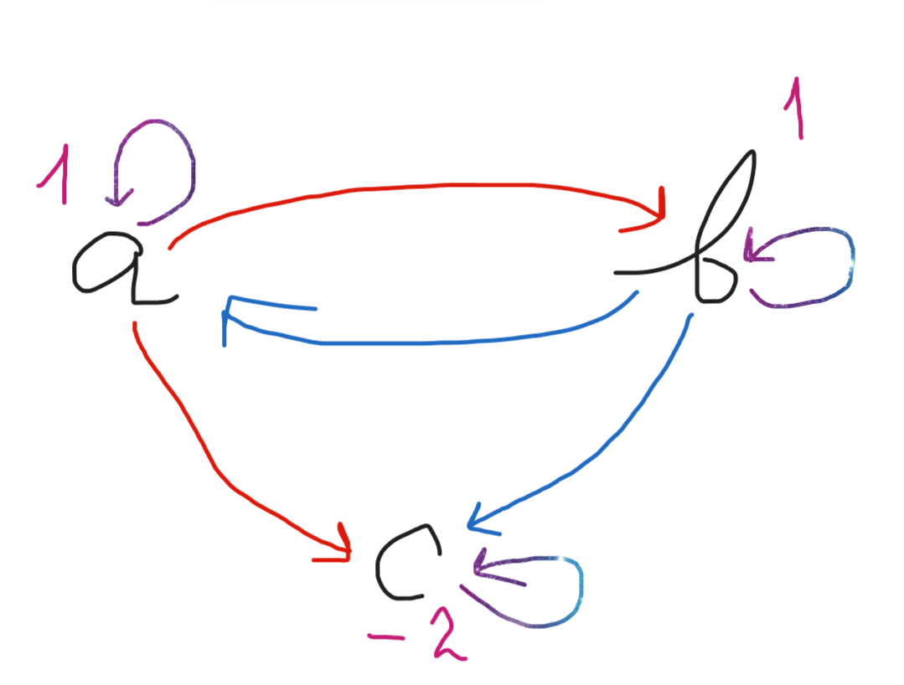

Зеленным цветом будут выделяться тестируемые элементы системы (в данном случае сама система является тестируемой).

Как показывалось ранее, такие тесты хоть и обладают наивысшей защитой от регресса и сопротивляемостью рефакторингу, их
чрезвычайно тяжело поддерживать и выполнять. В итоге это может вылиться только в большие затраты по времени (и по
бюджету как следствие). Тесты станут просто невыгодными и здравой альтернативой будет стратегия внесения изменений через
расширение, "ручные" проверки или частичное покрытие.

## Оптимизация

Сам собой встает вопрос, можем ли мы каким-либо образом изменить структуру так, чтобы наличие тестов стало оправданным?
Для этого нам нужно сделать их более поддерживаемыми. К тому же они не должны занимать так много времени для выполнения.

# Источники данных

Первым и одним из самых очевидных элементов системы, тяжело поддающихся тестированию, являются запросы к данным. Это
необязательно запросы к "удаленному серверу" в классическом понимании. Здесь подойдут любые функции которые обладают
двумя свойствами:

* Зависимость от скрытых аргументов - например от базы данных, состояние которой может отличаться от времени запуска
  тестов.
* Наличие внешних эффектов - возьмем local storage. Запись значения в данное хранилище может повлиять на работу системы,
  тем самым усложняя процесс верификации поведения.

Выделим такие функции во внешний компонент системы и назовем их "Repositories"

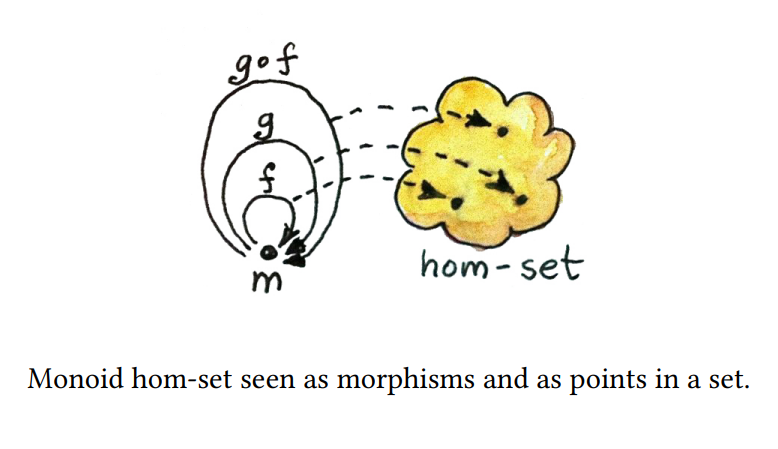

Данный блок очевидно не является окрашенным, т. к. намеренно не покрывается автоматизированными проверками. Из этого
также следует что Repositories это Humble object.

Зависимость в общем случае выражается в коде как явная ссылка на компонент. Компонент может быть обычной переменной,
классом, функцией, типом, библиотекой и так далее.

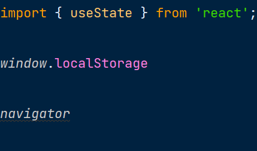

## Зависимость от конкретной реализации

Ниже, функция UsersList напрямую ссылается на конкретную реализацию getAllUsers. Изменить поведение компонента не меняя
исходного кода обеих функций нельзя:

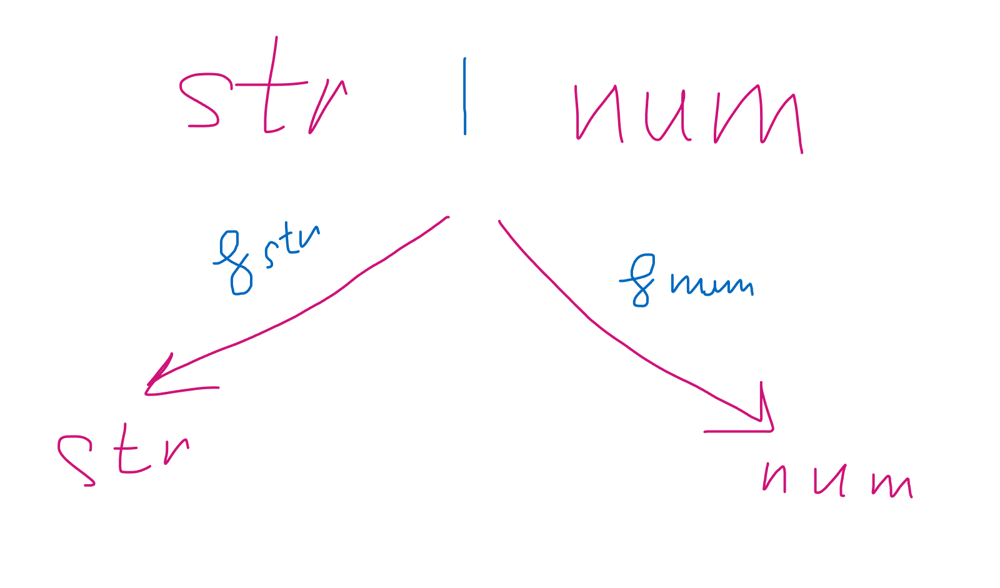

Таким образом можно сказать, что компонент UsersList не является расширяемым с точки зрения данного требования. Это и
определяет зависимость от реализации.

На диаграмме такая связь отображается следующим образом:

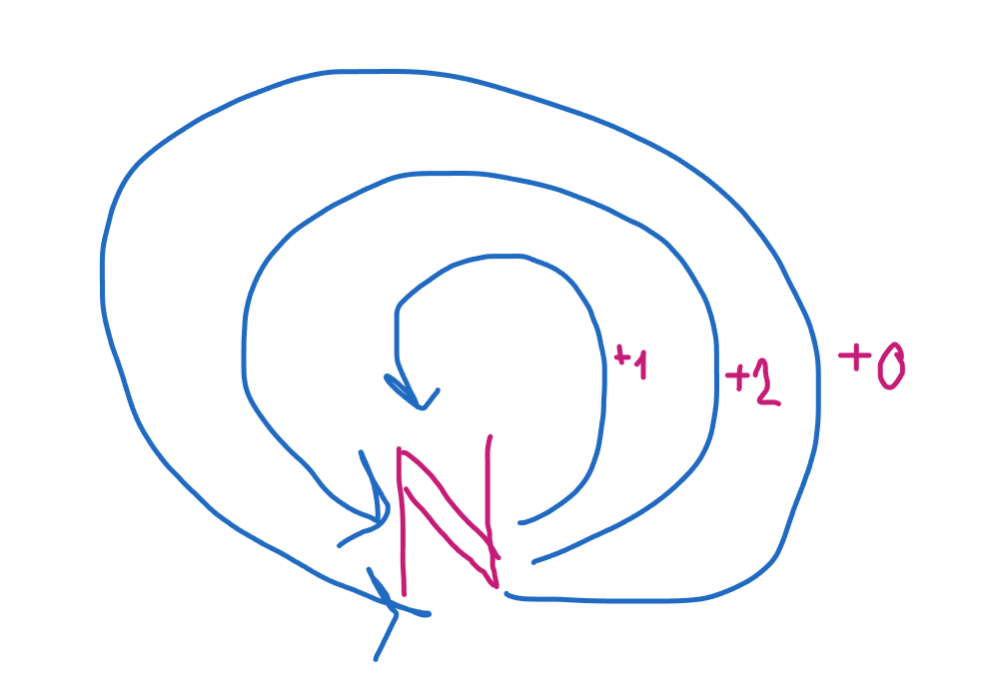

## Зависимость от интерфейса

Попробуем выполнить небольшое изменение:

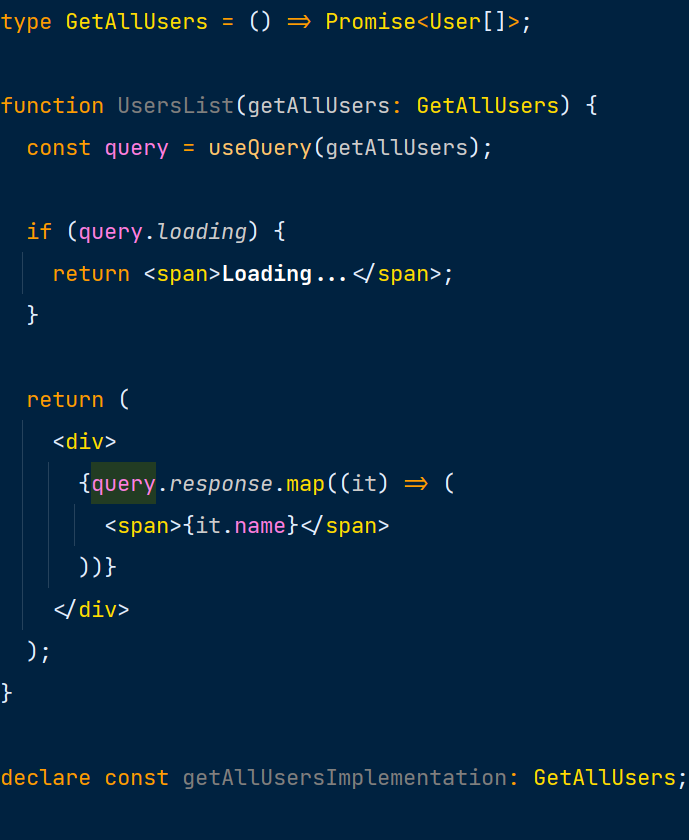

Теперь, функция UsersList ссылается не на конкретную реализацию функции, а на её интерфейс. Это открывает нам
возможность подмены поведения getAllUsers, без изменения исходного кода UsersList. Компонент становится расширяемым в
данной плоскости.

Изобразить это можно следующим образом:

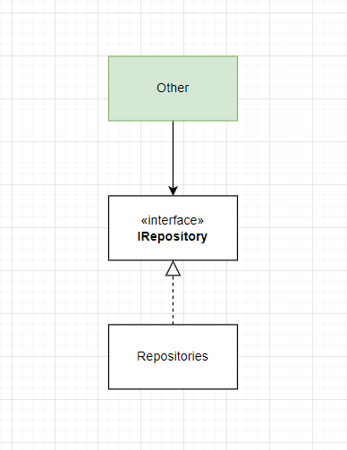

getAllUsers (часть Repositories) реализует (или удовлетворяет) интерфейсу GetAllUsers, который в свою очередь
используется в UsersList.

## Заглушки

Расширяемость тестируемого компонента можно использовать следующим образом: можно создать отдельную функцию
getAllUsersMock, которая вместо реального запроса к api, будет брать данные из локального источника.

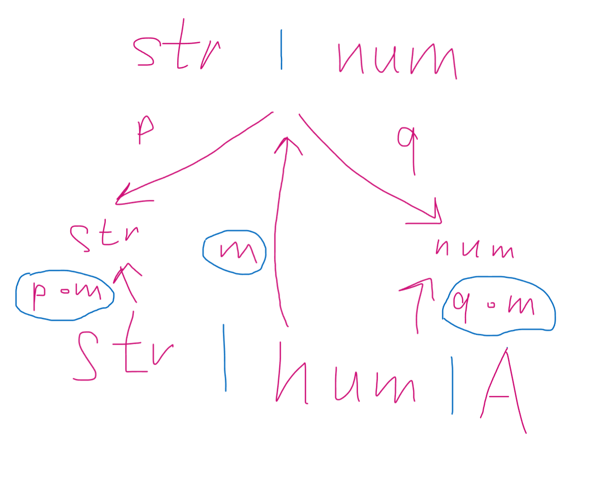

Функция легко поддается тестированию, так как лишена проблем перечисленных ранее. Она является "чистой".

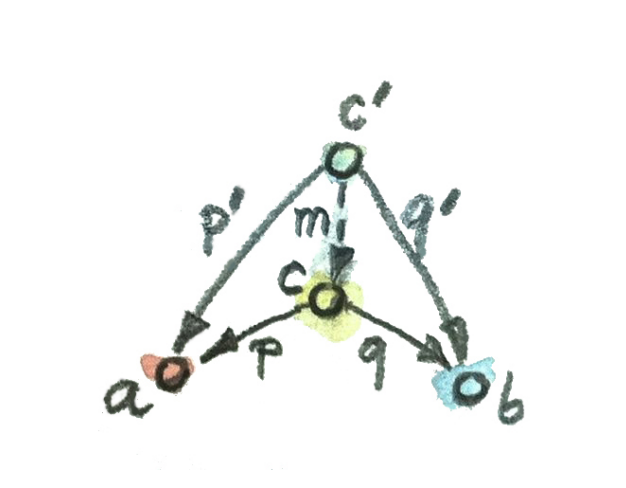

## Содержание компонентов

Далее, для общности, клиентом будет называться импортирующий компонент, а сервером - импортируемый.

* Изменения в клиенте нередко вызывают изменений в интерфейсе, что в свою очередь порождает изменения во всех его
  реализациях, которых обычно подавляющее большинство.
* Используя клиент (UsersList) разработчик неизбежно использует интерфейс, в отличие от его реализаций.

Из этого следует что нам выгодно держать интерфейсы и клиенты в одном компоненте:

* Пара (UsersList, GetAllUsers) образует "ядро" системы. То есть компонент с наивысшей ответственностью, изменение
  которого вызовет многочисленные модификации в зависимых серверах (конкретных реализациях). Это облегчает применения
  основных методов борьбы с изменением: абстрактности и направлении зависимостей.
* Клиент и интерфейс имеют тенденцию изменяться по одним и тем же причинам, что делает их ответственность единой.
* Инженер, используя UsersList, может внедрить собственные имплементации серверов, либо выбрать только некоторые из
  существующих. Это ярче всего проявляется в вопросах тестирования, где тип замещается заглушкой, удобной в целях
  верификации поведения.

По итогу структуру можно изобразить следующим образом:

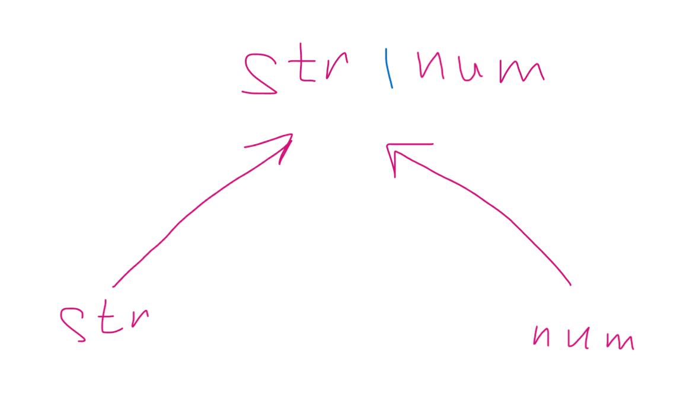

Сам собой также образуется второй компонент системы - Externals, содержащий в себе конкретные реализации интерфейса. При
этом не сильно важно где находятся Mocks в данном контексте, они с тем же успехом могут быть закреплены в рамках
конкретных тестовых сценариев, но не в самом компоненте Core по причинам высказанным выше.

## Форма и содержание

Полезной будет следующая аналогия: возьмем слово "лук". Оно состоит из двух компонент:

* Форма - буквы "л", "у" и "к" идущие друг за другом образуют "лицо" или "внешность" слова
* Содержание - смысл слова "лук" не фиксирован и зависит от контекста. Так, в рамках кулинарного шоу речь скорее всего
  будет идти о луке как об овоще. В случае обсуждения, например, войн средневековья значение скорее всего будет
  совершено иным.

Ровно такая же ситуация и здесь. Форма GetAllUsers может включать в себя множество разных содержаний (т. е. реализаций)
в зависимости от потребностей разработчика ПО.

## Инверсия

Мы поняли, что теперь можно изменить реализацию сервера не касаясь при этом исходного кода его клиентов, но можно ли
сказать то же самое и про форму?

Представим что функция getAllUsers вместо простого списка пользователей теперь возвращает данные с дополнительной
оберткой. Казалось бы, это изменение не является совместимым с установленным интерфейсом и не остается ничего другого,
как изменить тип.

Однако, мы можем воспользоваться техникой, называемой "адаптер", как показано на примере ниже:

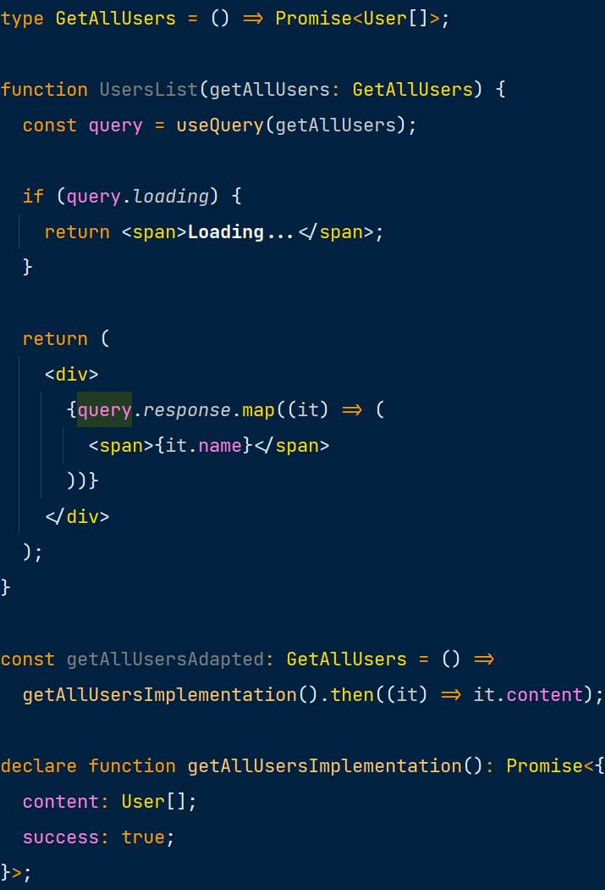

getAllUsersAdapted может быть передана компоненту GetAllUsers без модификаций исходного кода последнего.

Обратим внимание на то, что в случаях изменения реализации и интерфейса Repositories, исходный код компонента не
потребовал изменения. Это явно говорит об отсутствии зависимости UsersList от Repositories. С другой стороны, сами
репозитории теперь зависят от их клиентов!

Можно сказать что у нас появилось две картины происходящего:

* На уровне исполнения программы, на этапе runtime, вызовы передаются от Core к Externals:

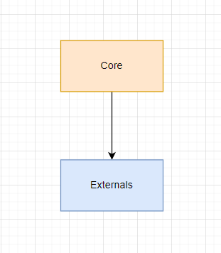

* На уровне структуры, как мы с вами увидели, зависимости обращены ровно в обратную сторону, то есть инвертированы:

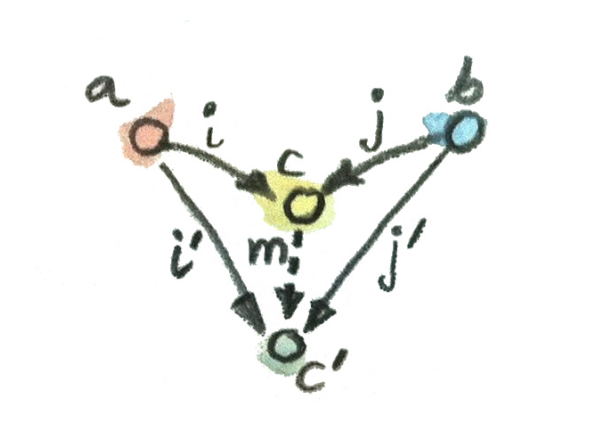

Инверсия зависимостей произошла за счет внедрения дополнительного интерфейса и расположения его в границах компонента
Core. Без этих двух условий, направление зависимостей между runtime и compile time было бы идентичным.

Между элементами Core и Externals формируется так называемая *неполная архитектурная граница*. Неполной её делает тот
факт, что Externals ссылается напрямую на компонент Core. Так, мы можем использовать Core с разными Externals, но
Externals только с одним конкретным Core.

## Верификация репозиториев

Мы определили то, каким образом будет оптимизироваться компонент Core (ранее Other) под задачи тестирования. Но
по-прежнему остается открытым вопрос проверки корректности поведения.

## Наблюдаемое поведение

Первое, что необходимо определить при проектировании тестов - это клиенты (или границы) системы. В случае визуальных
тестов, клиентом системы является человеческий орган восприятия - глаза. Таким образом, "наблюдаемое" поведение системы
есть ничто иное как изображение на мониторе. Отсюда и исходят соответствующие методы верификации.

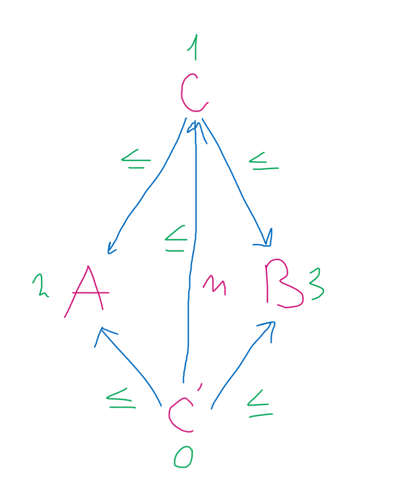

Когда речь идет о репозиторях, здесь также многое зависит от выбора границ. Для целей оптимизации процесса тестирования,
выгодно определять сетевой интерфейс как своеобразный "монитор". Стандартное изображение в нем заменяется простым
снимком вызова методов. Важно контролировать в каком порядке и с какими аргументами последние были вызваны, ведь все это
будет "замечено" сервером, т. е. повлияет на его наблюдаемое поведение в реальных условиях.

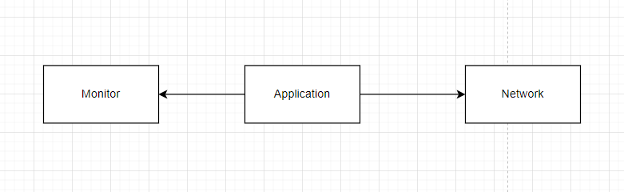

Проверка может быть представлена следующим образом (в комментариях приведен пример слепка запросов):

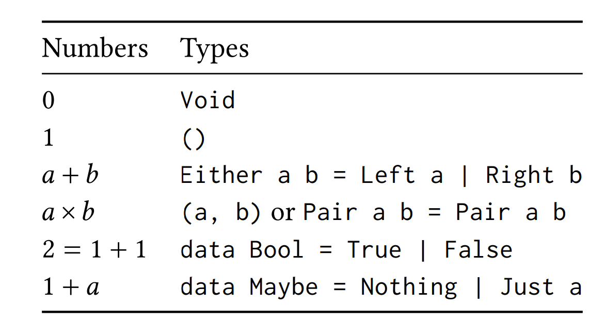

## Команды и запросы

Заметим, что помимо вывода информации (будь то монитор либо сетевой интерфейс), система также ожидает и ввода.
Очевидными источниками в случае человека являются, например, клавиатура и мышь:

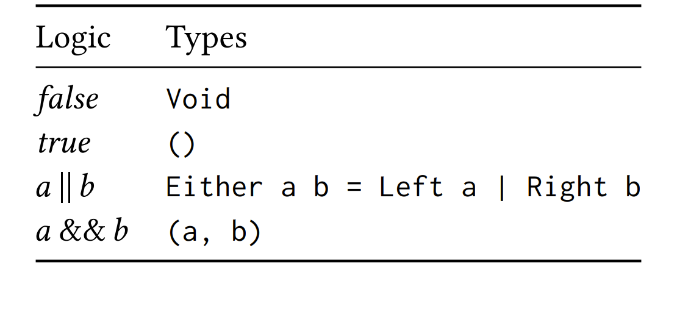

Сохраняя не совсем очевидную аналогию, можно то же самое сказать и про сервер. Вводом здесь будет считаться любой метод,
возвращающий отображаемую информацию, например любой GET метод. В общем случае здесь подойдет любая функция у которой
отсутствуют внешние эффекты, т. е. та, что не изменяет состояния приложения. Для простоты далее будет называть такие
функции запросами (queries).

Все остальные методы, т. е. те что изменяют состояние (например методы группы DELETE), назовем командами (commands).

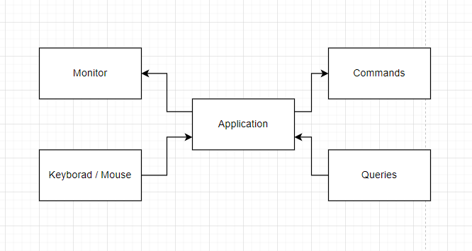

Как изображение на мониторе зависит от совокупности логики системы и действий пользователя, так и ответ от сервера будет
зависеть от команд, исполняемых приложением.

## Верификация CQR

Представим что мы хотим проверить поведение простой функции складывающей два числа

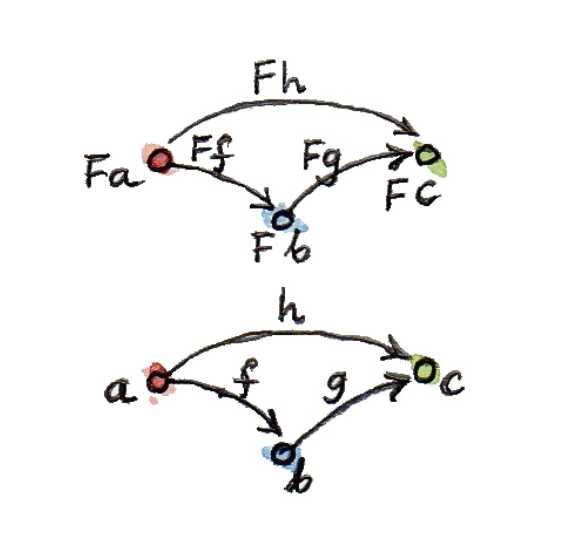

На таком простом примере очевидно, проверять имеет смысл только возвращаемое значение функции, так как именно оно и
будет "наблюдаться" её клиентом. В то же самое время, верификация её аргументов, т. е. входных данных теряет всякий
смысл.

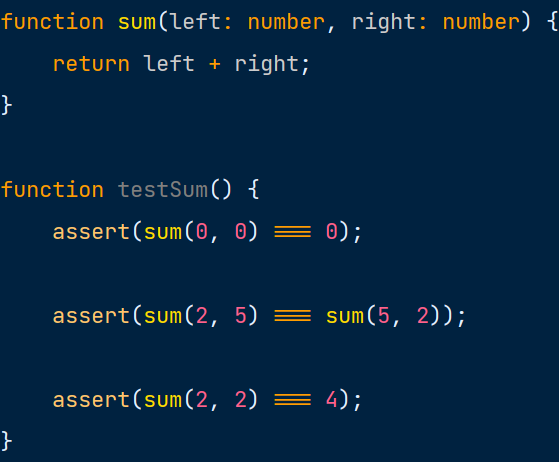

Программа для нас в таком случае не является исключением, её можно представить в таком виде:

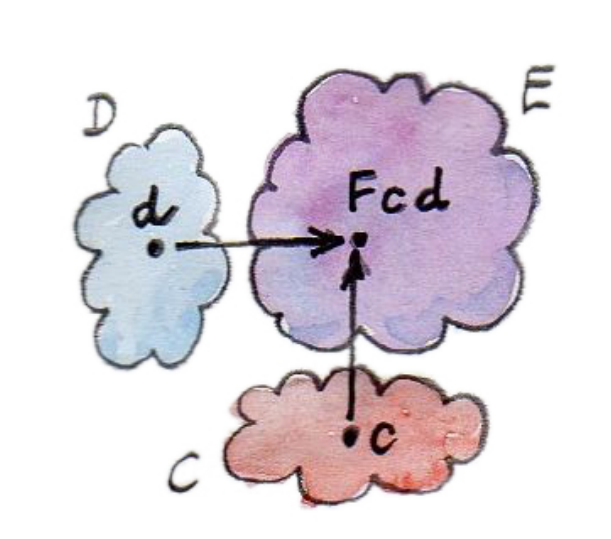

Сам процесс тестирования будет не сильно отличаться от аналогичного с функцией sum (сами аргументы естественно будут
иметь более сложную структуру):

Пример выше является несколько идеализированным с одной единственной целью - показать связь между целью функции (как
запроса или команды) и способа её верификации.

## Проверка запросов

Если говорить откровенно, то всегда игнорировать проверку корректности запросов - не верно. Например, мы могли бы
проверять то, с какими аргументами они вызываются, от этого зависит поведение сервера и как следствие может повлиять на
наблюдаемое поведение системы в целом.

## Принцип подстановки

Запросы, хоть и не имеют внешних эффектов, все равно зависят от изменяющегося источника данных, например БД. Это
приводит к тому что, например, возвращаемое значение getAllUsers может отличаться в зависимости от того, был ли метод
вызван до или после удаления пользователя.

# Заключение

Приведенные выше техники не являются откровением. Они достаточно известны и часто встречаются в литературе, однако, их
редко используют по причинам либо непонимания решаемых целей и задач, либо при отсутствии успехов их согласования с
заказчиком (согласование работ по техническому долгу и/или написание тестов). Оба фактора связаны. Относясь к паттернам
как к "брэндам", используя их по форме, а не по содержанию, программист рискует только ускорить процесс гниения проекта.

Одной из основных ролей инженера заключается в понимании просто факта: с каждым реализованным требованием, с каждым
исправленным дефектом сложность системы неуклонно растет, выражаясь в возрастающем времени выполнения задач.
Следовательно, стоимость проекта увеличивается, что не всегда можно сказать про бюджет.

Поэтому чрезвычайно важно контролировать данный показатель, путем постоянной корректировки структуры в направление
упрощения поддержки и развития ПО. Это делается не один раз, не раз в неделю, а непрерывно на протяжении всего цикла
разработки. Достичь этого нельзя не имея при этом качественных тестов. Они в свою очередь, требуют использования
подходящих структурных парадигм и паттернов, таким образом у последних появляется четкая, измеряемая причина для
существования - деньги.

Что более важно, эта причина понятна не только разработчикам, но и менеджерам, заказчикам и руководителям, тем, перед
кем и требуется чаще всего обосновывать данные работы. Нам этого не говорят напрямую, но от нас ожидают умения сказать
"нет", предупредить риски, обеспечить расширяемость и поддерживаемость системы на всем периоде её существования.

### Заметки

SRP - разделение тестов на представление и все остальное (пример с функцией валидации пароля и обрисовкой ошибки зеленым
цветом)
OCP - расширяемость тестируемых элементов проявляется через возможность их тестирования
LSP - моки должны быть подтипами основных репозиториев
ISP - ограниченное кол-во зависимостей упрощает повторное использование (а значит и тестирование) компонент
DIP - как основной метод разделения компонентов, при котором в рамках тестирования возможно использовать моки