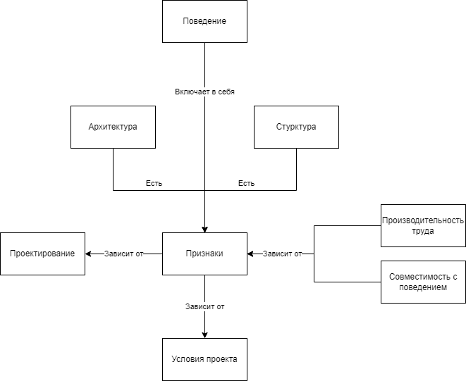

# Mind Map

# Введение

Архитектура является неотъемлемой частью процесса разработки ПО.
Окутанная мистикой, она часто представляется чем то темным, недоступным обычному разработчику.

Выделяют отдельных специалистов (архитекторов), которые с высоты своей позиции диктуют простым рабочим
догмы - инструкции для решения всех проблем.

Многие авторы пишут книги с красноречивыми названиями,
где приводят свои правила, обещающие сделать любой проект *чистым*, чтобы это не значило.

Различные библиотеки клянутся своим пользователям, что именно их решение (в корни отличающееся от конкурентов) обеспечит
проекту вожделенные: расширяемость, поддерживаемость и тестируемость.

Но стоит ли обычному специалисту лезть в спутанные дебри из понятий, принципов и паттернов, для того чтобы разобраться с причинами и следствиями?
Вопрос, конечно, риторический.

# Архитектура и Дизайн

## Определение

Архитектура - это форма, описывающая строение программы в виде её *составных* компонентов, связанных друг с другом
некоторыми отношениями, называемыми *зависимостями*.

Компонент - есть набор качеств, определяющий то, какие элементы системы он должен содержать.

Зависимость - это отношение между компонентами системы. Играет роль не только *присутствие* зависимости, но и её *
отсутствие* и *направленность*.

Дизайн - это архитектура, но на меньшем масштабе. На самом деле, смысла в разделении данного явления не особо много.
Высокоуровневые решения (архитектура) существуют благодаря низкоуровневым деталям (дизайн). Верно и обратное. Поэтому
далее понятия архитектура и дизайн будут считаться тождественными (т. е. взаимозаменяемыми).

## Роль

Зачастую считают, что архитектура является набором решений, которые будет *сложно* изменить в будущем.

Напротив, главной задачей архитектуры, на *любом* этапе проекта, является обеспечение достаточного многообразия
возможностей к изменению с сохранением достаточной *эффективности* разработки.

Возможно, читатель думает что целью архитектуры является обеспечение правильной работы системы. Конечно, никто не
отменяет важности данной задачи, в конце концов, это и есть причина существования дизайна в первую очередь. Однако, сама
по себе, архитектура имеет очень мало влияния на работоспособность системы. Существует много проектов с рабочей
системой, но с удручающей архитектурой. Главной проблемой в таких системах является *производительность труда* о которой речь пойдет
немного позднее.

Из сказанного ясно, что ролью архитектуры является обеспечение эффективности разработки. Но каким образом
обычный набор *компонентов* и их *зависимостей* может на это повлиять?

Для того чтобы попытаться ответить на данный вопрос, нужно начать с самых основ,
а именно с определения программы. 

# Две ценности

Любое ПО можно разделить на две составные части (или две ценности):

* Поведение
* Структура

## Поведение

Первое представляет собой то, что формирует потребительскую ценность, т. е. то за что платит заказчик.
Она же и является *единственной* причиной существования программы.

Эффектом данной ценности является *наблюдаемое* поведения. Из чего можно сказать,
что если данный эффект не соответствует ожиданиям (ввиду наличия дефектов и/или недоработок),
то и вся ценность в целом считается нарушенной.

## Структура

Ясно, что любая программа обладающая поведением, также содержит в себе и структуру. Также, очевидным будет и то, что одно и то же поведение может быть реализовано с использованием совершено разных структур.

Но что заставляет инженеров отдавать предпочтения одним решениям, игнорируя другие?

Ответ - эффекты структурной ценности. Если в случае с поведенческой ценностью, эффектом является наблюдаемый,
осязаемый заказчиком продукт, решающий поставленные задачи, то структура,
являясь неотъемлемой её частью оказывает *прямое* влияние на факт и степень осуществимости самой идеи в целом.  

Еще одним неприятным фактом является и то, что всякая структура *постоянно стремится к усложнению*, т. е. к
приобретению/усилению признаков, негативно влияющих на эффективность труда. Это зачастую обусловлено человеческим
фактором.

*Правильная* структура будет ускорять реализацию поведения, не будет ему противоречить.

*Неправильная* же структура, наоборот, будет выступать в роли вязкой жижи, замедляющей ход инженерного станка.
Быть непреодолимой стеной перед очередными бизнес задачами, постоянно то возникающими, то преходящими без конца.

Из приведенного выше ясно, что основной ролью архитектуры есть удовлетворение структурной ценности программы.

Для того чтобы разобраться, каким образом определять качество дизайна, необходимо рассмотреть признаки, через которые
могут проявляться характеристики неэффективных структур.

# Признаки нарушений

Любому инженеру, поставившему себе задачу по реализации поведения, неизбежно предстоит столкнуться
с признаками плохой структуры.

Вот основные из них:

### Жесткость

Программа называется жесткой,
если одно изменение в модуле вызывает за собой каскад изменений в других модулях.

*Пример Button с RoleGuard*

### Хрупкость

Программа называется хрупкой в двух случаях:

* Дефекты легко допустить
* Дефекты легко пропустить

*Пример Button с опциональным RoleGuard*
*Пример UI KIT с опциональным RoleGuard*

### Неподвижность

Программа называется неподвижной в случае если элементы системы,
полезные в других модулях или поведениях, тяжело переиспользовать.

*Очевидный пример Button с RoleGuard*
*Пример Singleton плеер*

### Вязкость

Вязкость в общем случае, наблюдается тогда, когда целевой в проекте дизайн трудно соблюсти.

Разделяют следующие причины:

#### Вязкость проекта

Проявляется в случаях когда проще реализовать поведение через противоречащие основному дизайну
средства (костыли), чем следовать установленным правилам.

*Пример Redux architect*

#### Вязкость окружения

Проекты, в которых инструментарий является помехой для достижения требуемого поведения, называются вязкими. Такие
ситуации зачастую заставляют разработчика использовать обходные пути, в конечном итоге нарушая целевой дизайн системы.

*Пример с микросервисами (изменениями в них)*

### Избыточная сложность

Проект называется избыточно сложным, если в нем присутствуют надстройки,
не имеющие оправданий как со стороны поведения, так и со стороны других признаков.

*Пример UI KIT только для одного проекта*

### Избыточное дублирование

Дублирование бывает двух видов

#### Ложное дублирование

Если код является идентичным или примерно похожим, это не значит что он является дублирующим.
Дальнейшие правки таких признаков приведут к еще большим проблемам в будущем.

*Пример с searchable select (офлайн и онлайн)*

#### Истинное дублирование

Код обладающий одинаковым наблюдаемым поведением, изменяющийся по одним и тем же причинам
и в одно и то же время является дублирующим.

*Пример с общими переменными стилей (закономерности в планшете)*

### Непрозрачность

Программа называется непрозрачной если разработчик не может вывести поведенческую ценность исходя из исходного кода
модуля.

*Пример со screaming architecture*
*Пример с многоуровневыми абстракциями. Одна функция vs Пять функций*

# Понятия

## Проектирование

Обратим внимание на то, каким образом проходила работа с указанными признаками:

* Приводилось описание проблемы
* Происходила явная идентификация в коде
* Применялись подходящие инструменты исправляющие исходный признак

Назовем данный алгоритм процессом *проектирования*.
Данный процесс оказывает влияние на структуру, которая,
в качестве собственного эффекта выражается в виде измененного набора признаков.

Отдельно выделяют проектирование, при котором происходит изменение на основе существующей
структуры, а не формирование совершенно новой. Это называется *Рефакторинг*.
В дальнейшем, для простоты, оба понятия будут объеденины в одно.

Еще одним важным свойством проектирования является то, что процесс затрагивает *только структуру* и ничего более, не
влияя при этом на поведенческую ценность приложения. Рефакторинг, изменяющий поведение (например порождающий регресс),
не является проектированием (и рефакторингом в том числе).

## Архитектура

*Архитектура*/*Структура*/*Дизайн* есть результат проектирования, качество которой выражается в определенном состоянии
данных признаков.

Признаки в данном случае выполняют роль параметров, с помощью которых можно измерить применимость того или иного дизайна
в рамках конкретного случая.

## Итого

* Качество архитектуры - есть определенное состояние признаков структуры
* Проектирование - есть процесс, изменяющий/создающий структуру (т. е. влияющий на признаки)
* Рефакторинг - есть частный случай проектирования

# Роль Архитектуры в ПО

Если рассмотреть приведенные ранее семь признаков, то можно обнаружить
что все они не являются дефектами или недоработками в прямом смысле.

Вместо этого, каждый из них, при нарушении будет замедлять процесс разработки за счет его усложнения. Т. е. снижать
производительность труда.

## Производительность труда

*Производительность труда* - это количество задач выполняемых специалистом за данный промежуток времени.
Чем этот показатель выше, тем разработка эффективней.

Например, предположим что создание формы входа средней сложности (и последующее её сопровождение) занимает у специалиста 2 дня.
Возьмем некоторый проект на котором требуется реализировать приведенное поведение, тогда возможно одно из следующего:
* Задача занимает *примерно* 2 дня - в таком случае производительность считается средней или нормальной.
* Задача занимает *менее* 2 дней - производительность считается высокой. Проект с высокой производительностью труда, называется *простым* проектом.
* Задача занимает *более* 2 дней - производительность считается низкой. Проект с низкой производительностью труда, называется *сложным* проектом.

Legacy project (устаревший/заброшенный проект) - есть проект с низкой производительностью труда, где она вызвана
эффектами исходящими от плохой структуры ПО.

## Низкая производительность труда

Снижение эффективности разработки приводит к её удорожанию, что негативно влияет не только на отношение с заказчиком,
но и на конкурентноспособность в целом.

Для того чтобы нивелировать данный эффект и соблюсти дедлайн, зачастую предпринимают следующее:

* Намеренное упрощение реализации за счет недоработок явно противоречащих бизнесу
* Расширение штата разработчиков, для восстановления скорости, что приводит к усложнению и удорожанию процесса  
* Сверхурочные работы, снижающие способность к труду в перспективе

Очевидно, что указанные меры способны только временно оттянуть неизбежное, а именно постепенную стагнацию и деградацию поведенческой ценности.
Когда каждое новое требование требует все больше времени на реализацию и приносит за собой бесчисленное количество
дефектов в казалось-бы уже устоявшихся частях проекта.

Разработка становится дорогой и клиент не всегда готов платить больше, что делает авантюру не прибыльной для
компании-разработчика.

Одной из крайних стадий такого развития является намерение о полном переписывании проекта, что к сожалению не всегда
возможно ввиду финансовых причин.

## Высокая производительность труда

Предположим теперь что производительность труда увеличилась на 25%. Это значит, что задача, которая раньше занимала 8
часов, теперь требует всего 6. На что можно потратить освободившееся время?

Инженер-разработчик:

* На другие задачи, тем самым быстрее приблизив выполнение плана
* На рефакторинг, для исправления найденных признаков и контроля тенденции структуры к деградации
* На самообучение, для повышения компетенции и сложности труда как следствие. Труд более высокого порядка оплачивается
  больше.

Компания-разработчик:

* Снизить стоимость проекта на 25%, тем самым существенно повысив свою конкурентоспособность и увеличив прибыль как
  следствие.
* Разделить образовавшуюся подушку в виде части прибыли себе и зарплаты специалистам, тем самым увеличив спрос труда.
* Отправить средства на амортизацию средств производства и повышение квалификации инженеров, тем самым открывая
  потенциал к дальнейшим оптимизациям.

## Роль

Из сказанного очевидно, что *архитектура* оказывает непосредственное влияние на
производительность труда.

Следовательно, можно постановить:

* *Ролью архитектуры* является обеспечение *высокой*/*достаточной* производительности труда.
* *Проектирование* в целевом виде - это *непрерывный* процесс, предназначенный для изменения признаков (через
  модификацию структуры) в направлении *увеличения/поддержания* эффективности разработки.

Из чего можно вывести что архитектура является *чистой*/*хорошей*/*правильной* только в случае если имеет место высокая производительность труда.

## Поведение

Поведение это то, из-за чего существует архитектура в первую очередь. Единственное условие которое необходимо соблюсти -
это обеспечить *непротиворечивость* этим требованиям.

Но как было отмечено раннее, несмотря на причину существования, основной *ролью* архитектуры было и остается - обеспечение
эффективности производства.

# Сложность проектирования

Отметим, что сложный проект (legacy project) является частым явлениям в индустрии, что говорит о сложностях построения и поддержки чистой архитектуры.

Почему проектирование - это сложно?

## Условия проекта

Дело в том, что каждый из признаков не образуется сам по себе. В этом ему помогают различные *условия проекта*.

Приведем некоторые из них:

* Компетенция разработки
* Частота показов
* Стабильность требований
* Технологии разработки
* Этап проекта
* Специфика предметной области

Проектирование, должно учитывать не только сам признак, но и условия проекта, т. к. именно они являются причиной
появления проблемы в первую очередь и они же, будут являться причинами появления многих других в будущем.

Необходимо подобрать такое решение, которое взамен на избавление или ослабление признака, предоставит архитектуру,
учитывающую тенденции в будущем и настоящем.

Рассмотрим некоторые примеры.

### Стабильность требований

Требования меняются. Это одно из основных свойств данного понятия, его определяющих качеств. Самое неприятное здесь то,
что вектор изменений зачастую принимает обратное положение по отношению к тому, на что расчитывал изначальный дизайн.

Более того, изменения зачастую требуется сделать быстро и они могут быть проделаны разработчиками, слабо знакомыми с
изначальными целями дизайна.

Отсутствие общего понимания роли архитектуры и часто изменяющиеся требования приводят к постепенному загниванию проекта,
которое выражается в приобретении/усилении последним указанных признаков плохой структуры.

### Компетенция разработки

Предположим что в проекте обнаружилось *избыточное дублирование*. Можно попробовать избавиться от него,
добавив дополнительные абстракции, но в случае если на проекте нет постоянной разработки либо компенция является
недостаточной, то итоговое решение может оказаться *непрозрачным*, что только усугубит ситуацию.

Необходимо предоставить такое решение, которое обменяет одни признаки, на другие. Это всегда *игра компромиссов*.

### Направление развития

Сложность не заканчивается на этом, *архитектура* также должна предугадывать и возможные векторы развития условий
проекта, для обеспечения подходящих показателей в *жесткости* и *неподвижности*.

Данные условия в сумме требуют от специалиста следующих качеств:

* Опыт - для предупреждения признаков
* Внимательность - для своевременного обнаружения признаков
* Знание - для подбора подходящего инструмента решения
* Ответственность - для обеспечения *непрерывного* процесса поддержки/улучшения структуры

## Паттерны

Отметим, что несколько разных проектов могут обладать одинаковыми условиями и признаками, это означает что для них
подойдут одинаковые решения по проектированию.

Такие универсальные элементы называются *паттернами* (или *принципами* в более широком смысле). Основной их задачей
является изменение признаков в сторону увеличения производительности труда.

Для их грамотного применения необходима способность к идентификации решаемых паттерном признаков и требуемых им условий.
В противном случае велик риск только ухудшить имеющуюся структуру в сторону *избыточной сложности*
и *непрозрачности*.