# Mind Map


# Введение

Архитектура является неотъемлемой частью процесса разработки ПО.
Окутанная мистикой, она часто представляется чем то темным, недосягаемым обычному разработчику.

Выделяют отдельных специалистов (архитекторов), которые с высоты своей позиции диктуют простым рабочим
догмы - инструкции для решения всех проблем.

Многие авторы пишут книги с красноречивыми названиями,
где приводят свои правила, обещающие сделать любой проект *чистым*, чтобы это не значило.

Различные библиотеки клянутся своим пользователям, что именно их решение (в корни отличающееся от конкурентов) обеспечит
проекту вожделенные: расширяемость, поддерживаемость и тестируемость.

Но стоит ли обычному специалисту лезть в спутанные дебри из понятий, принципов и паттернов, для того чтобы разобраться с причинами и следствиями?
Вопрос, конечно, риторический.

# Архитектура и Дизайн

## Определение

Архитектура - это форма, описывающая строение программы в виде её *составных* компонентов (слоев), связанных друг с другом
некоторыми отношениями, называемыми *зависимостями*.

Компонент - есть набор ответственностей, устанавливающих то, какие элементы системы он должен содержать.

Зависимость - это отношение между компонентами системы. Играет роль не только *присутствие* или *отсутствие*
зависимости, но и её *направленность*.

Дизайн - это архитектура, но на меньшем масштабе. На самом деле, смысла в разделении данного явления не особо много.
Высокоуровневые решения (архитектура) существуют благодаря низкоуровневым деталям (дизайн). Верно и обратное. Поэтому
далее, понятия архитектура и дизайн будут считаться тождественными (т. е. взаимозаменяемыми).

## Роль

Распространено мнение, что архитектура является набором решений, которые *сложно* изменить в будущем.

Напротив, главной задачей архитектуры, на *любом* этапе проекта, является обеспечение адекватной гибкости с сохранением
достаточной *эффективности* разработки.

Кто-то может возразить и сказать что целью архитектуры является обеспечение правильной работы системы. Конечно, никто не
отменяет важности данной задачи, в конце концов, это и есть причина существования дизайна в первую очередь. Однако, сама
по себе, архитектура имеет очень мало влияния на работоспособность системы. Существует много проектов с рабочей
системой, но с удручающей архитектурой. Главной проблемой в таких системах является *производительность труда* о которой речь пойдет
немного позднее.

Из сказанного ясно, что ролью архитектуры является обеспечение эффективности разработки. Но каким образом обычный
набор *компонентов* и их *зависимостей* может в этом помочь?

Для того чтобы попытаться ответить на данный вопрос, нужно начать с самых основ,
а именно с определения программы. 

# Две ценности

Любое ПО можно разделить на две составные части (две ценности):

* Поведение
* Структура

## Поведение

Первое представляет собой то, что формирует потребительскую ценность, т. е. то за что платит заказчик.
Она же и является *единственной* причиной существования программы.

Эффектом данной стороны является *наблюдаемое* поведения. Если данный эффект не соответствует ожиданиям (ввиду наличия
дефектов и/или недоработок), то и вся ценность программы в целом считается нарушенной.

## Структура

Ясно, что любая программа обладающая поведением, также содержит в себе и структуру. Также, очевидным будет и то, что
одно и то же поведение может быть реализовано с использованием совершено разных структур.

Но что заставляет инженеров отдавать предпочтения одному дизайну, игнорируя другие?

Ответ - структурные эффекты. Если в случае с поведенческой ценностью, эффектом является наблюдаемый,
осязаемый заказчиком продукт, решающий поставленные задачи, то структура,
являясь неотъемлемой её частью оказывает *прямое* влияние на степень осуществимости самой идеи в целом.  

Еще одним неприятным фактом является то, что всякая структура *постоянно стремится к усложнению*, т. е. к постоянному
снижению эффективность труда. Это зачастую обусловлено человеческим фактором.

*Правильная* структура будет ускорять реализацию поведения, не будет ему противоречить.

*Неправильная* же структура, наоборот, будет выступать в роли вязкой жижи, замедляющей ход инженерного станка.
Быть непреодолимой стеной перед очередными бизнес задачами, постоянно то возникающими, то преходящими без конца.

Для того чтобы разобраться, каким образом определять качество дизайна, необходимо рассмотреть признаки, через которые
могут проявляться характеристики неэффективной архитектуры проекта.

# Признаки нарушений

Любому инженеру, поставившему себе задачу по реализации поведения, неизбежно предстоит столкнуться
с признаками плохой структуры.

Вот основные из них:

### Жесткость

Программа называется жесткой,
если одно изменение в модуле вызывает за собой каскад изменений в других модулях.

#### Пример

Имеется три разные страницы, на которых используется один и тот же компонент - `Button`.

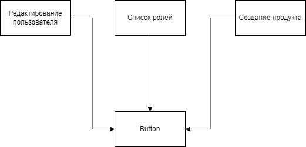

В один момент, приходит требование - на странице редактирования пользователя,
кнопка удаления должна быть доступна сотрудникам с ролью Администратор.

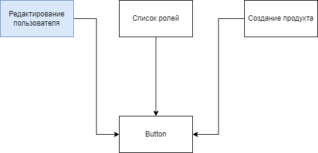

Одним из вариантов, который может прийти в голову - это добавление нового аттрибута `guard` в компонент кнопки.

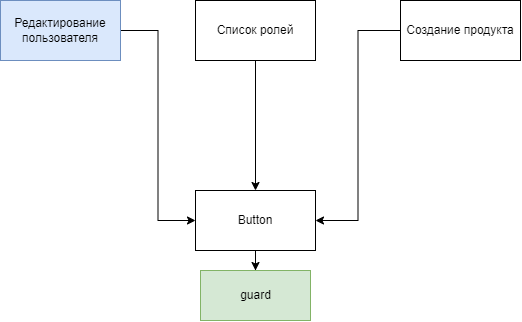

Такое изменение, вызовет сложности следующего характера:

* Новый обязательный аттрибут нарушает обратную совместимость с остальными страницами, что потребует дополнительных работ по интеграции
* Теперь, любые изменения во внешнем интерфейсе, связанные с необходимостью обеспечить работу `guard`, также повлекут за
  собой изменения в зависимых модулях, хоть эта возможность там и не используется
* Могут потребоваться дополнительные работы связанные с подменной сайд эффектов при тестировании, т. к. для определения
  роли может отправляться запрос, либо считываться информация из внешнего хранилища прямо внутри `Button`.

В общем случае, указанные проблемы ведут за собой изменения во всех зависимых от `Button` страницах, хотя требование
касалось исключительно страницы редактирования.

Измененные элементы обозначены желтым цветом:

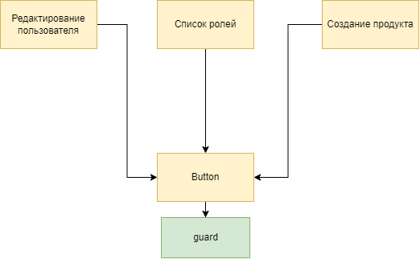

Такая ситуация называется *жесткостью*.

#### Решение

Нивелировать данную проблему можно двумя способами:

Создание нового компонента `RoleGuardButton` расширяющего оригинальный `Button`.


Таким образом, исходный код оригинального компонента не будет изменен и все новые эффекты будут изолированы в рамках
страницы редактирования.

Другим вариантом будет добавление свойства `guard` как опционального


В таком случае, также, эффект будет изолирован на конкретный сценарий использования. Но исходный код оригинального
компонента будет подвержен модификации, что незамедлительно вызовет *хрупкость*.

### Хрупкость

Каким образом, факт изменения компонента `Button` вызовет хрупкость решения?

Для начала скажем следующее: программа называется хрупкой в двух случаях:

* Когда дефекты легко допустить
* Когда дефекты легко пропустить

#### Незаметность дефекта

Рассмотрим диаграмму еще раз:


Кажется, что зависимые от `Button` элементы остались нетронутыми. Но на самом деле, ввиду модификации внутренней
реализация компонента, была изменена реализация (не исходный код) *всех* зависимых от `Button` страниц.


Это объясняется простым фактом - наблюдаемое поведение страницы является комбинацией наблюдаемых поведений её составных
частей, коей и является `Button`.

Любое изменение в деталях реализации поведения, имеет все шансы оказать на него негативный эффект. То что работало
раньше, может сломаться после казалось бы, не относящихся напрямую модификаций.

Дефекта легко пропустить ввиду того что затрагивается больше кол-во компонентов системы (транзитивно, не напрямую).
Инженер или QA не будет *и не должен* постоянно, точно и беспристрастно перепроверять каждый зависимый сценарий.

#### Простота допущения

Опциональный `guard` также имеет еще один интересный эффект - он добавляет компоненту новую *ответственность*. Она
выражается в виде дополнительных причин для изменения, т. е. `Button` будет изменяться чаще.

С каждым таким изменением, помимо постоянных перепроверок зависимых от него элементов, нужно будет ухитриться и не
нарушить существующую реализацию, что будет сделать не просто, т. к. поведение самого компонента (с появлением
дополнительной ответственности) неизбежно *усложнилось*.

#### Решение

Исходя из чего остаются следующие варианты:

* Расширить элемент через композицию `RoledGuardButton`
* Использовать средства автоматизированного тестирования

Но и здесь не все так просто. Для того чтобы расширить `Button`, он должен быть достаточно подвижным т. е.
*расширяемым*.

То же верно и в случае с тестированием. Ведь тесты сами по себе - просто отдельное окружение в котором тестируемые
компоненты *переиспользуются* в новых контекстах.


### Неподвижность

Дадим определение. Модуль является неподвижным в случае если его элементы, полезные в других модулях или поведениях,
тяжело переиспользовать.

#### Пример

Из примера с `Button` ясно, что недостаточная подвижность элемента может выразиться в дальнейшем в большей *жесткости* и
*хрупкости* системы.

Рассмотрим другую ситуацию. Стоит задача, реализовать модуль, контролирующий работу проигрывателя. При этом сказано, что
только *один* плеер может присутствовать на странице во взятый момент времени.

Исходя из постановки, инженер приходит к, казалось бы, логическому выводу - использовать до боли известный
паттерн `Singleton`.


И в один прекрасный момент бизнесу приходит осознание - теперь нужно отображать не один плеер, а все, которые открыл
пользователь.


Проблема в том, что изначальное решение не оказалось *неподвижным* по отношению к новому требованию, что будет выражено
в жесткости решения (будут изменены все страницы).

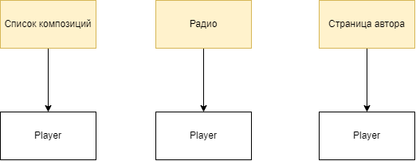

#### Решение

Единственным решением данной проблемы будет абстрагирования данной детали реализации от клиентов `Player`, например,
через фабрику `createPlayer`.


Обратим внимание на то, что изменения также затронут все элементы системы, но взамен, это даст нам защиту от подобных
изменений в будущем.

Могло ли данное решение быть применено раньше? Безусловно. В таком случае, изменение заняло бы гораздо меньше сил,
ввиду отсутствия некоторого зависимого функционала.

Можно пойти еще дальше. Почему абстрагируется только деталь создания (фабрика)? Может быть стоит сокрыть и другие
подробности, добавить новые промежуточные элементы в виде интерфейсов, типов и абстрактных классов.

Это приводит нас к следующему признаку.

### Избыточная сложность

Модуль называется избыточно сложным, если в нем присутствуют надстройки, не имеющие оправданий как со стороны поведения,
так и со стороны других признаков.

#### Пример

Представим абстракция `createPlayer` была добавлена в самом начале проекта.


Безусловно, в момент изменения детали работы плеера, данный ход сразу же приобретет оправдание, у него появится *смысл*
к существованию.

Но, что если данное изменение не произойдет впринципе? Или произойдет, но на самых поздних этапах проекта? В таком
случае, все это время, функция `createPlayer` будет висеть тяжким грузом, усложняя понимание системы, тем самым
увеличивая её *непрозрачность*.

#### Решение

К сожалению, основным фактором успеха здесь являются опыт и удача. Невозможно с полной уверенностью предугадать
направление изменений проекта.

Подходящей стратегией является поддержка системы в не избыточном состоянии, т. е. представляя что никакие требования
изменены не будут. Но как только данное предположение нарушено, необходимо использовать такое изменение, которое не
только удовлетворит новым вводным, но и защитит от подобных поворотов в будущем через *суперкоменсацию*.

Также, существуют методики, с помощью которых можно дополнительно стимулировать такие изменения
на более ранних этапах проекта (что добавит им оправданности и упростит их внедрение).

Обычно, появление изменений стимулируют следующие действия:

* Написание тестов. Сами по себе, они являются еще одним *клиентом*, удовлетворение которого заставит систему быть
  тестируемой, т. е. подвижной в известных границах. Что интересно, проблема с `SingletonPlayer` наврятли возникла бы, если бы
  в системе присутствовали тесты.
* Частые показы заказчику. Это требует построения итеративного плана разработки (Agile) и приоритизации в сторону
  функциональностей, а не инфраструктуры
* Приоритет разработки *определяющих* элементов поведения перед остальных функционалом
* Ранние релизы продукта с целью вывода в эксплуатацию и получению обратной связи от конечных пользователей

### Непрозрачность

Программа называется непрозрачной если разработчику требуются существенные когнитивные усилия, чтобы вывести
поведенческую ценность исходя из исходного кода модуля.

#### Пример

`createPlayer` явно показал, как обычные преждевременные оптимизации могут усложнить понимание системы в целом. Факт
усложнения объясняется тем, что мозгу приходится хранить больше информации о структуре элемента из-за увеличения её
составных элементов. Данный пример может показаться невинным, но на практике, такие цепочки могут разрастаться в
десятки, если не сотни промежуточных элементов.


На данный показатель может влиять не только структура кода, но и структура проекта в целом.
Взглянем на один из примеров организации репозитория. 

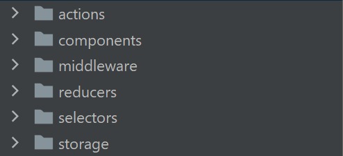

Какая информация доносится до читателя в данном виде? Только подсказки о том, какую *конкретную* реализацию использует
решение. Факт того, что целый проект кружится вокруг детали (конкретного паттерна/библиотеки),
увеличивает его *непрозрачность* в контексте требований.

#### Решение

Теперь взглянем на другой пример.


В данном случае, центром является не конкретная реализация, а бизнес требование. В результате чего, уменьшается *непрозрачность* и *неподвижность*. Часть поведения проекта теперь читается исходя из его структуры.

Важно отметить, что данный признак содержит в себе *субъективный* фактор, а именно - опыт инженера. Чем специалист
компетентней в целевой области решения, тем меньше когнитивных усилий требуется приложить для извлечения исходного
поведения. 

### Вязкость

Вязкость в общем случае, наблюдается тогда, когда целевой в проекте дизайн трудно соблюсти.

Разделяют следующие причины:

#### Вязкость проекта

Проявляется в случаях когда проще реализовать поведение через противоречащие основному дизайну
средства (костыли), чем следовать установленным правилам.

##### Пример

Возьмем для примера одно из популярных решений для управления состоянием.

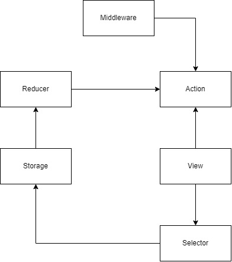

Далее предположим, что требуется реализовать простой список пользователей. Для этого, специалисту потребуется разбить
требуемый функционал на все указанные компоненты.

Но, прямая реализация через нативные средства управления состоянием явно проще (т. е. займет меньше времени) ввиду
отсутствия такого кол-ва промежуточных элементов.

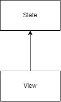

При наличии такой альтернативы, сжатых сроков и отсутствия *четких обоснований* исходного дизайна - текущая архитектура
может измениться. В самом изменении ничего плохого нет, проблема в его векторе. Модификации могут привести проект в
состояние неопределенности, где для решения одних и тех же задач используются разные средства, без особого на то
обоснования и контроля, увеличивая при этом его *непрозрачность*.

##### Решение

Проблему можно рассматривать с разных сторон:

* Недостаточная компетентность специалиста
* Избыточная сложность решения

Если предположить что решение является не избыточным, т. е. существуют *объективные* причины её существования, то тогда
достаточно их донести до специалистов работающих с ней.

В случае, если наблюдается *избыточная сложность*, т. е. причины существования дизайна *субъективны*, тогда необходимо
избавиться от лишних надстроек, упростив тем самым систему.

Возможно, нам важно по определенным причинам использовать глобальное хранилище, но Selector и Reducer являются
избыточными элементами.

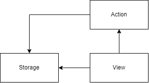

#### Вязкость окружения

Проекты, в которых средства/принципы производства являются помехой для достижения требуемого поведения, называются
вязкими. Такие ситуации зачастую заставляют разработчика использовать обходные пути, в конечном итоге нарушая целевой
дизайн системы.

##### Пример

Если на проекте, каждое изменение занимает большое время для компиляции/сборки, то в таком случае инженер будет пытаться
модифицировать как можно меньше кол-во файлов, даже если это в конечном итоге противоречит исходному дизайну.

Если на проекте написание тестов отнимает много усилий, то инженер не будет разрабатывать их вовсе, что откроет
дополнительную тенденцию к *хрупкости*. Это также снимает обязательство с разработчика писать тестируемый функционал,
что не только может противоречить изначальному дизайну (*непрозрачность*),
но и в конечном итоге повысит его *неподвижность*

Можно также представить следующую ситуацию, предположим что на проекте реализуется распределенная разработка путем
использования микросервисов.

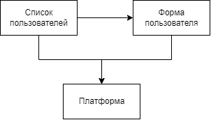

Далее предположим, что каждое изменение в стороннем модуле проходит через долгую процедуру проверок, тестов, сборки,
версионирования и развертывания.

Теперь представим, что Список пользователей вызывает Форму создания и по закрытию требует в ответ имя пользователя для
отображения нотификаций. 

```
UserForm.open({ onClose: (userName) => notification.show(userName) })
```

Спустя некоторое время, приходит новое требование, из-за которого списку, требуется помимо имени, информация о возрасте
созданного сотрудника. Очевидно, что это потребует изменений в обоих сервисах, один из которых будет являться
зависимостью, т. е. потребует за собой долгого цикла разработки и развертывания. Ситуация дополнительно усложняется
срочностью требования.

И в такой момент, момент безысходности, лени и не компетентности появляется следующее решение.

```
UserForm.open({ onClose: (userName) => {
  // Достать значение из дерева используя селектор
  const surname = document.querySelector('div form .... input[name="surname"]');
  
  notification.show(userName, surname.value);
} })
```

Казалось бы, проблема решения, исходное поведение достигнуто. Но что было получено взамен? Была нарушена *инкапсуляция*.

Инкапсуляция - это намеренное сокрытие информации реализации с целью *упрощения* её дальнейшего изменения.
Дополнительным эффектом также является и последующее упрощение внешнего интерфейса модуля.

Решение открывает тенденцию к следующим признакам:

* Хрупкость - в случае изменения деталей (в данном случае верстки), поведение будет нарушено.
* Жесткость - как следствие хрупкости, изменение в детали, потребует за собой последующих изменений в `onClose`
  обработчике
* Вязкость - одной из задач микросервисной архитектуры является обеспечение распределенной разработки. Это от части
  подразумевает, что модули в основном будут изменяться в разное время и по разным причинам. Но такое нарушение только
  усиливает связь последних, противореча изначальному дизайну системы.

##### Решение

Что выступило причиной данной ситуации? Можно выделить следующее:

* *Неподвижность* сервиса с формой пользователя, которая выразилась в необходимости прямых модификаций для достижения
  целевого поведения и сохранения дизайна. В целевом виде, модуль должен предоставлять достаточные механизмы для
  расширения из вне для обхода данной проблемы.
* Разделение *ответственностей* - вполне возможно, что деление списка пользователей и формы изначально было неверным,
  ввиду простого факта - сервисы обладают единой ответственностью, т. е. меняются в одно и то же время и по одним и тем
  же причинам. Из-за этого, растет *вязкость* системы, что приводит к указанным проблемам. Проблемы бы не произошло,
  если функционал лежал *близко* друг к другу (в одном сервисе).

### Избыточное дублирование

Дублирование бывает двух видов

#### Ложное дублирование

Если код является идентичным или примерно похожим, это не значит что он является дублирующим.
Дальнейшие правки таких признаков приведут к еще большим проблемам в будущем.


##### Пример

Представим две страницы/формы на которых требуется реализовать выпадающий список с офлайн поиском.


По итогам инженер обнаружил что на обеих страницах используется по сути идентичный код. Вспомнив священную догму DRY, он
принялся избавляться от проблемы, получив в итоге общий компонент `SearchableSelect`.


Казалось бы, все соответствует непреложным принципам и дублирование устранено. Но, тут приходит новое требование - на
странице администратора, список должен быть онлайн, с ленивой загрузкой, с серверным поиском и специальным отображением
опций (например чтобы рядом пунктом списка красовалась иконка).

Это приводит инженера к решению о *модификации* исходного компонента.


Теперь, если заменить название `SearchableSelect` на `RoleGuardButton` и тогда данная ситуация сводится уже к
рассмотренной, а именно той, при которой итоговое решение приобретало признаки *жесткости* и *хрупкости*


##### Решение

Конечно, можно поступить похожим образом и выделить общую часть `Select` и создать над ним обертки `OfflineSelect`
и `OnlineSelect`

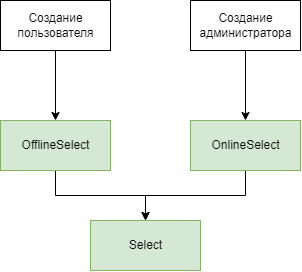

Это решит проблему жесткости и хрупкости *относительно подобных* изменений в будущем. Но потребует за собой
достаточной *подвижности* от `Select` что сделает его более абстрактным и уменьшит его *прозрачность*.

Иногда, лучшим вариантом будет возвращение к исходному примеру с дублированием.

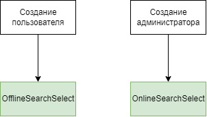

Это может быть оправдано, ведь само наличие проблемы говорит о *разности ответственностей* компонентов на странице
пользователя и администратора. Обратим внимание на то что в данном решении также отсутствуют *жесткость* и *хрупкость*,
но остается высокий шанс *истинного дублирования*. 

#### Истинное дублирование

Код обладающий одинаковым наблюдаемым поведением, изменяющийся по одним и тем же причинам
и в одно и то же время является дублирующим.

##### Пример

Представим что одной из ценностей системы, является использование специальных закономерностей, при которых все размеры
кратны двум, а цвета берутся исключительно из специальной ограниченной палитры.

Далее предположим, что инженеры не посчитали нужным и начали описывать данные размерности in place (т. е. без
использования обобщающих конструкций/переменных).

Далее представим что приходит новое требование, обязующее изменить один из цветов палитры на другой или поменять кратный
коэффициент размеров с двойки на тройку. В таком случае, для удовлетворения новых обстоятельств, потребуется проделать
изменения во многих частях системы одновременно, что и является одним из признаков дублирования. Такие массовые
изменения зачастую дополнительно усложняются наличием признаков *жесткости* и *хрупкости*

##### Решение

Что качественно отличает данную ситуацию от предыдущей? Единство ответственности. В требованиях явно указанно о закономерностях, а
именно об идентичности поведения. Такая идентичность, должна явно отражаться в коде при помощи общих констант, функций
и компонентов, иначе велик риск напороться на массовые модификации, которые зачастую еще больше угнетают дизайн системы,
стимулируя появление новых и развитие существующих признаков.

# Понятия

## Проектирование

Обратим внимание на то, каким образом проходила работа с указанными признаками:

* Приводилось описание проблемы
* Происходила явная идентификация в коде
* Применялись подходящие инструменты исправляющие исходный признак

Назовем данный алгоритм процессом *проектирования*.
Данный процесс оказывает влияние на структуру, которая,
в качестве собственного эффекта выражается в виде измененного набора признаков.

Отдельно выделяют проектирование, при котором происходит изменение на основе существующей
структуры, а не формирование совершенно новой. Это называется *Рефакторинг*.
В дальнейшем, для простоты, оба понятия будут объеденины в одно.

Еще одним важным свойством проектирования является то, что процесс затрагивает *только структуру* и ничего более, не
влияя при этом на поведенческую ценность приложения. Рефакторинг, изменяющий поведение (например порождающий регресс),
не является проектированием (и рефакторингом в том числе).

## Архитектура

*Архитектура*/*Структура*/*Дизайн* есть результат проектирования, качество которой выражается в определенном состоянии
данных признаков.

Признаки в данном случае выполняют роль параметров, с помощью которых можно измерить применимость того или иного дизайна
в рамках конкретного случая.

## Итого

* Качество архитектуры - есть определенное состояние признаков структуры
* Проектирование - есть процесс, изменяющий/создающий структуру (т. е. влияющий на признаки)
* Рефакторинг - есть частный случай проектирования

# Роль Архитектуры в ПО

Если рассмотреть приведенные ранее семь признаков, то можно обнаружить
что все они не являются дефектами или недоработками в прямом смысле.

Вместо этого, каждый из них, при нарушении будет замедлять процесс разработки за счет его усложнения. Т. е. снижать
производительность труда.

## Производительность труда

*Производительность труда* - это количество задач выполняемых специалистом за данный промежуток времени.
Чем этот показатель выше, тем разработка эффективней.

Например, предположим что создание формы входа средней сложности (и последующее её сопровождение) занимает у специалиста 2 дня.
Возьмем некоторый проект на котором требуется реализировать приведенное поведение, тогда возможно одно из следующего:
* Задача занимает *примерно* 2 дня - в таком случае производительность считается средней или нормальной.
* Задача занимает *менее* 2 дней - производительность считается высокой. Проект с высокой производительностью труда, называется *простым* проектом.
* Задача занимает *более* 2 дней - производительность считается низкой. Проект с низкой производительностью труда, называется *сложным* проектом.

Legacy project (устаревший/заброшенный проект) - есть проект с низкой производительностью труда, где она вызвана
эффектами исходящими от плохой структуры ПО.

## Низкая производительность труда

Снижение эффективности разработки приводит к её удорожанию, что негативно влияет не только на отношение с заказчиком,
но и на конкурентноспособность в целом.

Для того чтобы нивелировать данный эффект и соблюсти дедлайн, зачастую предпринимают следующее:

* Намеренное упрощение реализации за счет недоработок явно противоречащих бизнесу
* Расширение штата разработчиков, для восстановления скорости, что приводит к усложнению и удорожанию процесса  
* Сверхурочные работы, снижающие способность к труду в перспективе

Очевидно, что указанные меры способны только временно оттянуть неизбежное, а именно постепенную стагнацию и деградацию поведенческой ценности.
Когда каждое новое требование требует все больше времени на реализацию и приносит за собой бесчисленное количество
дефектов в казалось-бы уже устоявшихся частях проекта.

Разработка становится дорогой и клиент не всегда готов платить больше, что делает авантюру не прибыльной для
компании-разработчика.

Одной из крайних стадий такого развития является намерение о полном переписывании проекта, что к сожалению не всегда
возможно ввиду финансовых причин.

## Высокая производительность труда

Предположим теперь что производительность труда увеличилась на 25%. Это значит, что задача, которая раньше занимала 8
часов, теперь требует всего 6. На что можно потратить освободившееся время?

Инженер-разработчик:

* На другие задачи, тем самым быстрее приблизив выполнение плана
* На рефакторинг, для исправления найденных признаков и контроля тенденции структуры к деградации
* На самообучение, для повышения компетенции и сложности труда как следствие. Труд более высокого порядка оплачивается
  больше.

Компания-разработчик:

* Снизить стоимость проекта на 25%, тем самым существенно повысив свою конкурентоспособность и увеличив прибыль как
  следствие.
* Разделить образовавшуюся подушку в виде части прибыли себе и зарплаты специалистам, тем самым увеличив спрос труда.
* Отправить средства на амортизацию средств производства и повышение квалификации инженеров, тем самым открывая
  потенциал к дальнейшим оптимизациям.

## Роль

Из сказанного очевидно, что *архитектура* оказывает непосредственное влияние на
производительность труда.

Следовательно, можно постановить:

* *Ролью архитектуры* является обеспечение *высокой*/*достаточной* производительности труда.
* *Проектирование* в целевом виде - это *непрерывный* процесс, предназначенный для изменения признаков (через
  модификацию структуры) в направлении *увеличения/поддержания* эффективности разработки.

Из чего можно вывести что архитектура является *чистой*/*хорошей*/*правильной* только в случае если имеет место высокая производительность труда.

## Поведение

Поведение это то, из-за чего существует архитектура в первую очередь. Единственное условие которое необходимо соблюсти -
это обеспечить *непротиворечивость* этим требованиям.

Но как было отмечено раннее, несмотря на причину существования, основной *ролью* архитектуры было и остается - обеспечение
эффективности производства.

# Сложность проектирования

Отметим, что сложный проект (legacy project) является частым явлениям в индустрии, что говорит о сложностях построения и поддержки чистой архитектуры.

Почему проектирование - это сложно?

## Условия проекта

Дело в том, что каждый из признаков не образуется сам по себе. В этом ему помогают различные *условия проекта*.

Приведем некоторые из них:

* Компетенция разработки
* Частота показов
* Стабильность требований
* Технологии разработки
* Этап проекта
* Специфика предметной области

Проектирование, должно учитывать не только сам признак, но и условия проекта, т. к. именно они являются причиной
появления проблемы в первую очередь и они же, будут являться причинами появления многих других в будущем.

Необходимо подобрать такое решение, которое взамен на избавление или ослабление признака, предоставит архитектуру,
учитывающую тенденции в будущем и настоящем.

Рассмотрим некоторые примеры.

### Стабильность требований

Требования меняются. Это одно из основных свойств данного понятия, его определяющих качеств. Самое неприятное здесь то,
что вектор изменений зачастую принимает обратное положение по отношению к тому, на что расчитывал изначальный дизайн.

Более того, изменения зачастую требуется сделать быстро и они могут быть проделаны разработчиками, слабо знакомыми с
изначальными целями структуры.

Отсутствие адаптивной архитектуры и наличие часто изменяющихся требования приводят к постепенному загниванию проекта,
которое выражается в приобретении/усилении последним указанных признаков плохой структуры.

### Компетенция разработки

Предположим что в проекте обнаружилось *избыточное дублирование*. Можно попробовать избавиться от него, добавив
дополнительные абстракции, но в случае если на проекте нет постоянной разработки либо компетенция существующей является
недостаточной, то итоговое решение может оказаться *непрозрачным*, что только усугубит ситуацию.

Любое решение будет в конечном итоге обменивать одни признаки, на другие. Это всегда *игра компромиссов*.

### Направление развития

Сложность не заканчивается на этом, *архитектура* также должна предугадывать и возможные векторы развития условий
проекта, для обеспечения подходящих показателей в *жесткости* и *неподвижности*.

Данные условия в сумме требуют от специалиста следующих качеств:

* Опыт - для предупреждения признаков
* Внимательность - для своевременного обнаружения признаков
* Знание - для подбора подходящего инструмента решения
* Ответственность - для обеспечения *непрерывного* процесса поддержки/улучшения структуры

## Паттерны

Отметим, что несколько разных проектов могут обладать одинаковыми условиями и признаками, это означает что для них
подойдут одинаковые решения по проектированию.

Такие универсальные рецепты называются *паттернами* (или *принципами* в более широком смысле). Основной их задачей
является изменение признаков в сторону увеличения производительности труда.

Для их грамотного применения необходима способность к идентификации решаемых паттерном проблем, требуемых им условий и
его недостатков. В противном случае велик риск только ухудшить имеющуюся структуру в сторону *избыточной сложности*
и *непрозрачности*.
