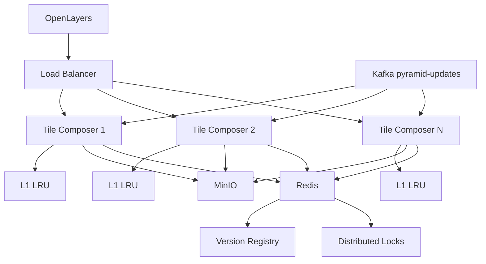

```text
Kafka updates
→ version registry
→ versioned cache keys
→ L1 memory LRU
→ L2 filesystem cache
→ upstream tile sources
→ sharp composite
→ cache source tiles + composite tiles
```


```text
Kafka:
  сообщает, что pyramidId получил новую version

Version Registry:
  хранит current version каждой пирамиды

L1 LRU:
  быстрый hot cache внутри процесса

L2 FS:
  большой локальный cache тайлов и склеек

Cleanup job:
  удаляет старые/лишние файлы по TTL и max-size

Tile Composer:
  строит versioned cache keys,
  достаёт source tiles,
  склеивает,
  кеширует,
  отдаёт OpenLayers один PNG
```

И потенциальная архитектура для мульти-инстансов


